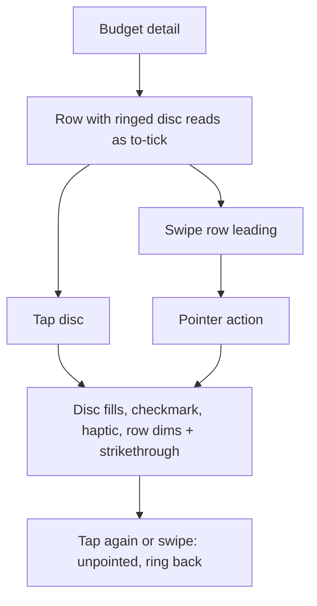

# Instruction: Pointing is visible again on the budget detail ledger

## Architecture projection

> Tree of the final files. ✅ create · ✏️ modify · ❌ delete

```txt
ios/Pulpe
├── Features/Budgets/BudgetDetails
│   ├── PointCircle.swift                                ✏️ unpointed = glyph wash + 1.5pt ring in the tint (`DesignTokens.Checkbox.ringWidth`); pointed = filled tint + checkmark; press scale FLICK-like, 0.15s
│   ├── BudgetLineMixedRow.swift                         ✏️ leading swipe action "Pointer / Dépointer" (tint, `checkmark.circle`) on the row; unchanged for withdrawal rows
│   ├── BudgetDetailsFreeTransactionsList.swift          ✏️ same swipe action on the free row
│   └── BudgetMixedSection.swift                         ✏️ rows must sit in a `List`-free `VStack`: use `.swipeActions` only if the row is in a `List`; otherwise implement the leading swipe with the existing `SwipeToPointModifier` or add one shared modifier (see task 2)
├── Shared/Design/DesignTokens.swift                     ✏️ `Checkbox.ringWidth = 1.5`
├── DESIGN.md                                            ✏️ One Ledger Rule: "the disc is also the pointing control: ring = to point, filled = pointed"
└── PulpeUITests/BudgetDetails/BudgetDetailsPointingUITests.swift ✅ tap the disc → row strikes through; swipe → same
```

## User Journey



## Test Scope

```mermaid
---
title: Test scope
---
journey
  section Setup
    Seed budget with unpointed lines and one free transaction => detail loaded: 5: system
  section Happy path
    Tap the leading disc of an expense row => disc filled with checkmark, row dimmed, `À pointer` count minus one: 5: browser
    Swipe the next row from the leading edge => Pointer action visible, tap it => same pointed state: 5: browser
    Tap the filled disc => ring state back, count restored: 5: browser
  section Edge case - planned withdrawal row
    Row is a planned withdrawal => disc is a plain RowIcon, no ring, no swipe action: 1: browser
  section Edge case - VoiceOver
    Focus the disc => label "À pointer", trait button; after tap "Pointé", selected: 1: browser
```

## Tasks to do

### `1)` Ring on the unpointed disc

> The disc must read as a control before the first tap.

1. `PointCircle` unpointed branch: `RowIcon(...)` + `.overlay(Circle().strokeBorder(color, lineWidth: Checkbox.ringWidth))`; pointed branch unchanged.
2. Press feedback: `.scaleEffect(isPressed ? 0.92 : 1)` through a `ButtonStyle`, spring `.spring(response: 0.2, dampingFraction: 0.8)` (oa-design FLICK class: exits faster than entrances, nothing past 0.2s); Reduce Motion → no scale.
3. `DESIGN.md` One Ledger Rule sentence.

### `2)` Leading swipe as the second path

> Same gesture as Mail; no new trailing control.

1. Rows live in `ScrollView`/`VStack` (no `List`), so `.swipeActions` is unavailable: reuse an existing swipe modifier if one exists in `Shared/` (grep `DragGesture` on rows); otherwise add `Shared/Components/LeadingSwipeAction.swift` (drag reveals a tinted action, threshold 72pt, snaps back, haptic on commit, disabled under VoiceOver where the button path already exists).
2. Wire on `BudgetLineMixedRow` (non-withdrawal) and `BudgetDetailsFreeTransactionRow` calling the existing `onTogglePointed`.
3. Ensure the row's `Button(action: onTap)` does not fire when a swipe commits (`simultaneousGesture` with minimum distance).

### `3)` Verify

1. Add `BudgetDetailsPointingUITests` (tap disc, swipe row); run it and `BudgetDetailsCoordinatorToggleTransactionTests`.
2. Screenshot a ledger with mixed pointed/unpointed rows.

## Test acceptance criteria

| Task | Acceptance criteria              |
| ---- | -------------------------------- |
| 1 | An unpointed row shows a ring in its nature tint around the glyph disc; a pointed row shows a filled disc with a checkmark. |
| 1 | Withdrawal rows keep a plain `RowIcon` with no ring. |
| 2 | Swiping a row from the leading edge reveals a "Pointer" action whose tap toggles the same state as the disc. |
| 2 | A swipe never opens the row's detail sheet. |
| 3 | `BudgetDetailsPointingUITests` green; existing toggle unit tests green; swiftlint strict clean. |
