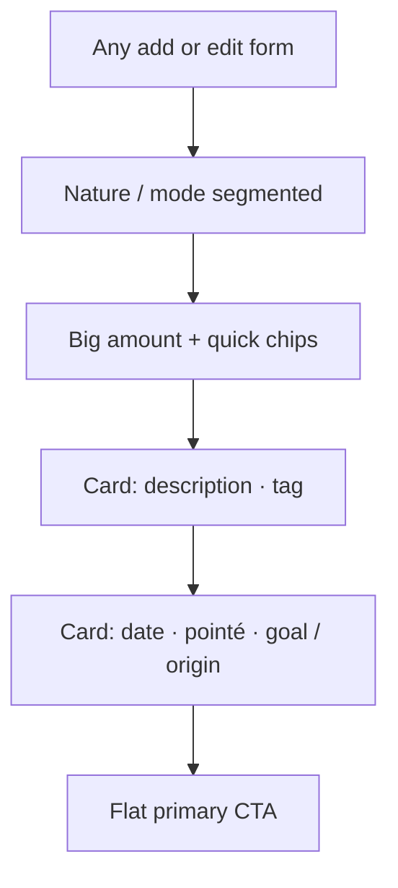
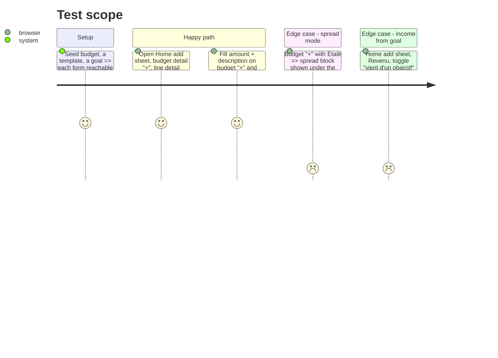

# Instruction: One entry-form model for the six add/edit forms

## Architecture projection

> Tree of the final files. ✅ create · ✏️ modify · ❌ delete

```txt
ios/Pulpe
├── Shared/Components
│   ├── SavingsGoalPickerField.swift                     ✏️ `style: FormRowStyle` (`.row` = label left, value + chevron right, no own card)
│   ├── FormCard.swift                                   ✏️ optional `title:` eyebrow above the card (caption, `textSecondary`)
│   └── EditBudgetLineSheet.swift                        ✏️ three-block layout
├── Features/Budgets/BudgetDetails
│   ├── AddBudgetLineSheet.swift                         ✏️ three-block layout; spread section stays its own block below the details card
│   ├── AddAllocatedTransactionPage.swift                ✏️ three-block layout; `realizationHeader` becomes the eyebrow above the amount; sticky CTA unchanged
│   └── EditTransactionPage.swift                        ✏️ three-block layout
├── Features/Templates/TemplateDetails/EditTemplateLineSheet.swift ✏️ three-block layout
└── DESIGN.md                                            ✏️ "The Form Rule": amount zone → what card → details card → CTA; segmented choices above the amount; one primary CTA
ios/PulpeTests/Shared/Components/FormRowStyleTests.swift  ✅ `.row` variants of the atoms render their label and value (snapshot-free: `ViewInspector` absent → test the presentation structs only)
```

## User Journey



## Test Scope



## Wireframe

```txt
┌──────────────────────────────────┐
│ (x)        Titre                 │
│ (1) [Revenu | Dépense | Épargne] │
│     [Une fois | Étalé]           │
│ (2)        CHF                   │
│          0.00                    │
│   [10] [15] [20] [30]            │
│ (3) ╭──────────────────────────╮ │
│     │ Description  Ex. Courses │ │
│     │ Tag          Aucun     › │ │
│     ╰──────────────────────────╯ │
│ (4) ╭──────────────────────────╮ │
│     │ Date        22 août 2026 │ │
│     │ Déjà pointé         (○ ) │ │
│     │ Objectif    Vacances   › │ │
│     ╰──────────────────────────╯ │
│ (5) [        Ajouter         ]   │
└──────────────────────────────────┘
```

1. Segmented choices (nature, once/spread, total/monthly) — only the ones the form needs.
2. Hero amount + quick chips (unchanged atoms).
3. "What" card: description, tag.
4. "Details" card: date (transactions only), pointed toggle, goal or origin rows.
5. One flat primary CTA; pages keep the sticky bottom CTA.

## Tasks to do

### `1)` Give the last atom a row style

> Every field the six forms use can sit inside a `FormCard`.

1. `SavingsGoalPickerField`: add `style: FormRowStyle = .standalone`; `.row` renders label + selected goal name + chevron on `ListRow.minHeight`, the picker sheet unchanged; withdrawal readiness message stays under the row as a caption.
2. `FormCard(title:)` optional eyebrow.

### `2)` Migrate the five forms

> Same order everywhere; nothing gained or lost functionally.

1. `AddBudgetLineSheet`: `FormCard { description, FormRowDivider, tag (when shown) }`, `FormCard { checked (when allowed), goal picker (saving), origin picker (income), planned-withdrawal picker }`; `SpreadFormSection` after the details card.
2. `AddAllocatedTransactionPage`: `FormCard { description }`, `FormCard { date, checked, tag }`; keep `pulpeStickyBottomCTA`.
3. `EditTransactionPage`, `EditBudgetLineSheet`, `EditTemplateLineSheet`: same split; delete buttons stay where they are.
4. Remove the now-unused `.standalone` branches only if no caller remains (grep first).
5. `ios/DESIGN.md` Form Rule.

### `3)` Verify

1. Screenshot the six forms on the simulator side by side.
2. Run `AddBudgetLineSpreadLogicTests`, `AddTransactionSheetTests` (or the closest existing), `EditTemplateLineSheet` tests; UI suites `BudgetLinkedForecastDeleteUITests`.

## Test acceptance criteria

| Task | Acceptance criteria              |
| ---- | -------------------------------- |
| 1 | `SavingsGoalPickerField(style: .row)` renders on one `ListRow.minHeight` row with a chevron and opens the same sheet. |
| 2 | All six forms show, top to bottom: segmented choices, amount + chips, "what" card, "details" card, CTA. |
| 2 | Budget "+" in spread mode shows no tag row and the spread block below the details card; submit creates the spread group as before. |
| 2 | Home add sheet in Revenu with goal origin shows the goal picker inside the details card and still blocks submission without a goal. |
| 3 | Named tests green, swiftlint strict clean, no file above 500 lines (`EditTemplateLineSheet` type_body_length pre-existing exception stays). |
