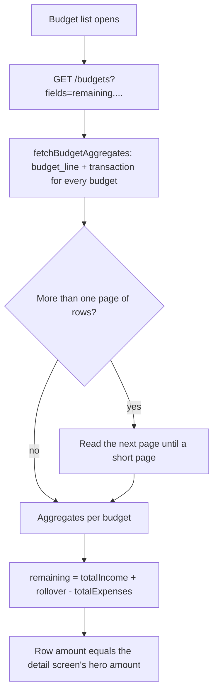
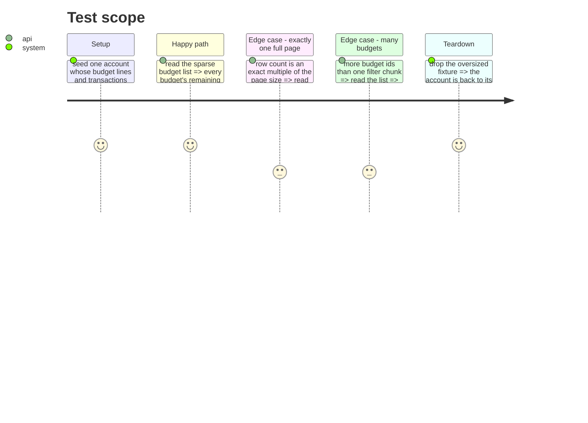

# Instruction: paginate the batched aggregate reads

## Architecture projection

```txt
.
└── backend-nest/
    ├── src/
    │   ├── common/utils/
    │   │   ├── postgrest-pagination.ts                       ✅ fetchAllPages / fetchRowsByParentIds
    │   │   └── postgrest-pagination.spec.ts                  ✅
    │   └── modules/
    │       ├── budget/infrastructure/persistence/
    │       │   ├── supabase-budget.repository.ts             ✏️ page fetchBudgetAggregates + fetchHistoryData
    │       │   └── supabase-budget.repository.spec.ts        ✏️ regression: a second page is read and folded in
    │       └── encryption/infrastructure/crypto/
    │           └── aes-gcm.crypto-service.ts                 ✏️ delegate its private loops to the shared util
```

## User Journey



## Test Scope



## Tasks to do

### `1)` Extract the paging helpers

> One implementation of "read until a short page", reachable from any repository.

1. Create `src/common/utils/postgrest-pagination.ts` exporting `POSTGREST_PAGE_SIZE`, `POSTGREST_FILTER_CHUNK_SIZE`, `fetchAllPages`, `fetchRowsByParentIds`, lifted verbatim from `aes-gcm.crypto-service.ts`.
2. Replace the crypto service's `#fetchAllPages` / `#fetchRowsByParentIds` bodies with a delegation to the util; keep the private method names so its call sites stay untouched.

### `2)` Page the budget aggregate reads

> The aggregates are computed from every row, not from the first thousand.

1. In `fetchBudgetAggregates`, read `budget_line` and `transaction` through `fetchRowsByParentIds`, adding `.order('id', { ascending: true })` so pages never overlap or skip.
2. Do the same in `fetchHistoryData`, which batches the same two tables over every previous budget.
3. Keep the existing error handling: a failed page must still raise `BUDGET_FETCH_FAILED` / `TRANSACTION_FETCH_FAILED`.

### `3)` Guard it with tests

> A truncated read fails the suite instead of reaching the screen.

1. `postgrest-pagination.spec.ts`: a source of `PAGE_SIZE + 1` rows is returned whole; a short first page stops the loop; more ids than one chunk issue several filtered reads.
2. `supabase-budget.repository.spec.ts`: `fetchBudgetAggregates` over a two-page source returns aggregates that include the second page's rows, and orders by `id` before ranging.
3. Re-run the live comparison against the local stack: sparse `remaining` per budget must equal the detail endpoint's computed `remaining`, with the oversized fixture in place.

## Test acceptance criteria

| Task | Acceptance criteria                                                                                                                            |
| ---- | -----------------------------------------------------------------------------------------------------------------------------------------------|
| 1    | The crypto service's paging behaviour is unchanged: its existing suite passes with no edit to its call sites.                                    |
| 2    | With rows spanning two pages, every budget's `totalIncome` / `totalExpenses` matches what a per-budget read of the same budget produces.         |
| 3    | Reverting either paging call turns a test red, and the local list-versus-detail comparison reports zero divergent budgets.                       |
