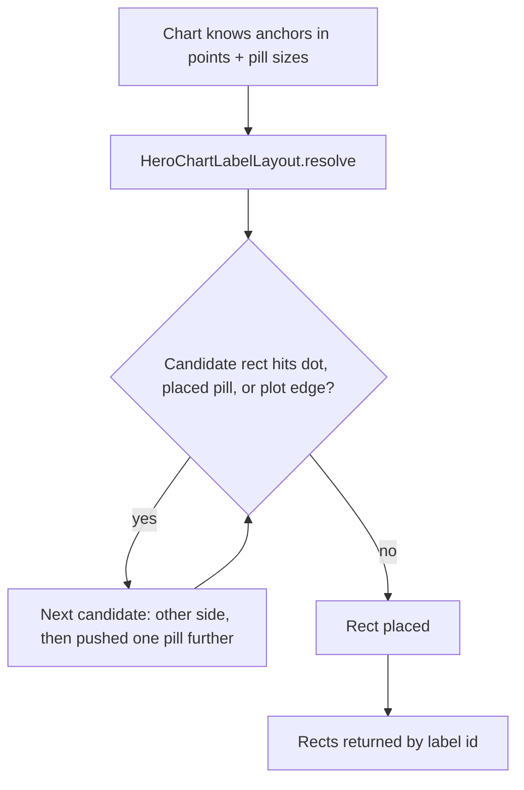
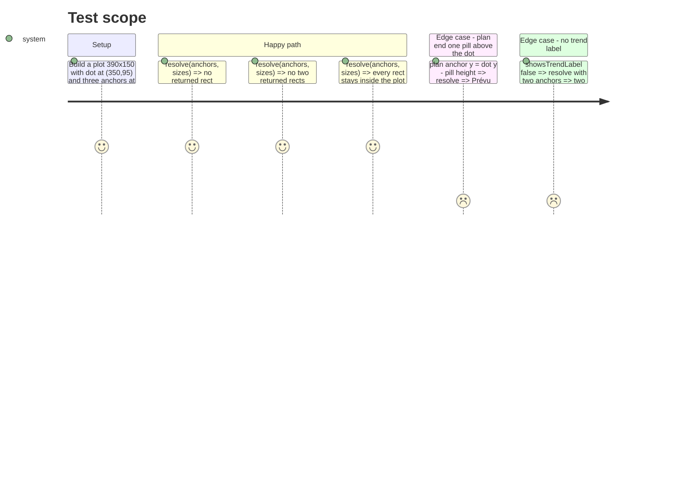

# Instruction: Pure label layout resolver + tests

## Architecture projection

> Tree of the final files. ✅ create · ✏️ modify · ❌ delete

```txt
ios/Pulpe/Features/CurrentMonth/Components/
└── ✅ HeroChartLabelLayout.swift
ios/PulpeTests/Features/CurrentMonth/
└── ✅ HeroChartLabelLayoutTests.swift
```

## User Journey



## Test Scope



## Tasks to do

### `1)` Resolver

> One pure `enum HeroChartLabelLayout` with `static func resolve(...) -> [Label: CGRect]`.

1. `enum Label: CaseIterable { case today, trend, plan }` in priority order (today first).
2. Input: `plot: CGRect`, `dot: CGRect` (from `Chart.pointSymbolArea` + ring), `anchors: [Label: CGPoint]` (missing = label absent), `sizes: [Label: CGSize]`, `preferredSide: [Label: AnnotationPosition]` (seeded by the existing `*LabelPosition` functions), `spacing` (`Spacing.xs`), `inset` (`Spacing.xxl`, the hero text inset).
3. Candidates per label, in order: preferred side, opposite side, preferred side pushed by one more pill height, opposite pushed. Each candidate = rect grown leftward from the anchor (trailing alignment, as today), then clamped in x to `plot.insetBy(dx: inset)`.
4. Take the first candidate that intersects neither `dot` nor an already placed rect; fall back to the last candidate. `// ponytail: greedy, fixed priority; add a scoring pass when a 4th label shows up`.
5. Keep `planLabelPosition` / `trendLabelPosition` / `todayLabelPosition` in `HomeHeroCard+Chart.swift` as the seeds; do not duplicate them.

### `2)` Tests

> Swift Testing suite in `HomeHeroCardTests` style, no chart instantiated.

1. Reproduce the screenshot geometry (plan end ≈ one pill above the dot, today at 90 % of width) and assert no rect intersects the dot.
2. Assert pairwise disjointness and containment in the inset plot for the three-label and two-label cases.
3. Assert the preferred side wins when it is free (no gratuitous flipping).

## Test acceptance criteria

| Task | Acceptance criteria                                                                                             |
| ---- | --------------------------------------------------------------------------------------------------------------- |
| 1    | `resolve` returns one rect per present anchor; none intersects the dot, another rect, or leaves the inset plot. |
| 1    | When the preferred side is free, the rect sits on that side at `spacing` from the anchor.                       |
| 2    | `xcodebuild test` on the dedicated simulator reports the new suite green; `swiftlint --strict` clean.           |
