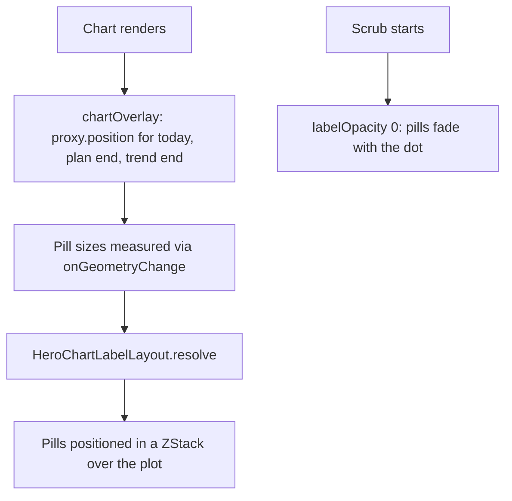
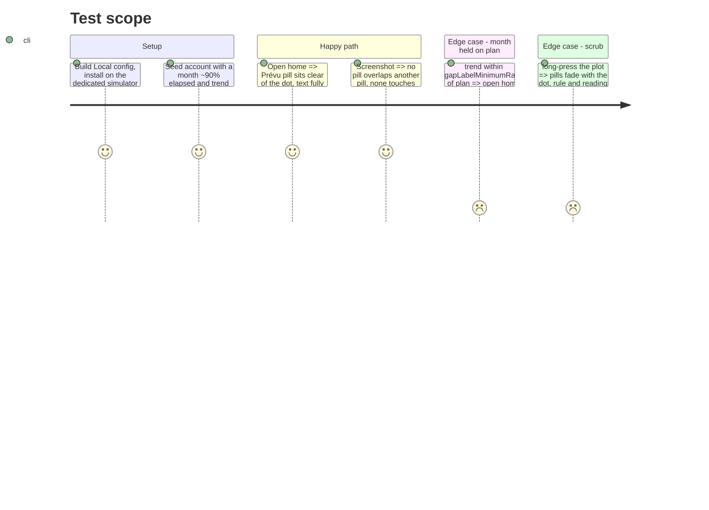

# Instruction: Draw pills from the resolver in the chart overlay

## Architecture projection

> Tree of the final files. ✅ create · ✏️ modify · ❌ delete

```txt
ios/Pulpe/Features/CurrentMonth/Components/
├── ✏️ HomeHeroCard+Chart.swift   (drop the three label annotations and their symbolSize(0) anchors; add labelOverlay(proxy:))
└── ✏️ HomeHeroCard.swift         (@State pill sizes, the extension cannot hold stored state)
```

## User Journey



## Test Scope



## Wireframe

```txt
┌────────────────────────────────────────────────┐
│ ╲ ‥‥‥‥‥‥‥‥‥‥‥‥‥‥‥‥‥‥‥‥‥‥‥‥‥‥ [1]           │
│  ╲__                        ‥‥‥‥‥‥‥‥ ┌─────┐  │
│     ╲_____                           │Prévu│[3]│
│           ╲_____         ┌───────────┴─────┘‥ │
│                 ╲________│ Aujourd’hui │ ●[2]- -│
│                          └─────────────┘       │
│                     ┌────────────────────────┐ │
│                     │ Si tu continues : -717 │[4]
│                     └────────────────────────┘ │
│ 27 juillet                            26 août  │
└────────────────────────────────────────────────┘
```

1. Plan dashed stroke, unchanged.
2. Today's dot + ring, still a chart `PointMark`; its rect is the resolver's first obstacle.
3. « Prévu » flipped above its anchor because below it hits the dot.
4. Trend pill keeps its preferred side (below), pushed left to the text inset.

## Tasks to do

### `1)` Overlay

> Pills become one `ZStack` in `chartOverlay`, fed by the resolver.

1. In `balanceChart`, delete the three label `.annotation(...)` blocks and the two `symbolSize(0)` `PointMark`s that only carried them (`plotted` already holds both ends in the y-domain).
2. Add `func labelOverlay(proxy: ChartProxy) -> some View`: read `proxy.plotFrame`, `proxy.position(for:)` for today / plan end / trend end (trend only when `showsTrendLabel`), call `HeroChartLabelLayout.resolve` seeded by the existing `*LabelPosition` functions, draw `chartLabel(...)` at each rect's center via `.position`, `.opacity(labelOpacity)` (trend pill also `settlingOpacity`).
3. Measure each pill with `.onGeometryChange(for: CGSize.self)` into `@State private var pillSizes: [HeroChartLabelLayout.Label: CGSize]` on `HomeHeroCard`; first pass uses an estimate (caption2 line height + 2·`Spacing.xxs`), then relayout once measured. Layout is pure, so no feedback loop.
4. Compose: `.chartOverlay { proxy in ZStack { scrubOverlay(proxy:); labelOverlay(proxy:) } }` with the label overlay `.allowsHitTesting(false)` so the scrub gesture keeps the whole plot.
5. Pills `.accessibilityHidden(true)`; the chart's a11y label already speaks them. Keep the dot's `.overlay` ring annotation.

### `2)` Verify on device

> Build Local, install from an explicit `-derivedDataPath`, screenshot the seed account.

1. Reproduce the screenshot month (day ~27/31, trend ≪ plan) and a held month.
2. `swiftlint --strict`: `HomeHeroCard+Chart.swift` is near the 500-line ceiling; if it crosses, move `labelOverlay` to `HomeHeroCard+ChartLabels.swift`.

## Test acceptance criteria

| Task | Acceptance criteria                                                                               |
| ---- | ------------------------------------------------------------------------------------------------- |
| 1    | Late-month screenshot: « Prévu » readable, clear of the dot; no pill overlaps another or the edge. |
| 1    | Scrub still works on the whole plot; pills fade with the dot.                                     |
| 1    | Existing `HomeHeroCardTests` stay green (position seeds unchanged).                               |
| 2    | `xcodebuild test` on the dedicated simulator green; `swiftlint --strict` clean.                   |
