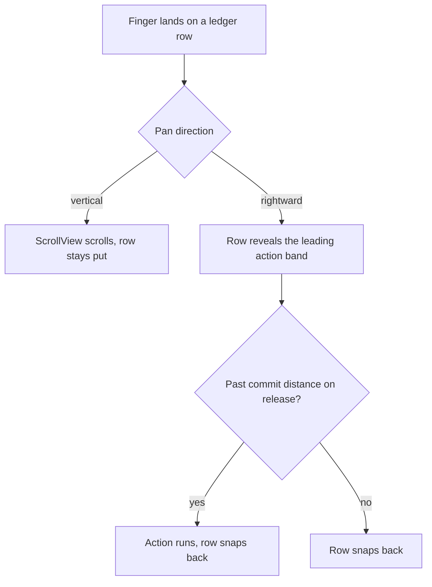
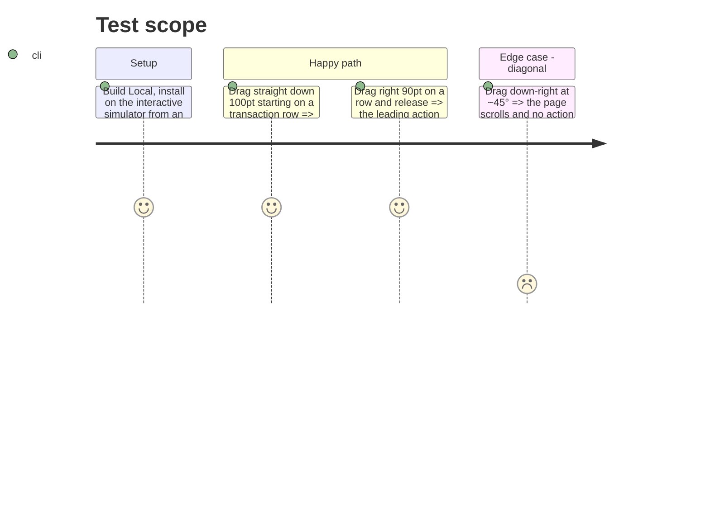

# Instruction: Ledger scroll: swipe gesture no longer claims vertical pans

## Architecture projection

> Tree of the final files. ✅ create · ✏️ modify · ❌ delete

```txt
ios/Pulpe/Shared/Components/
└── ✏️ LeadingSwipeAction.swift   (highPriorityGesture → simultaneousGesture)
```

## User Journey



## Test Scope



## Tasks to do

### `1)` Gesture

> Let the scroll view keep vertical pans.

1. In `LeadingSwipeAction.body`, replace `.highPriorityGesture(drag, including:)` with `.simultaneousGesture(drag, including:)`.
2. Keep the `dx > abs(dy)` guard: it is what keeps a diagonal from revealing the band.
3. Update the doc comment: the row no longer pre-empts the scroll view; both see the pan, the guard picks the horizontal one.

## Test acceptance criteria

| Task | Acceptance criteria                                                                                        |
| ---- | ---------------------------------------------------------------------------------------------------------- |
| 1    | A vertical drag started on a ledger row scrolls the page on that same drag, every time.                     |
| 1    | A rightward drag past 72pt still commits the leading action with its haptic; a short one snaps back.       |
| 1    | `xcodebuild build` Local succeeds; `swiftlint --strict` clean on the file.                                  |
