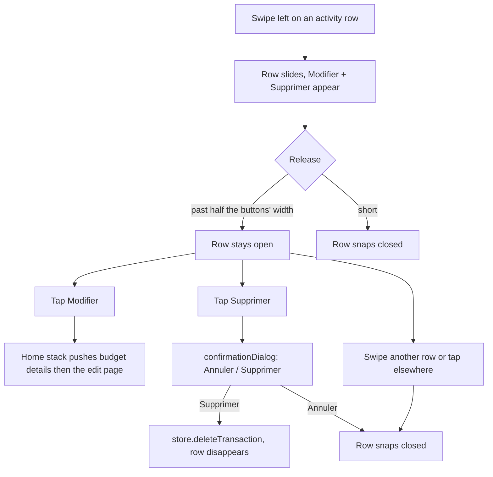

# Instruction: Trailing swipe actions on home activity rows

## Architecture projection

> Tree of the final files. ✅ create · ✏️ modify · ❌ delete

```txt
ios/Pulpe/Shared/Components/
└── ✅ TrailingSwipeActions.swift          (drag-left reveals N buttons, snaps open/closed, one open row per group)
ios/Pulpe/Features/CurrentMonth/
├── Components/
│   └── ✏️ ActivityCard.swift              (rows get the modifier; onEdit/onDelete callbacks; delete confirmationDialog)
└── ✏️ CurrentMonthView.swift              (wire onEdit → push details + editTx; onDelete → store.deleteTransaction)
ios/PulpeTests/Shared/
└── ✅ TrailingSwipeActionsTests.swift     (resting-offset math)
```

## User Journey



## Test Scope

```mermaid
---
title: Test scope
---
journey
  section Setup
    Build Local, install on the interactive simulator, log in with the seed account => home shows the Activité rows: 5: cli
  section Happy path
    Swipe a row left past 64pt and release => Modifier and Supprimer stay revealed: 5: cli
    Tap Modifier => the edit page for that operation is on screen, back returns to budget details then home: 5: cli
    Swipe left, tap Supprimer => a confirmation dialog appears; confirm => the row is gone and the hero amount updates: 5: cli
  section Edge case - cancel
    Dialog shown => tap Annuler => the row is still there, closed: 1: cli
  section Edge case - one open row
    A row is open => swipe another row => the first one closes: 1: cli
  section Edge case - vertical pan
    Drag straight down on a row => the home scrolls, no row opens: 1: cli
  section Edge case - VoiceOver
    VoiceOver on => the row exposes Modifier and Supprimer as custom actions: 1: cli
```

## Wireframe

```txt
┌──────────────────────────────────────────────┐
│ Activité                 [7 jours | Mois] (1) │
│ Aujourd’hui                                   │
│ ┌──────────────────────────────────────────┐  │
│ │ ⬈ Courses MCP                   -42.50   │  │ (2) closed row
│ ├──────────────────────────────────────────┤  │
│ │ hop                 │ ✎ Modifier│🗑 Suppr.│  │ (3) open row
│ └──────────────────────────────────────────┘  │
└──────────────────────────────────────────────┘
```

1. Header and window picker, unchanged.
2. A row at rest: identical to today.
3. A row swiped left: content slid by the buttons' width, two full-height buttons trailing (edit neutral, delete destructive).

## Tasks to do

### `1)` Modifier

> `TrailingSwipeActions` in `Shared/Components`, sibling of `LeadingSwipeAction`.

1. `struct TrailingSwipeActions<Actions: View>: ViewModifier` with `@Binding var openId: AnyHashable?`, `let id: AnyHashable`, `@ViewBuilder actions`. Buttons are the caller's; the modifier lays them in an `HStack` behind the content, trailing, each `frame(width: DesignTokens.TapTarget.minimum + Spacing.lg)`, full height.
2. Drag: `simultaneousGesture(DragGesture(minimumDistance: Spacing.xl))`, guard `-dx > abs(dy)`; offset = `-min(-dx, width)` from the resting offset. On end: `static func restingOffset(translation: CGFloat, wasOpen: Bool, width: CGFloat) -> CGFloat` (open when the row is dragged past half the width; pure, tested).
3. Open state = `openId == id`; setting `openId` to another row's id closes this one through the binding. Tapping the content while open closes it (`onTapGesture` only when open, so closed rows keep no tap).
4. Off under VoiceOver / Switch Control like `LeadingSwipeAction`; instead expose the actions with `.accessibilityAction(named:)` from the caller.
5. `// ponytail: no rubber-band past the buttons, no full-swipe commit; add when asked.`

### `2)` Activity rows

> `ActivityCard` gets `onEdit: (Transaction) -> Void`, `onDelete: (Transaction) -> Void`.

1. `@State private var openRowId: AnyHashable?`, `@State private var pendingDeletion: Transaction?`.
2. `row(transaction)` → `.trailingSwipeActions(id: transaction.id, openId: $openRowId) { Button(Modifier) …; Button(Supprimer, role: .destructive) { pendingDeletion = transaction } }`; both buttons close the row first. Labels `Label("Modifier", systemImage: "pencil")` / `Label("Supprimer", systemImage: "trash")` as in `BudgetLineDetailPage`.
3. `.confirmationDialog(AppLocale.string("Supprimer cette opération ?"), isPresented: …, presenting: pendingDeletion)` with `Annuler` / `Supprimer` (destructive) → `onDelete(tx)`. Text stays lexicon-safe (« opération », never « transaction »).
4. Rows clip: the card `VStack` gets `.clipShape` from `pulpeRowCard` already; confirm the slid content does not paint outside the card, else add `.clipped()` on the rows stack.
5. `.accessibilityAction(named: "Modifier")` / `"Supprimer"` on the row.

### `3)` Home wiring

> `CurrentMonthView` owns navigation and the store.

1. `onEdit`: `guard let budgetId = store.budget?.id`; `appState.currentMonthPath.append(BudgetDestination.details(budgetId:))`, then `.append(BudgetLinePushRoute.editTx(transactionId:))`. Reuse the existing `navigateToBudget` pattern's guard; push both in one update so the stack animates once.
2. `onDelete`: `Task { await store.deleteTransaction(tx) }`. Store already rolls back and sets `error` on failure, surfaced by the existing error handling on the page.

## Test acceptance criteria

| Task | Acceptance criteria                                                                                                               |
| ---- | --------------------------------------------------------------------------------------------------------------------------------- |
| 1    | `restingOffset` returns `-width` past half the width and `0` before it, from both closed and open; the suite is green.            |
| 1    | A vertical drag on a row scrolls the home; a leftward one reveals the buttons and stays open past half their width.               |
| 2    | « Supprimer » never deletes without the dialog; « Annuler » leaves the row in place. Only one row is open at a time.               |
| 3    | « Modifier » lands on the edit page of that operation; back pops to budget details then home. Deleting updates hero and rows.      |
| 2-3  | `pnpm test:lexicon` unaffected (no « transaction » on screen); `swiftlint --strict` clean; `HomeHeroCard`/`CurrentMonth` suites green. |
