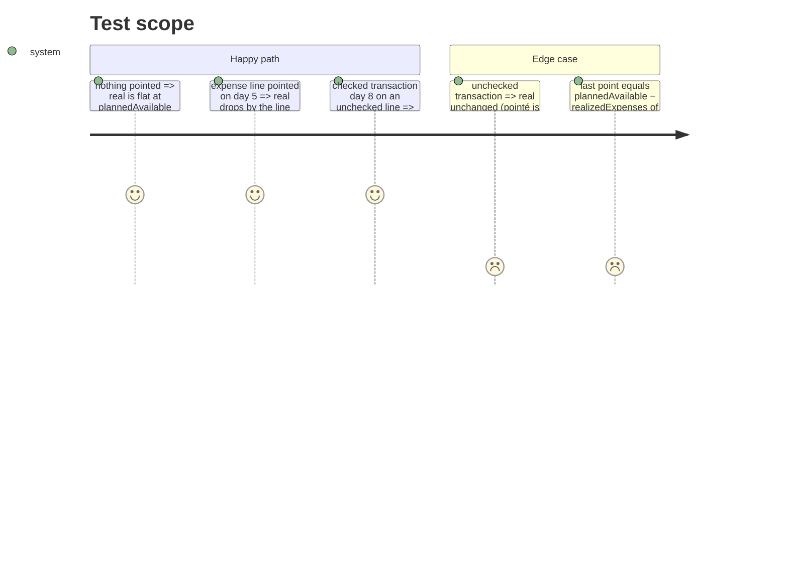

# Instruction: Série réel et disponible prévu

## Architecture projection

```txt
ios/Pulpe/Domain/Formulas
└── BalanceTrajectory.swift                       ✏️ `plannedAvailable`, `real: [Point]`, `realSeries(...)`
ios/PulpeTests/Domain/Formulas
└── BalanceTrajectoryTests.swift                  ✏️ real series tests
```

## Test Scope



## Tasks to do

### `1)` `plannedAvailable`

1. Stored property on `BalanceTrajectory`, set from `calculateAllMetrics(budgetLines:transactions: [], rollover:).available` (income lines + rollover, no transactions).

### `2)` `real` series

1. `realSeries(budgetLines:transactions:rollover:periodStart:today:)`: for `day in 0...today`, `plannedAvailable − calculateRealizedExpenses(budgetLines: lines whose checkedAt < periodStart + day (else treated unchecked), transactions: checked transactions with transactionDate < periodStart + day)`. Day `today` takes every checked item untouched (mirror of `landingSeries`).
2. A line "treated unchecked" = copy with `checkedAt: nil` (use `toggled()` only if checked; otherwise build the copy explicitly).
3. Tests listed above; `BalanceTrajectory` initializer callers in tests updated.

## Test acceptance criteria

| Task | Acceptance criteria |
| ---- | ------------------- |
| 1 | `plannedAvailable == 5_000` on the shared fixture |
| 2 | `BalanceTrajectoryTests` green with 4 new tests; `swiftlint --strict` clean |
