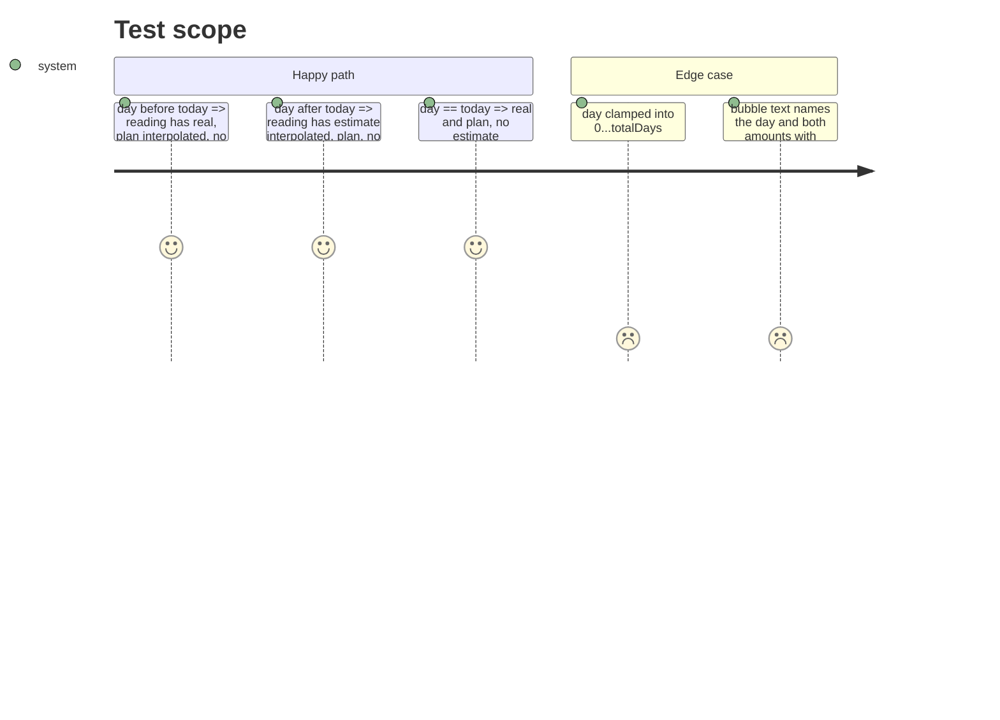

# Instruction: Lecture du jour et règle de scrub

## Architecture projection

```txt
ios/Pulpe/Features/CurrentMonth/Components
├── HomeHeroCard+Scrub.swift            ➕ `ScrubReading`, `scrubReading(at:)`, `scrubBubbleText`, overlay + gesture
├── HomeHeroCard+Chart.swift            ✏️ RuleMark + bubble when scrubbing, fixed labels hidden, `.chartOverlay`
├── HomeHeroCard.swift                  ✏️ `@State var scrubDay: Int?`
└── ios/PulpeTests/Features/CurrentMonth/HomeHeroCardScrubTests.swift ➕
```

## Test Scope



## Wireframe

```txt
│        ┊ 12 août · Réel 6'900 CHF · Prévu 7'400 CHF │
│ ╌╌╌╌╌╌╌┊╌╌╌╌╌╌╌╌╌╌╌╌╌╌╌╌╌╌╌╌╌╌╌╌╌╌╌╌╌╌╌╌╌╌╌╌╌╌╌╌╌╌╌ │
│ ━━━━━━━┿━━━━╲                                        │
│        ┊     ━━━●╌╌╌╌╌╌╌╌╌╌╌╌╌╌╌╌╌╌╌╌╌╌╌╌╌╌╌╌╌╌╌╌╌╌╌ │
```

## Tasks to do

### `1)` Pure reading

1. `ScrubReading { day, date, real: Decimal?, plan: Decimal, estimate: Decimal? }`; `scrubReading(at day: Int, in trajectory:)` clamps the day, interpolates plan between `plannedAvailable` and `plannedBalance`, reads `real[day]`, interpolates the projection after today.
2. `scrubBubbleText(_:currency:)` → « \(dayMonth) · Réel X · Prévu Y » or « … · Estimé X · Prévu Y ». 4 locales.

### `2)` Gesture and marks

1. `.chartOverlay`: `LongPressGesture(minimumDuration: 0.15).sequenced(before: DragGesture(minimumDistance: 0))`; on drag, `proxy.value(atX:) as Int?` → `scrubDay`; end → nil. `.sensoryFeedback(.selection, trigger: scrubDay)`.
2. `RuleMark(x:)` in `heroInkSecondary`, thin; bubble via `.annotation(position: .top, overflowResolution: .init(x: .fit(to: .chart)))`, `caption2`, `heroInk` on a `heroSurface` capsule. A dot on the real/estimate value at that day.
3. Fixed labels (« Aujourd'hui », « Prévu », trend) get `.opacity(scrubDay == nil ? 1 : 0)`.
4. `swiftlint --strict`; `HomeHeroCardScrubTests` + `HomeHeroCardTests` green; build on the user's sim.

## Test acceptance criteria

| Task | Acceptance criteria |
| ---- | ------------------- |
| 1 | 5 tests green on readings and text |
| 2 | Screenshot mid-scrub: one rule, one bubble, no fixed label; vertical scroll still works on device |
