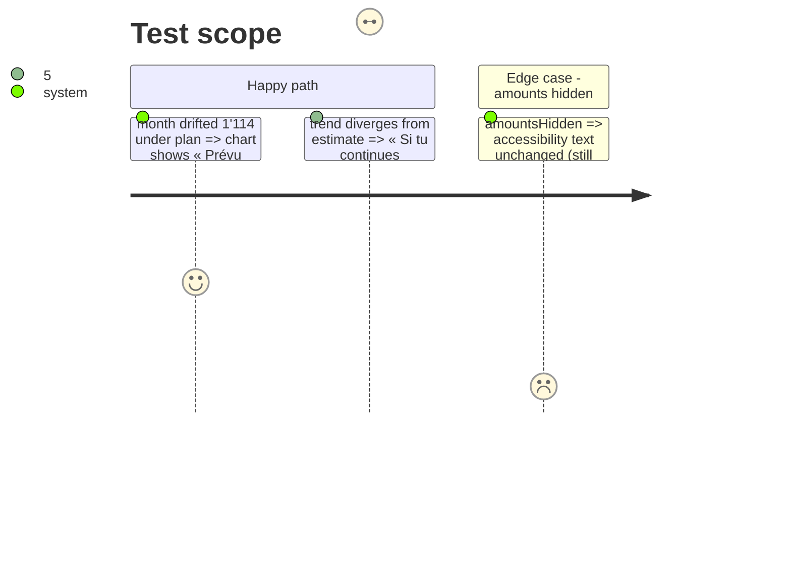

# Instruction: Trois rôles, trois places sur le graphe

## Architecture projection

```txt
ios/Pulpe/Features/CurrentMonth/Components
├── HomeHeroCard+Chart.swift            ✏️ trend label « Si tu continues : X », anchor label always « Aujourd'hui »
└── ios/PulpeTests/Features/CurrentMonth
    ├── HomeHeroCardTrendTests.swift    ✏️ trend label copy
    └── HomeHeroCardTests.swift         ✏️ anchorLabel tests
```

## Test Scope



## Wireframe

```txt
┌──────────────────────────────────────┐
│ Estimé fin août                      │ 1
│ 9'533.66 CHF                         │
│ ───────────────────  Prévu 10'648 ── │ 2
│ ▔▔▔▔╲                                │
│      ╲▁▁▁╲                            │
│           ●╌╌╌╌╌╌╌╌╌                 │ 3
│        Aujourd'hui   Si tu continues │ 4
│                          9'237 CHF   │
│ 1er août                    31 août  │
└──────────────────────────────────────┘
```

1. Hero figure, the only end-of-month number.
2. Plan rule, labelled once.
3. Today's dot, labelled by the day only.
4. Trend figure at the stroke's end, conditional verb.

## Tasks to do

### `1)` Relabel the trend

> The figure stays; the words say it is conditional.

1. `trendLabel` → « Si tu continues : \(amount) ». Keep `showsTrendLabel` (hides when it would print over the estimate).
2. Check the label fits at `lineLimit(1)` in fr/en/de/it; shorten the verb per locale if needed.

### `2)` Today's dot says « Aujourd'hui »

> The gap amount lives in the tile only.

1. `anchorLabel` returns « Aujourd'hui » unconditionally; remove `showsGapLabel`/`gapLabelPosition` if dead.
2. Update `HomeHeroCardTests` / `HomeHeroCardTrendTests` accordingly.
3. `swiftlint --strict` on touched files; run both suites.

## Test acceptance criteria

| Task | Acceptance criteria |
| ---- | ------------------- |
| 1 | `trendLabel` starts with « Si tu continues » ; no « à ce rythme » string left in `ios/Pulpe` |
| 2 | `anchorLabel` == « Aujourd'hui » for drifted and on-plan trajectories; suites green |
