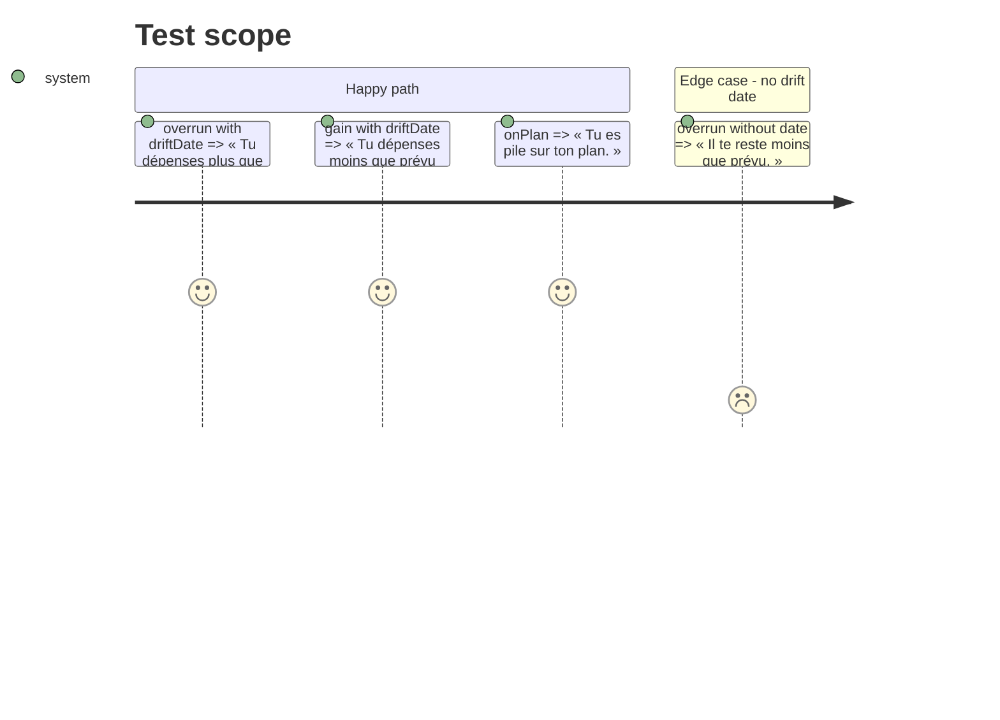

# Instruction: Verdict et casse

## Architecture projection

```txt
ios/Pulpe
├── Shared/Components/HeroZone/HeroVerdictPresentation.swift   ✏️ verdict sentences by verb
├── Features/CurrentMonth/Components/HomeHeroCard.swift        ✏️ « Estimé fin … », « À pointer », link « Voir le budget »
├── Features/CurrentMonth/Components/HomeHeroCard+Chart.swift  ✏️ « Prévu … » on the rule
└── ios/PulpeTests/Features/CurrentMonth/HomeHeroCardTests.swift ✏️ copy assertions
```

## Test Scope



## Tasks to do

### `1)` Verdict by verb

> « sous / au-dessus » replaced by what the user does.

1. `HeroVerdictPresentation.verdictText`: overrun+date → « Tu dépenses plus que prévu depuis le \(day). » ; gain+date → « Tu dépenses moins que prévu depuis le \(day). ». Other branches unchanged.
2. `HeroVerdictPresentation` has two consumers, both Home (`HomeHeroCard`, `CurrentMonthView`); the savings simulator owns a different `verdictText`. No other wording to keep coherent.

### `2)` Sentence case

> One register on the card.

1. `HomeHeroCard`: eyebrow « Estimé fin \(monthName) », tile « À pointer », link « Voir le budget » (a11y « Voir le détail du budget » stays).
2. `HomeHeroCard+Chart`: rule label « Prévu … ».
3. `pnpm test:lexicon` still green (no « transaction », tutoiement kept); xcstrings: add the new keys in fr/en/de/it per `ios-test-schemes-pinned-french` conventions (check `Localizable.xcstrings` for the old keys and replace).

## Test acceptance criteria

| Task | Acceptance criteria |
| ---- | ------------------- |
| 1 | Four verdict cases assert the new sentences; lexicon test green |
| 2 | No lowercase eyebrow/tile label left on the hero; every new key has 4 locales |
