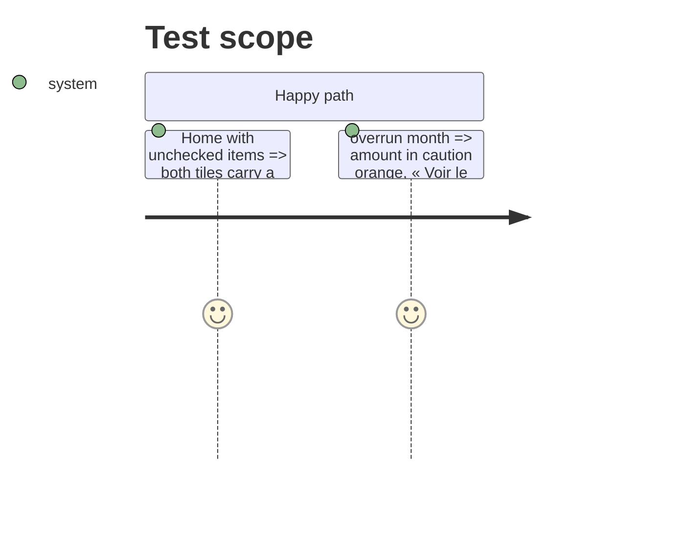

# Instruction: Tuiles et accent

## Architecture projection

```txt
ios/Pulpe
├── Features/CurrentMonth/Components/HomeHeroCard.swift   ✏️ chevron on both tiles, link in hero ink
└── Shared/Components/HeroZone/HeroVerdictRow.swift      ✏️ accept ink-only accent (check signature)
```

## Test Scope



## Wireframe

```txt
┌────────────────┐ ┌────────────────┐
│ 4           ›  │ │ -1'114 CHF  ›  │   ← one button, two entries
│ À pointer      │ │ Imprévus       │
└────────────────┘ └────────────────┘
Tu dépenses plus que prévu depuis le 15 août. Voir le budget ›
```

## Tasks to do

### `1)` Chevron on both tiles

1. `HomeHeroCard.summaryMetrics`: `showsChevron: true` on the « À pointer » tile too.

### `2)` Link in ink

1. `verdictSentence`: pass `.heroInk` as link accent (keep `accentColor` for the tile tint). Verify `HeroVerdictRow` contrast on the green hero (≥ 4.5:1) by reading `Color+Pulpe`.

## Test acceptance criteria

| Task | Acceptance criteria |
| ---- | ------------------- |
| 1 | Screenshot: chevron on both tiles |
| 2 | Screenshot: orange only on the amount; link readable on the hero |
