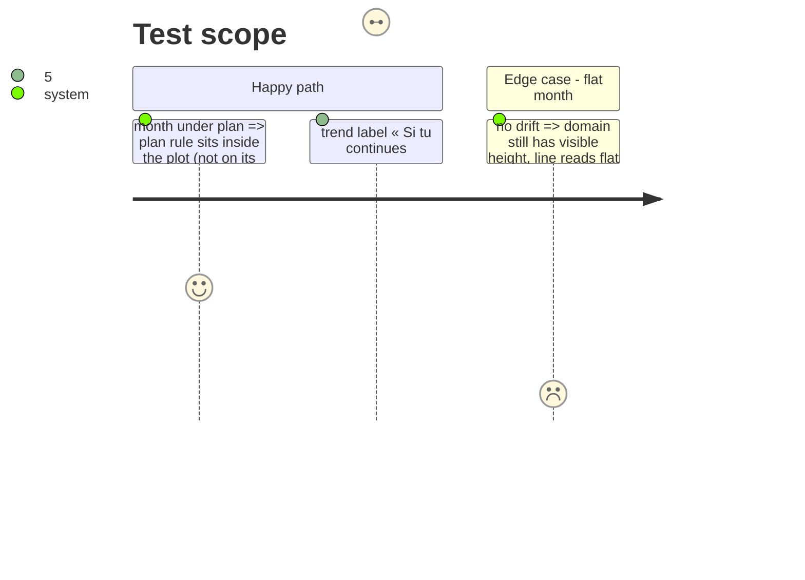

# Instruction: Graphe lisible : base, marge, aucune collision

## Architecture projection

```txt
ios/Pulpe
├── Features/CurrentMonth/Components/HomeHeroCard+Chart.swift   ✏️ domain floor, leading inset, label layout
├── Shared/Design/DesignTokens+Chart.swift                       ✏️ floorRatio, leadingInset
└── ios/PulpeTests/Features/CurrentMonth/HomeHeroCardTests.swift ✏️ chartYDomain assertions
```

## Test Scope



## Wireframe

```txt
│  Prévu 10'648 ─ ─ ─ ─ ─ ─ ─ ─ ─ ─ ─ ─   │ 1
│   ▔▔▔▔▔╲                                │
│         ╲▁▁▁╲                           │ 2
│              ●╌╌╌╌╌╌╌╌╌╌╌╌╌╌ 9'237      │ 3
│           Aujourd'hui     Si tu continues│
│  ─────────────── plancher ────────────── │ 4
```

1. Plan rule with air above it.
2. Line starts inset from the edge.
3. Trend figure at stroke end, on its own row.
4. Explicit floor: domain min = min(points) − span × floorRatio.

## Tasks to do

### `1)` Domain with air

1. `chartYDomain`: add headroom above max and a floor below min (token `domainPaddingRatio` already exists; raise or split into top/bottom).
2. `.chartXScale(domain:)`: keep 0…totalDays but add `.padding(.leading, DesignTokens.Chart.leadingInset)` on the plot so the line does not touch x=0.

### `2)` Labels that never collide

1. Trend label: `position: .trailing` at the stroke end, one row; dot label « Aujourd'hui » `position: .bottom`; plan label `position: .top`. Three labels, three positions, no `gapLabelPosition` logic.
2. Orange text on the hero ≥ 4.5:1: use `heroInk` for the figure, tint only a 6 pt marker if colour is needed.

## Test acceptance criteria

| Task | Acceptance criteria |
| ---- | ------------------- |
| 1 | `chartYDomain` upper > plannedBalance and lower < min(landing) for a drifted fixture; screenshot shows air above the rule and a leading inset |
| 2 | Screenshot: no label crossed by a stroke at the three widths (SE, Pro, Pro Max) |
