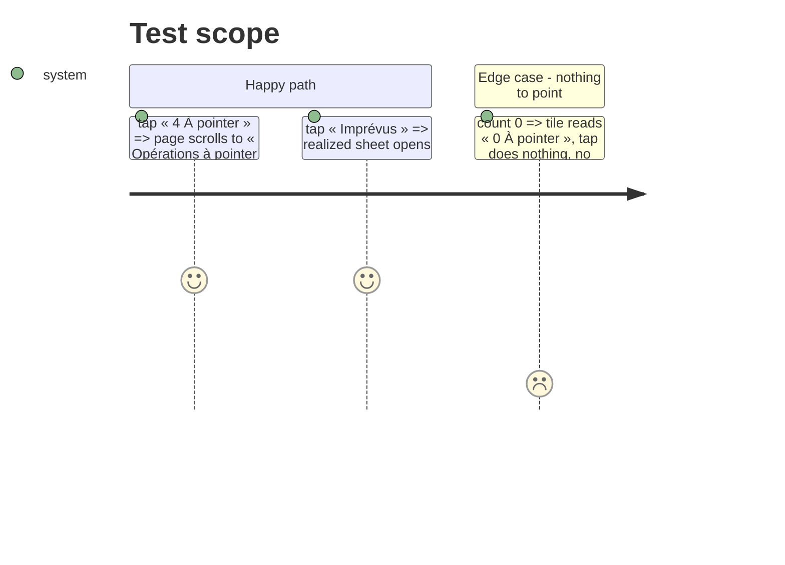

# Instruction: Une tuile, une destination

## Architecture projection

```txt
ios/Pulpe
├── Features/CurrentMonth/Components/HomeHeroCard.swift   ✏️ two buttons (onTapUnchecked, onTapVariance)
├── Features/CurrentMonth/CurrentMonthView.swift          ✏️ unchecked → scrollTo deck; variance → realized sheet
└── ios/PulpeTests/Features/CurrentMonth/HomeHeroCardTests.swift ✏️ a11y labels per tile
```

## Test Scope



## Tasks to do

### `1)` Split the metrics button

1. `HomeHeroCard`: `metricsButton` becomes two `Button`s inside `HeroMetricTileRow`; each with its own a11y label and hint; chevron on both when actionable.
2. `CurrentMonthView`: `ScrollViewReader` + `.id("uncheckedDeck")` on `UncheckedOperationsCard`; `onTapUnchecked` → `proxy.scrollTo("uncheckedDeck", anchor: .top)` with `gentleSpring`; `onTapVariance` → `activeSheet = .realizedBalance`.
3. Check `homeHeroMetrics` UI tests (`ContextualCreationUITests`) and rename identifiers.

## Test acceptance criteria

| Task | Acceptance criteria |
| ---- | ------------------- |
| 1 | Two distinct accessibility elements with their own hints; UI tests green; screenshot after tap shows the deck at the top of the white frame |
