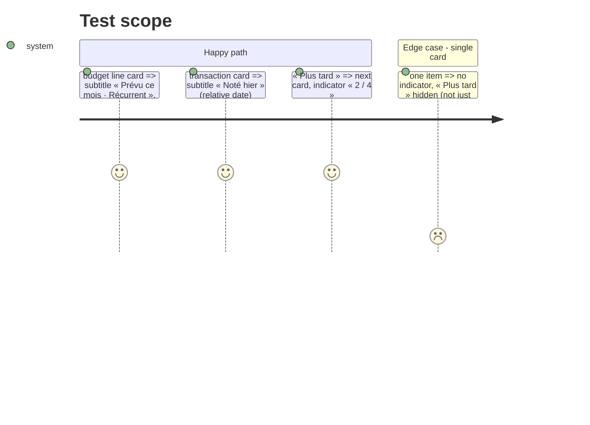

# Instruction: Deck : dire ce qui aide à décider

## Architecture projection

```txt
ios/Pulpe
├── Features/CurrentMonth/Components/UncheckedOperationsCard.swift  ✏️ subtitle, position indicator, peek off
├── Features/CurrentMonth/Components/UncheckedOperationsCard+DeckSlot.swift ✏️ drop wrap copies if peek goes
└── ios/PulpeTests/Features/CurrentMonth/UncheckedOperationsCardDeckTests.swift ✏️
```

## Test Scope



## Wireframe

```txt
┌ Opérations à pointer ──────────── Tout voir › ┐
│ ┌──────────────────────────────────────────┐ │
│ │ ◎ Assurance habitation        -25.00     │ │
│ │   Prévu ce mois · Récurrent              │ │ 1
│ │ ─────────────────────────────────────── │ │
│ │ [✓ C'est passé]   Plus tard        1 / 4 │ │ 2
│ └──────────────────────────────────────────┘ │
└──────────────────────────────────────────────┘
```

1. Subtitle answers « should this have happened already? ».
2. Position replaces the edge peek; card takes full width.

## Tasks to do

### `1)` Subtitle that helps

1. `subtitle(for:)`: budget line → « Prévu ce mois · \(recurrence.label) »; transaction → « Noté \(relativeFormatted) » (lowercase rule per locale comment stays).
2. Colour `textSecondary` (≥ 4.5:1), not `textTertiary`.

### `2)` Position instead of peek

1. Remove the edge peek (`containerRelativeFrame` inset + wrap copies) ; keep the horizontal paging and the cycle.
2. Add « \(index+1) / \(count) » trailing on the actions row, `labelMedium`, `textSecondary`, hidden when count == 1.
3. Hide « Plus tard » when count == 1.
4. Update `UncheckedOperationsCardDeckTests` (cycle logic unchanged, wrap copies may go).

## Test acceptance criteria

| Task | Acceptance criteria |
| ---- | ------------------- |
| 1 | Subtitle strings asserted for both kinds; contrast token changed |
| 2 | No clipped neighbour on either edge in screenshot; indicator updates on « Plus tard »; deck tests green |
