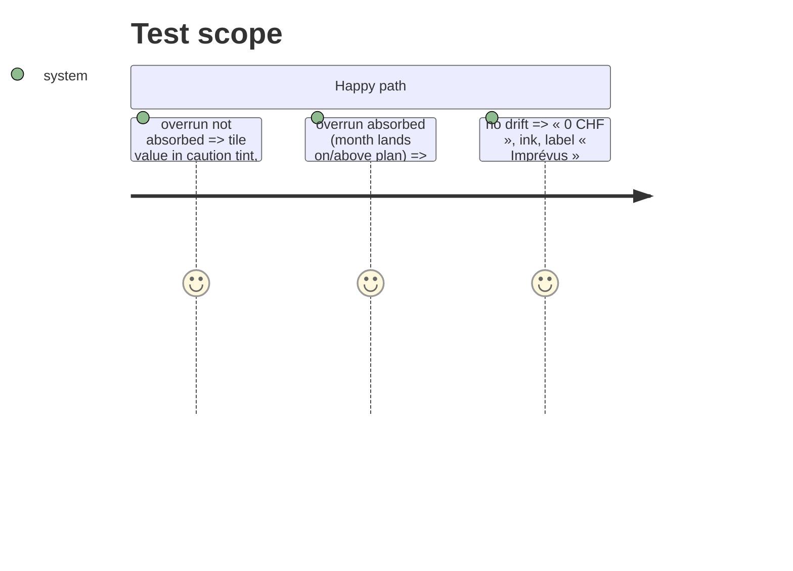

# Instruction: Imprévus sans alarme quand c'est compensé

## Architecture projection

```txt
ios/Pulpe
├── Shared/Components/HeroZone/HeroVerdictPresentation.swift   ✏️ varianceTint uses absorbsEnvelopeOverrun
├── Features/CurrentMonth/Components/HomeHeroCard.swift        ✏️ tile label « Imprévus · compensés » when absorbed
└── ios/PulpeTests/Features/CurrentMonth/HomeHeroCardTests.swift ✏️
```

## Test Scope



## Tasks to do

### `1)` One meaning per colour

1. `HeroVerdictPresentation`: `varianceTint` = caution only when `verdict == .overrun`; otherwise `heroInk`. Orange means « needs your attention », nothing else on this card.
2. `HomeHeroCard`: label « Imprévus · compensés » when `absorbsEnvelopeOverrun && variance != 0`.
3. Keep `DriftCard` wording « compensé ailleurs ce mois » in sync (same predicate, already shared).

## Test acceptance criteria

| Task | Acceptance criteria |
| ---- | ------------------- |
| 1 | Three cases asserted on tint and label; lexicon test green |
