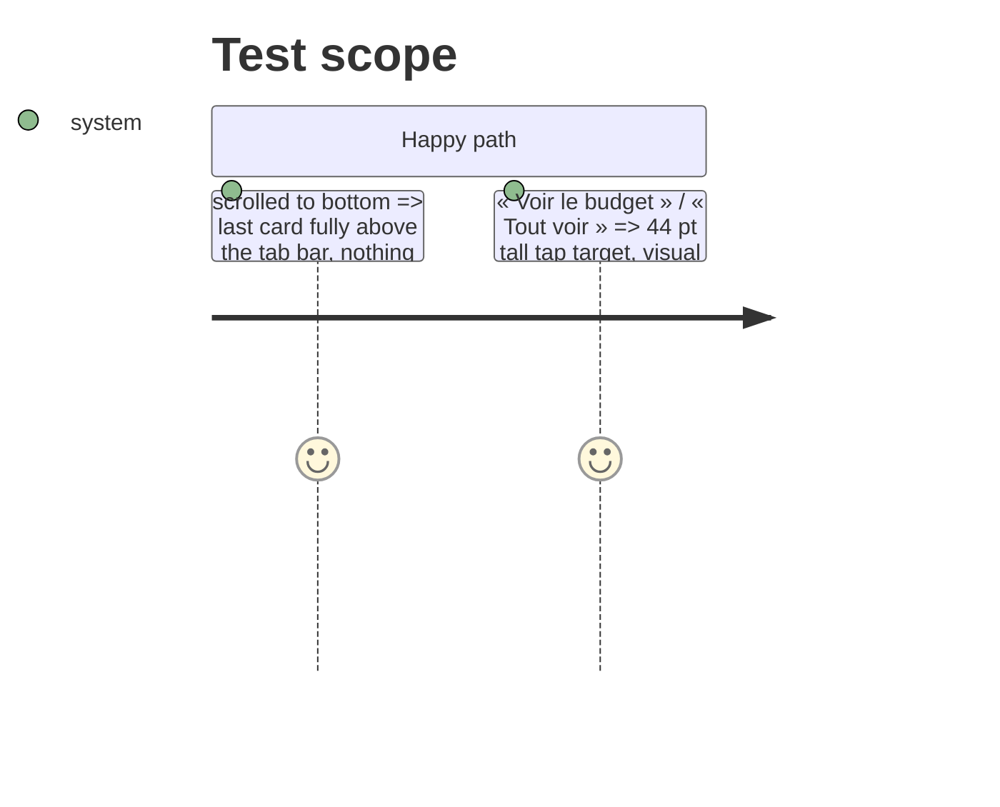

# Instruction: Bas d'écran : rien ne se cache sous la barre

## Architecture projection

```txt
ios/Pulpe
├── Features/CurrentMonth/CurrentMonthView.swift               ✏️ bottom content inset = tab bar height + lg
├── Shared/Components/HeroZone/HeroVerdictRow.swift            ✏️ link hit area ≥ 44 pt
└── Shared/Components/SectionHeader.swift                      ✏️ « Tout voir » hit area ≥ 44 pt
```

## Test Scope



## Tasks to do

### `1)` Bottom inset

1. `CurrentMonthView` scroll content: `.safeAreaPadding(.bottom, …)` or `.contentMargins(.bottom, DesignTokens.TabBar.clearance, for: .scrollContent)`; verify against `BudgetDetailsView` which may already solve it (reuse the same modifier).

### `2)` 44 pt links

1. `HeroVerdictRow` link and `SectionHeader` link: `.frame(minHeight: DesignTokens.TapTarget.minimum)` + `.contentShape(Rectangle())`, no visual change.

## Test acceptance criteria

| Task | Acceptance criteria |
| ---- | ------------------- |
| 1 | Screenshot at scroll end: no content under the bar |
| 2 | Accessibility Inspector (or `accessibilityFrame` test) reports ≥ 44 pt on both links |
