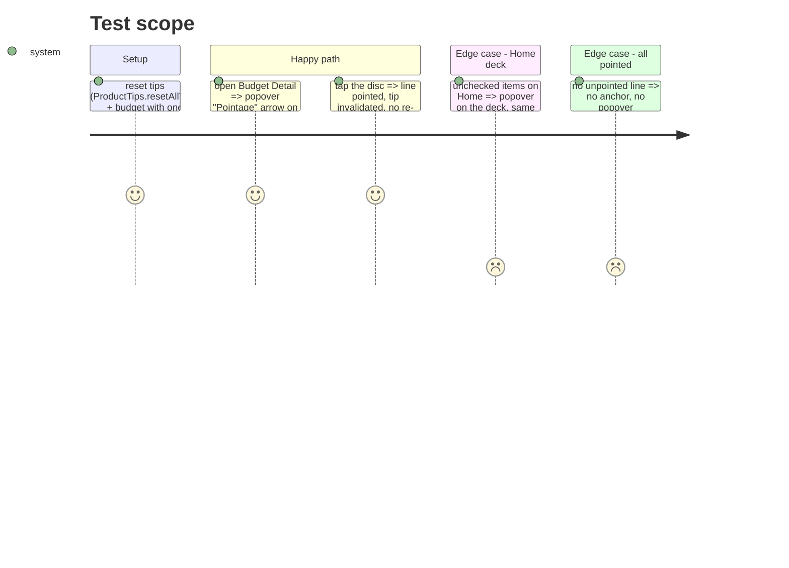

# Instruction: Tips pointage à jour et ancrés sur le vrai contrôle

## Architecture projection

```txt
ios/Pulpe
├── Features/Tips/ProductTips.swift                              ✏️ drop GesturesTip + instance, rewrite CheckingTip copy
├── Features/CurrentMonth/Components/BudgetSection.swift         ✏️ drop `tip` param, TipView, gestures.invalidate calls
├── Features/CurrentMonth/CurrentMonthView.swift                 ✏️ keep .popoverTip on deck (copy now actionable)
├── Features/Budgets/BudgetDetails/BudgetDetailsView.swift       ✏️ compute checkingTipLineId, remove popoverTip on filter
├── Features/Budgets/BudgetDetails/BudgetMixedSection.swift      ✏️ pass checkingTipLineId through
├── Features/Budgets/BudgetDetails/BudgetLineMixedRow.swift      ✏️ .popoverTip(ProductTips.checking) on PointCircle when id matches
└── App/BudgetLongPressUITestHarness.swift                       ✏️ drop BudgetSection tip arg if any
```

## Test Scope



## Tasks to do

### `1)` Remove the dead gestures tip

> No tip describes a gesture the app no longer has.

1. Delete `GesturesTip`, `ProductTips.gestures`.
2. `BudgetSection`: remove `tip` property/init arg, the `TipView` block, every `ProductTips.gestures.invalidate`.
3. Fix any caller passing `tip:` (harness).

### `2)` Make the checking tip say how, and point at the disc

> First-time user sees the arrow on the control that points, with the gesture in words.

1. `CheckingTip` copy: title « Pointer un mouvement », message « Dès qu'un mouvement est passé sur ton compte, touche le rond devant sa ligne (ou « C'est passé » sur l'accueil). Pulpe garde le fil de ce qui est réel. » Keep `MaxDisplayCount(3)`, rules unchanged.
2. `BudgetDetailsView`: drop `.popoverTip` on `BudgetTypeFilter`; compute `checkingTipLineId` = first line in display order that is `!isChecked`, not virtual rollover, not planned savings withdrawal.
3. Thread `checkingTipLineId: String?` → `BudgetMixedSection` → `BudgetLineMixedRow`; in the row, apply `.popoverTip(ProductTips.checking)` to the `PointCircle` only when `line.id == checkingTipLineId`.
4. Build `-configuration Local` on the dedicated test sim, run `PulpeTests` Tips + BudgetDetails suites, swiftlint strict.
5. Screenshot Budget Detail fresh (reset datastore via `xcrun simctl` app reinstall) to confirm arrow on the disc and no overlap with hero.

## Test acceptance criteria

| Task | Acceptance criteria |
| ---- | ------------------- |
| 1 | `grep -rn GesturesTip ios/` returns nothing; build green |
| 2 | Fresh install, Budget Detail with an unpointed line: popover arrow sits on that line's disc, copy names the tap; tapping the disc points the line and the tip stops showing; Home deck still shows the same tip once |
