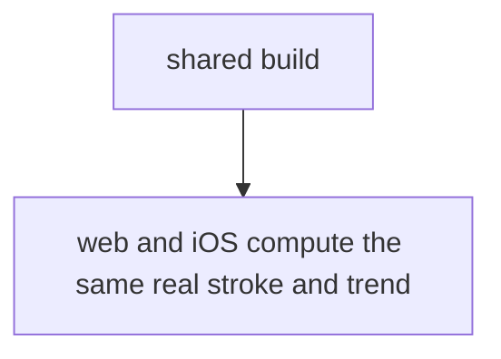
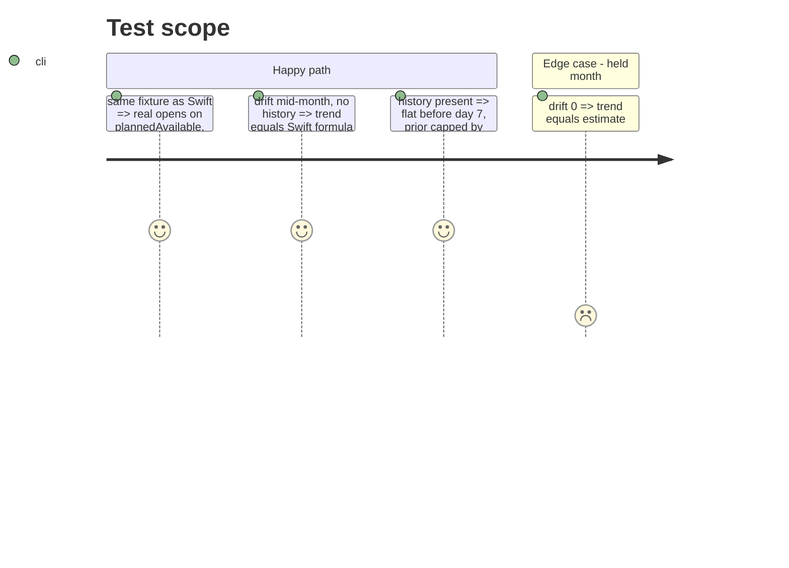

# Instruction: TS trajectory mirrors `real` and `trendBalance`

## Architecture projection

```txt
shared/src/calculators
├── balance-trajectory.ts        ✏️ `real`, `plannedAvailable`, `trendBalance(priorDays, history?)`, `PRIOR_WARMUP_DAYS`
└── balance-trajectory.spec.ts   ✏️ one `it` per Swift test in `BalanceTrajectoryTests` (real_*) and `HomeHeroCardTrendTests`
```

## User Journey



## Test Scope



## Tasks to do

### `1)` Port `real` series

> Same semantics as `realSeries` in `ios/Pulpe/Domain/Formulas/BalanceTrajectory.swift`.

1. Add `checkedAt?: string | null` to `TrajectoryBudgetLine` and `TrajectoryTransaction` (transaction also needs `isChecked`/`checkedAt`, match the API field).
2. `plannedAvailable` = `calculateAllMetrics(lines, [], rollover).available`.
3. `real[d]` = `plannedAvailable − calculateRealizedExpenses(lines toggled to unchecked when checkedAt ≥ day d, checked transactions dated < day d)`; last reading takes everything checked.

### `2)` Port `trendBalance`

> Same formula as Swift, including `history` prior guards.

1. Export `trendBalance(trajectory, priorDays, history?)` where `history` is `DriftHistory` from `shared/schemas.ts`.
2. `PRIOR_WARMUP_DAYS = 7`; round to 2 decimals.

### `3)` Tests

> Mirror the Swift cases one to one, same numbers.

1. `real_*` cases from `BalanceTrajectoryTests.swift:177-215`.
2. Trend cases from `HomeHeroCardTrendTests.swift`.
3. `cd shared && pnpm test` green; `pnpm build:shared`.

## Test acceptance criteria

| Task | Acceptance criteria |
| ---- | ------------------- |
| 1 | For the Swift fixtures, `real` produces the same balances day by day. |
| 2 | For the Swift fixtures, `trendBalance` returns the same 2-decimal value with and without history. |
| 3 | `shared` tests green; Swift file header still names the TS file and vice versa. |
