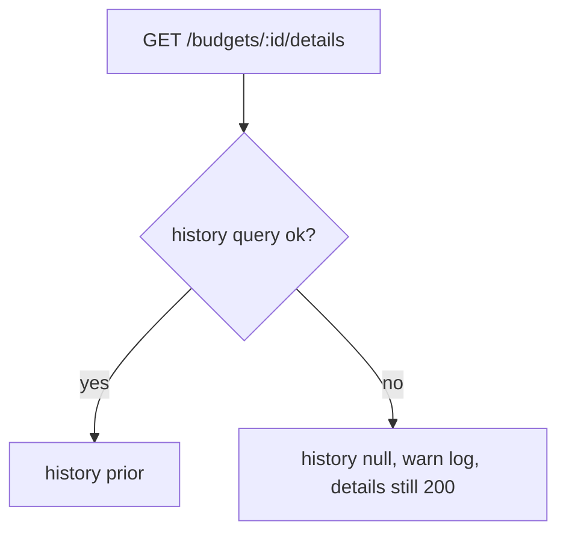
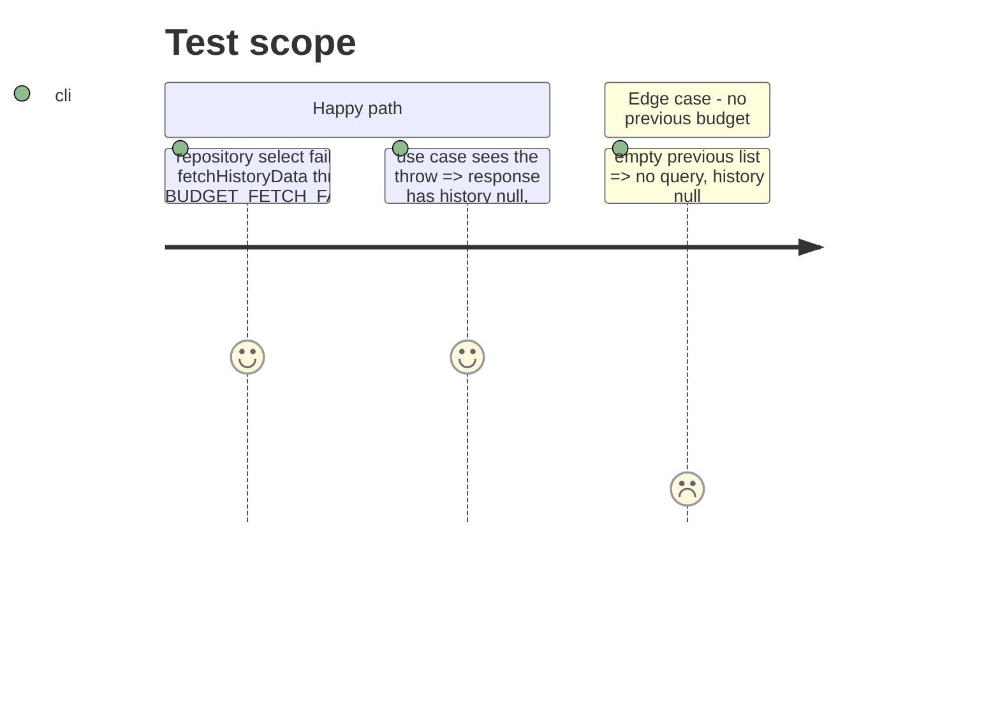

# Instruction: History query errors surface instead of faking data

## Architecture projection

```txt
backend-nest/src/modules/budget
├── infrastructure/persistence/supabase-budget.repository.ts   ✏️ `fetchHistoryData` throws on either select error
├── application/find-budget-with-details.use-case.ts           ✏️ `computeHistory` catches, logs, returns null
└── application/find-budget-with-details.use-case.spec.ts      ✏️ failing history => details still returned, history null
```

## User Journey



## Test Scope



## Tasks to do

### `1)` Throw in the repository

> Same pattern as `fetchAllBudgets`.

1. Check `budgetLinesResult.error` and `transactionsResult.error`; throw `BusinessException(ERROR_DEFINITIONS.BUDGET_FETCH_FAILED, …)`.

### `2)` Degrade in the use case

> A broken prior must not break the screen.

1. Wrap `computeHistory` body in try/catch; on error `this.logger.warn({ budgetId, operation: 'budget.history.failed' })` and return `null`.
2. Spec: mock `fetchHistoryData` rejecting; expect `history` null and the rest intact.

## Test acceptance criteria

| Task | Acceptance criteria |
| ---- | ------------------- |
| 1 | A Supabase error on either select rejects with `BUDGET_FETCH_FAILED` instead of returning empty months. |
| 2 | Details still resolve with `history: null` and one warn log when the history fetch rejects. |
