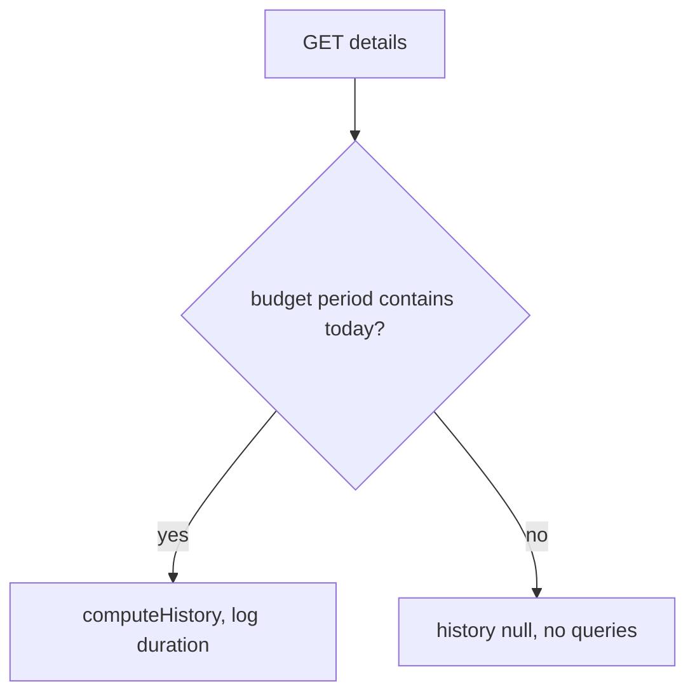
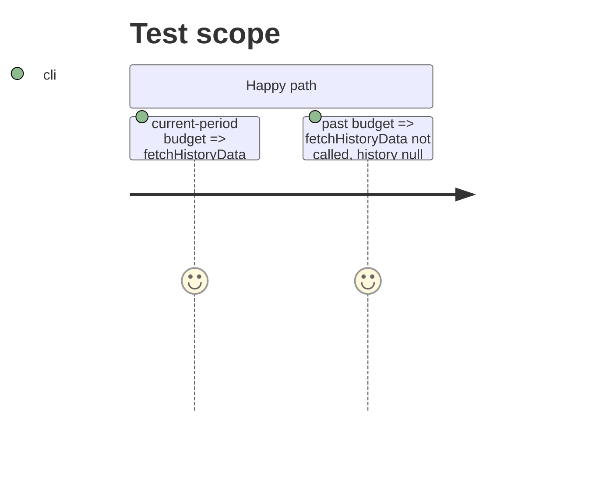

# Instruction: History cost measured, skipped off the current period

## Architecture projection

```txt
backend-nest/src/modules/budget/application
├── find-budget-with-details.use-case.ts        ✏️ skip `computeHistory` unless budget is the current period; log `historyMs`
└── find-budget-with-details.use-case.spec.ts   ✏️ past budget => no history fetch; current => fetched and timed
```

## User Journey



## Test Scope



## Tasks to do

### `1)` Gate on the current period

> Only the home projection reads the prior.

1. Use `getBudgetPeriodDates(budget.month, budget.year, payDayOfMonth)` from `pulpe-shared`; compute only when `startDate <= now <= endDate`.
2. Inject `now` for tests the way `driftHistory` already does (default `new Date()`).

### `2)` Measure

> "Persist only if the cost shows up" needs a number.

1. `performance.now()` around `computeHistory`; add `historyMs` to the `budget.details.fetched` log.

## Test acceptance criteria

| Task | Acceptance criteria |
| ---- | ------------------- |
| 1 | A past budget's details carry `history: null` without any history query. |
| 2 | The fetched log line includes `historyMs` for a current budget. |
