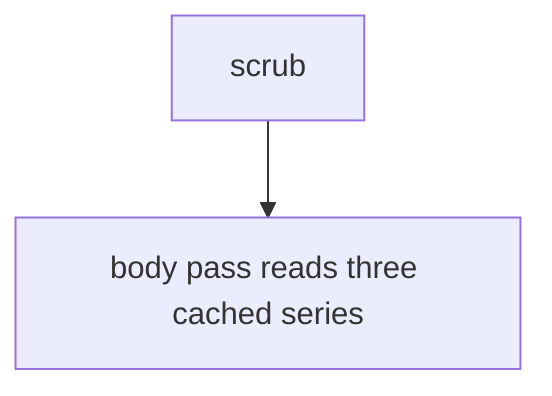
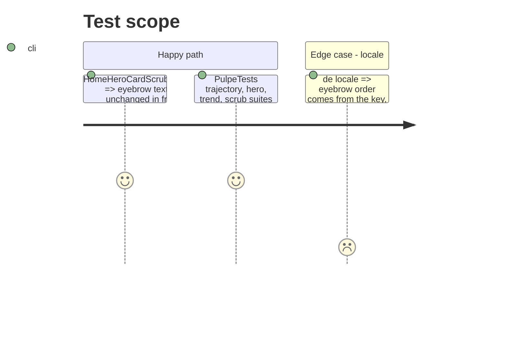

# Instruction: Chart body hoists its series, eyebrow is one key

## Architecture projection

```txt
ios/Pulpe/Features/CurrentMonth/Components
├── HomeHeroCard+Chart.swift   ✏️ `let plan/projection/yDomain` computed once at top of `balanceChart`
├── HomeHeroCard+Scrub.swift   ✏️ `scrubEyebrow` uses one localized key "%@ · Prévu %@"
└── ios/Pulpe/Resources/Localizable.xcstrings ✏️ new key, en/de/it
```

## User Journey



## Test Scope



## Tasks to do

### `1)` Hoist

1. In `balanceChart`, bind `Self.plan(for:)`, `Self.projection(for:)`, `Self.chartYDomain(for:)` once; replace the inline calls.

### `2)` One key

1. `AppLocale.string("\(lead) · Prévu \(amount)")` with `lead` itself localized; add translations; run `swiftlint --strict` on both files.

## Test acceptance criteria

| Task | Acceptance criteria |
| ---- | ------------------- |
| 1 | No `Self.plan(for:)`/`projection(for:)`/`chartYDomain(for:)` call inside a `ForEach` or annotation closure. |
| 2 | Existing scrub tests pass unchanged; the new key has en/de/it localizations. |
