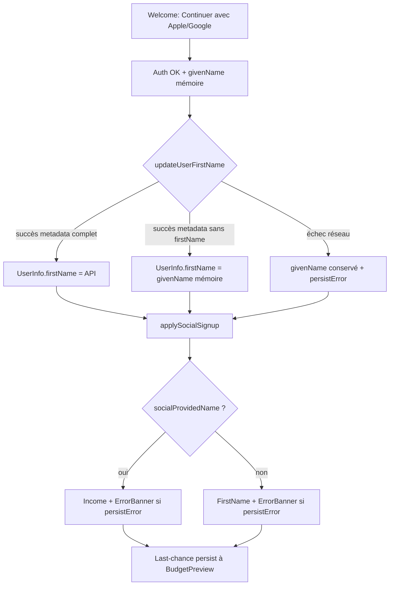

# Instruction: persister sans perdre le prénom, montrer l’échec

## Architecture projection

> Tree of the final files. ✅ create · ✏️ modify · ❌ delete

```txt
ios/Pulpe/
├── Core/Auth/
│   └── FirstNameResolver.swift                 ✏️ coalescing(_:fallbackFirstName:)
├── Features/Auth/Components/
│   └── SocialLoginButtons.swift                ✏️ coalesce après update ; passer Error? à onAuthenticated
├── Features/Onboarding/
│   ├── OnboardingState.swift                   ✏️ applySocialSignup(_:persistError:) + persistFirstName
│   └── Steps/WelcomeStep.swift                 ✏️ déléguer à applySocialSignup
└── PulpeTests/
    ├── Core/Auth/FirstNameResolverTests.swift  ✏️ cas coalesce
    └── Features/Onboarding/OnboardingSocialSignupTests.swift  ✏️ applySocialSignup + persistFirstName
```

## User Journey



## Wireframe

```
┌─────────────────────────────────────┐
│ (1) ←  Revenus              2 / 4   │
├─────────────────────────────────────┤
│ (2)  Tu comptes en francs           │
│      ou en euros ?                  │
│                                     │
│ (3)  Revenu mensuel net *           │
│      [ 5000                      ]  │
│                                     │
│ (4)  ⚠  Le prénom n’a pas           │
│      pu être enregistré.            │
│      [ Fermer ]                     │
│                                     │
│                          [ Continuer ] (5)
└─────────────────────────────────────┘
```

1. Chrome onboarding existant (progress + back).
2. Copy Income inchangée — pas de nouvel écran.
3. Champ revenu existant.
4. `ErrorBanner` déjà rendu par `OnboardingStepView` depuis `state.error` — c’est la région qui manquait après Welcome.
5. CTA existant ; l’onboarding continue. Retry persist = last-chance à la fin.

Si Apple n’a pas donné de `givenName`, même bannière sur l’étape Prénom au lieu d’Income.

## Tasks to do

### `1)` Coalescer le `UserInfo` persisté avec le prénom mémoire

> Warning review : `patchFirstName` remplace `user` par l’API ; metadata sans `firstName` droppe Apple/Google et casse PUL-112.

1. `FirstNameResolver.coalescing(_:fallbackFirstName:)` → `firstName = normalized(persisted.firstName) ?? normalized(fallback)`.
2. Dans `SocialLoginSection.patchFirstName`, après `updateUserFirstName` réussi : `user = coalescing(updated, fallbackFirstName: name)` — ne plus assigner l’API brute.
3. Dans `OnboardingState.persistFirstName` : même coalesce sur `authenticatedUser` (aujourd’hui seul `firstName` String est coalescé).

### `2)` Faire vivre l’erreur de persist sur l’étape suivante

> Warning review : `errorMessage` est posé après `onAuthenticated` ; Welcome a déjà `nextStep()`.

1. `onAuthenticated: ((UserInfo, Error?) async -> Void)?` — second argument = erreur persist, `nil` si écriture OK ou rien à écrire.
2. `OnboardingState.applySocialSignup(_:persistError:)` : `configureSocialUser` ; si erreur, `error = APIError.serverError(message: AuthErrorLocalizer.localize(persistError))` (même pattern que `finishOnboarding`) ; puis `nextStep()`.
3. `WelcomeStep` appelle uniquement `applySocialSignup`. Ne plus compter sur le banner local de `SocialLoginSection` après navigation.
4. Login (pas `onAuthenticated`) : inchangé. Ne pas persist, ne pas écraser un `firstName` existant.

### `3)` Tests

> Verrouiller les deux warnings.

1. Resolver : API sans `firstName` + fallback `"Marie"` → `"Marie"` ; API `"Léa"` + fallback `"Marie"` → `"Léa"` ; whitespace API → fallback.
2. `persistFirstName` : persist qui renvoie `UserInfo` sans `firstName` → `authenticatedUser.firstName == "Marie"`.
3. `applySocialSignup` avec persistError + user `"Marie"` → `socialProvidedName`, `currentStep == .income`, `error != nil`.
4. `applySocialSignup` sans erreur + user sans prénom → `currentStep == .firstName`, `error == nil`.

## Test acceptance criteria

| Task | Acceptance criteria |
| ---- | ------------------- |
| 1 | Un `updateUserFirstName` dont le `UserInfo` omet `firstName` laisse le givenName Apple/Google sur `user` ; `configureSocialUser` skippe encore l’étape Prénom. |
| 2 | Un échec persist social pose `OnboardingState.error` avant `nextStep()` ; Income (ou Prénom) montre le banner ; Welcome n’est plus l’unique surface. |
| 3 | Les 4 cas de tests ci-dessus passent. Login social n’appelle toujours pas persist. |
