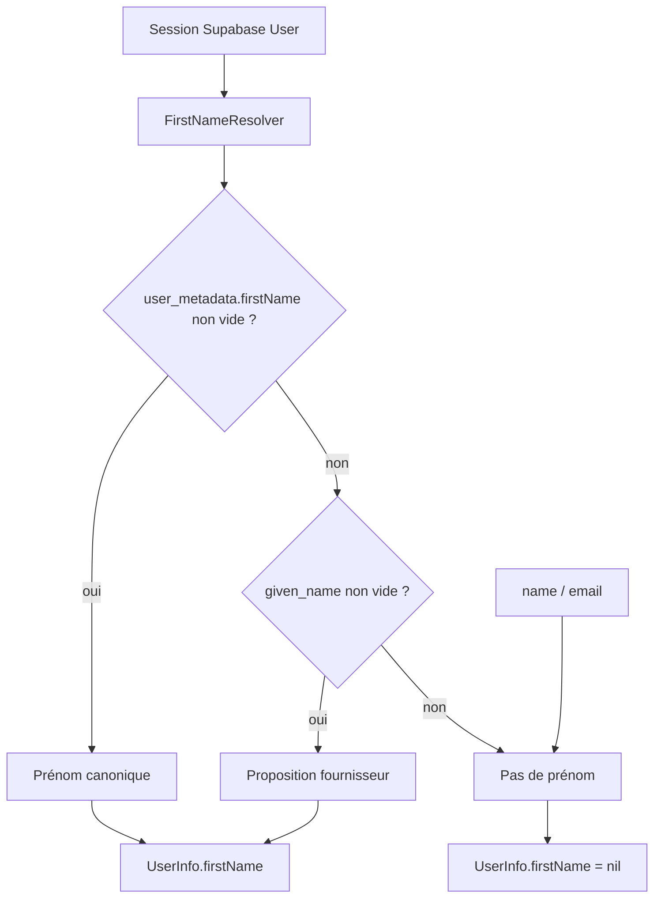

# Instruction: résolution canonique et API de persistance

## Architecture projection

> Tree of the final files. ✅ create · ✏️ modify · ❌ delete

```txt
ios/Pulpe/
├── Core/Auth/
│   ├── FirstNameResolver.swift          ✅ source unique firstName → given_name
│   ├── AuthService.swift                ✏️ persist trim + refuse vide + UserInfo
│   ├── AuthService+UserInfo.swift       ✏️ plus de fallback `name`
│   └── AuthTypes.swift                  ✏️ inchangé sauf si helper de merge
└── PulpeTests/Core/Auth/
    ├── FirstNameResolverTests.swift     ✅ matrice metadata
    └── AuthServiceUserInfoTests.swift   ✏️ `name` n’est plus un prénom
```

## User Journey



## Tasks to do

### `1)` Extraire `FirstNameResolver`

> Une priorité, zéro heuristique e-mail.

1. `normalized(_:)` : trim, nil si vide.
2. `canonical(from userMetadata:)` : `firstName` puis `given_name` seulement.
3. Jamais `name`, `full_name`, local-part d’e-mail, Private Relay.

### `2)` Brancher `AuthService.userInfo`

> Même lecture partout, y compris recovery.

1. Remplacer le bloc `firstName` / `given_name` / `name` dans `AuthService+UserInfo.swift`.
2. `beginPasswordRecovery` ne lit déjà que `firstName` : le laisser, ou passer par le resolver sans réintroduire `name`.

### `3)` Durcir `updateUserFirstName`

> Plus d’écriture vide, plus d’ignorer la réponse.

1. Trim ; throw si vide (ne pas appeler Supabase).
2. `supabase.auth.update(user: UserAttributes(data: ["firstName": .string(trimmed)]))`.
3. Construire `UserInfo` depuis l’`User` retourné (le SDK renvoie l’utilisateur mis à jour).
4. Ne pas écraser un `firstName` déjà persisté par un appel fournisseur vide : garde dans le resolver / l’appelant, pas en fusion aveugle de tout le metadata.

### `4)` Inverser les tests qui figent le bug

> CA4 et CA6 se jouent ici.

1. Cas `name` seul → `firstName == nil`.
2. Cas `given_name` + `name` → `given_name`.
3. Cas `firstName` + `given_name` + `name` → `firstName`.
4. Whitespace-only → nil.
5. E-mail / Private Relay dans metadata ou fallbackEmail → jamais utilisés comme prénom.

## Test acceptance criteria

| Task | Acceptance criteria |
| ---- | ------------------- |
| 1 | Un metadata sans `firstName` ni `given_name` produit nil, même si `name` ou un e-mail est présent. |
| 2 | `AuthService.userInfo` et les lectures recovery n’utilisent plus `name` comme prénom. |
| 3 | Un persist avec `"  Marie  "` écrit `"Marie"` ; `""` / `"   "` n’appelle pas Supabase. |
| 4 | `AuthServiceUserInfoTests` échoue si quelqu’un réintroduit le fallback `name`. |
