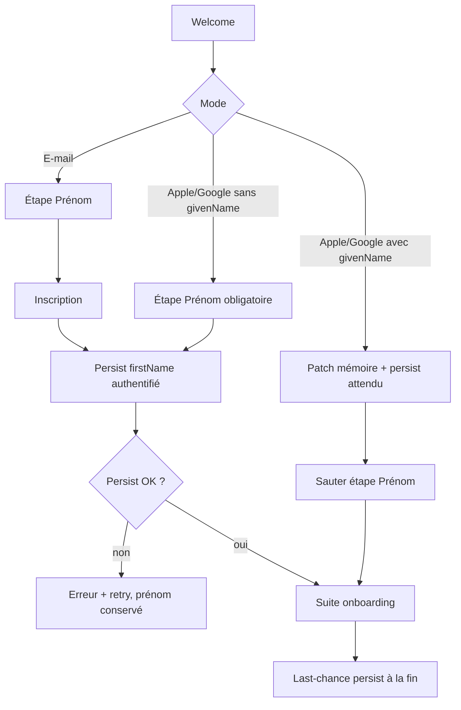

# Instruction: capturer et attendre le prénom pendant l’onboarding

## Architecture projection

> Tree of the final files. ✅ create · ✏️ modify · ❌ delete

```txt
ios/Pulpe/
├── Core/Auth/
│   ├── AppleSignInCoordinator.swift     ✏️ givenName déjà lu — ne pas relâcher
│   ├── GoogleSignInCoordinator.swift    ✏️ garder profile.givenName seulement
│   └── AuthService.swift                ✏️ signUp e-mail avec data firstName si le SDK le permet
├── Features/Auth/Components/
│   └── SocialLoginButtons.swift         ✏️ await persist ; plus de Task fire-and-forget
├── Features/Onboarding/
│   ├── OnboardingState.swift            ✏️ garder le prénom saisi / reçu pour retry
│   ├── OnboardingFlow.swift             ✏️ persist last-chance avant completeOnboarding
│   ├── Steps/FirstNameStep.swift        ✏️ erreur persist visible, saisie conservée
│   └── Steps/RegistrationStep.swift     ✏️ persist dès session e-mail créée
└── PulpeTests/
    ├── Features/Onboarding/OnboardingSocialSignupTests.swift  ✏️ PUL-112 + persist
    ├── Features/Onboarding/OnboardingFlowTests.swift          ✏️ e-mail persiste firstName
    └── Core/Auth/AppleSignInCoordinatorTests.swift            ✏️ givenName sur le résultat si injectable
```

## User Journey



## Wireframe

```
┌─────────────────────────────────────┐
│ (1) Progression · Retour            │
├─────────────────────────────────────┤
│ (2) Comment tu t'appelles ?         │
│     Juste ton prénom                │
│                                     │
│ (3) Prénom *                        │
│     [ Ton prénom                 ]  │
│                                     │
│ (4) Erreur persist / Réessayer      │
│                                     │
│ (5) Continuer                       │
└─────────────────────────────────────┘
```

1. Chrome onboarding existant.
2. Titre / sous-titre actuels — inchangés si Apple n’a pas fourni de prénom.
3. Champ obligatoire déjà en place.
4. Zone d’échec : pas un succès silencieux ; le texte du champ reste.
5. CTA bloqué tant que le prénom trimé est vide.

Pas de nouvel écran si Apple a fourni un `givenName` valide (PUL-112).

## Tasks to do

### `1)` Tuer le fire-and-forget social

> CA2, CA10, commentaire Apple à inverser.

1. Dans `SocialLoginButtons.patchFirstName`, `await updateUserFirstName` sur le chemin `onAuthenticated` / `.newUser`.
2. Réinjecter le `UserInfo` retourné (ou au moins `firstName`) avant `configureSocialUser`.
3. Si l’update échoue : garder `givenName` sur `UserInfo` / `OnboardingState`, afficher l’erreur du bouton social, permettre de continuer l’onboarding avec retry plus tard — ne pas logger-and-forget.
4. Login (pas signup) : ne pas appeler persist avec un givenName vide ; ne pas écraser un `firstName` déjà en metadata (CA9).

### `2)` E-mail : persist dès authentifié

> CA1 — aujourd’hui `signup(email:password:)` n’envoie aucune metadata, et `finishOnboarding` n’écrit pas le prénom.

1. Après `signUp` réussi (session existe), persist `OnboardingState.firstName` trimé.
2. Si le SDK `signUp` accepte `data:`, l’envoyer à la création ; sinon `updateUserFirstName` immédiat.
3. Last-chance dans `finishOnboarding` si `currentUser.firstName` est encore vide et l’état a un prénom valide.

### `3)` Social sans prénom fournisseur

> CA5 — déjà navigué ; il manque la persistance.

1. Garder l’étape visible et bloquante (`isFirstNameValid`).
2. Une fois authentifié, persist au `nextStep` depuis `.firstName` (ou last-chance à la fin).
3. Ne pas préremplir depuis l’e-mail Private Relay (déjà vrai après `resetDraftFields` ; ne pas casser PUL-196).

### `4)` Non-régression PUL-112

> CA3 — ne pas redemander Apple.

1. `socialProvidedName` reste true seulement si `givenName` fournisseur non vide.
2. `OnboardingSocialSignupTests` : skip firstName+registration si prénom Apple ; show firstName si nil/vide.
3. Google : uniquement `profile.givenName` / `given_name`, jamais `profile.name`.

## Test acceptance criteria

| Task | Acceptance criteria |
| ---- | ------------------- |
| 1 | Un échec `updateUserFirstName` n’est plus avalé par un `Task` détaché ; le prénom Apple reçu reste en mémoire. |
| 2 | Après inscription e-mail, `user_metadata.firstName` contient le prénom saisi avant la fin d’onboarding. |
| 3 | Apple/Google sans givenName : on ne quitte pas l’étape Prénom avec un champ vide ; la valeur saisie est persistée comme l’e-mail. |
| 4 | Apple avec givenName : l’étape Prénom n’apparaît pas. Google `name` n’alimente pas `UserInfo.firstName`. |
| 4 | Reconnexion Apple/Google sans nom : un `firstName` déjà persisté reste (CA9). |
