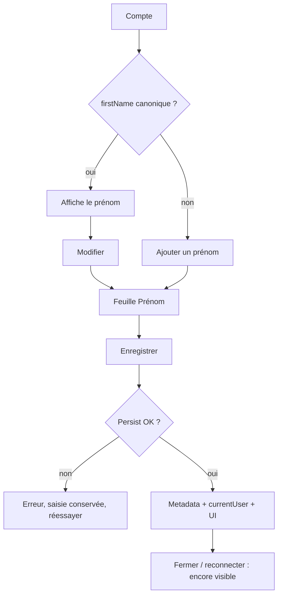

# Instruction: afficher et éditer le prénom dans Compte

## Architecture projection

> Tree of the final files. ✅ create · ✏️ modify · ❌ delete

```txt
ios/Pulpe/
├── App/
│   └── AppState+Auth.swift              ✏️ currentUser.firstName après update
├── Features/Account/
│   ├── AccountView.swift                ✏️ prénom visible / CTA ajouter
│   ├── EditFirstNameSheet.swift         ✅ feuille d’édition
│   └── EditFirstNameViewModel.swift     ✅ trim, persist, réinjecte UserInfo
├── Shared/Components/
│   └── ProfileAvatar.swift              ✏️ inchangé : initiale e-mail = glyphe, pas un prénom
└── PulpeTests/Features/Account/
    ├── EditFirstNameViewModelTests.swift ✅ CA7–CA8, CA10
    └── ProfileAvatarTests.swift          ✏️ ne pas traiter l’initiale e-mail comme un prénom persisté
```

## User Journey



## Wireframe

Compte avec prénom :

```
┌─────────────────────────────────────┐
│ (1) Fermer                    Compte│
├─────────────────────────────────────┤
│ (2)           (avatar)              │
│ (3)           Marie                 │
│ (4)     marie@example.com           │
│ (5)         Modifier                │
│                                     │
│ (6) PARAMÈTRES DE L'APPLICATION     │
│     Sécurité / Préférences / Tags   │
└─────────────────────────────────────┘
```

Compte sans prénom (Private Relay existant) :

```
┌─────────────────────────────────────┐
│ (1) Fermer                    Compte│
├─────────────────────────────────────┤
│ (2)           (avatar)              │
│ (3)     Ajouter un prénom           │
│ (4)  xyz@privaterelay.appleid.com   │
│                                     │
│ (6) PARAMÈTRES DE L'APPLICATION     │
└─────────────────────────────────────┘
```

Feuille d’édition :

```
┌─────────────────────────────────────┐
│ (7) Fermer                   Prénom │
├─────────────────────────────────────┤
│ (8) Prénom                          │
│     [ Marie                      ]  │
│ (9) Erreur persist                  │
│ (10) Enregistrer                    │
└─────────────────────────────────────┘
```

1. Sheet Compte existante.
2. Avatar actuel ; l’initiale e-mail reste un glyphe visuel, pas une identité.
3. Prénom canonique, ou CTA d’ajout — jamais l’e-mail comme nom.
4. E-mail inchangé (y compris Private Relay).
5. Entrée vers la feuille si un prénom existe déjà.
6. Reste des réglages inchangé.
7. `SheetFormContainer` / même chrome que `ChangePasswordSheet`.
8. `FormTextField`, `textContentType(.givenName)`.
9. Échec visible, champ non vidé.
10. CTA primaire désactivé si trim vide.

## Tasks to do

### `1)` En-tête Compte

> CA7 — aujourd’hui seul l’e-mail est affiché.

1. Si `currentUser.firstName` trimé non vide : l’afficher sous l’avatar, au-dessus de l’e-mail.
2. Sinon : contrôle « Ajouter un prénom » (pas de relance d’onboarding, pas de reset de compte).
3. Tutoiement, français, pas le mot « transaction ».

### `2)` Feuille d’édition

> CA8, CA10 — pattern `ChangePasswordSheet` + `SheetFormContainer` / `FormTextField`.

1. Préremplir avec le prénom actuel.
2. `await updateUserFirstName` ; écrire `appState.currentUser` avec le `UserInfo` retourné.
3. Échec : banner, saisie conservée, retry.
4. Succès : toast + dismiss ; PIN « Bonjour, {prénom} » et avatar voient la nouvelle valeur sans relogin.

### `3)` Tests Compte

> CA7, CA8, CA11 côté réglages.

1. ViewModel : persist succès met à jour le user en mémoire.
2. ViewModel : persist échec garde le brouillon.
3. Ne pas dériver un prénom depuis un e-mail relais dans cette feuille.

## Test acceptance criteria

| Task | Acceptance criteria |
| ---- | ------------------- |
| 1 | Un compte sans `firstName` montre « Ajouter un prénom » et l’e-mail, pas un prénom inventé. |
| 2 | Enregistrer écrit `user_metadata.firstName` et `currentUser.firstName` ; après dismiss + relogin simulé, la valeur est encore celle persistée. |
| 3 | Un update réseau en échec laisse le champ rempli et permet un second Enregistrer. |
