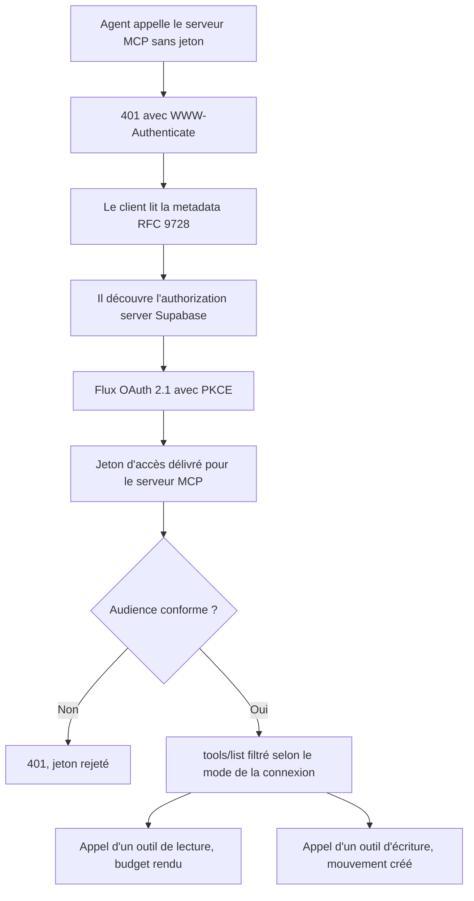
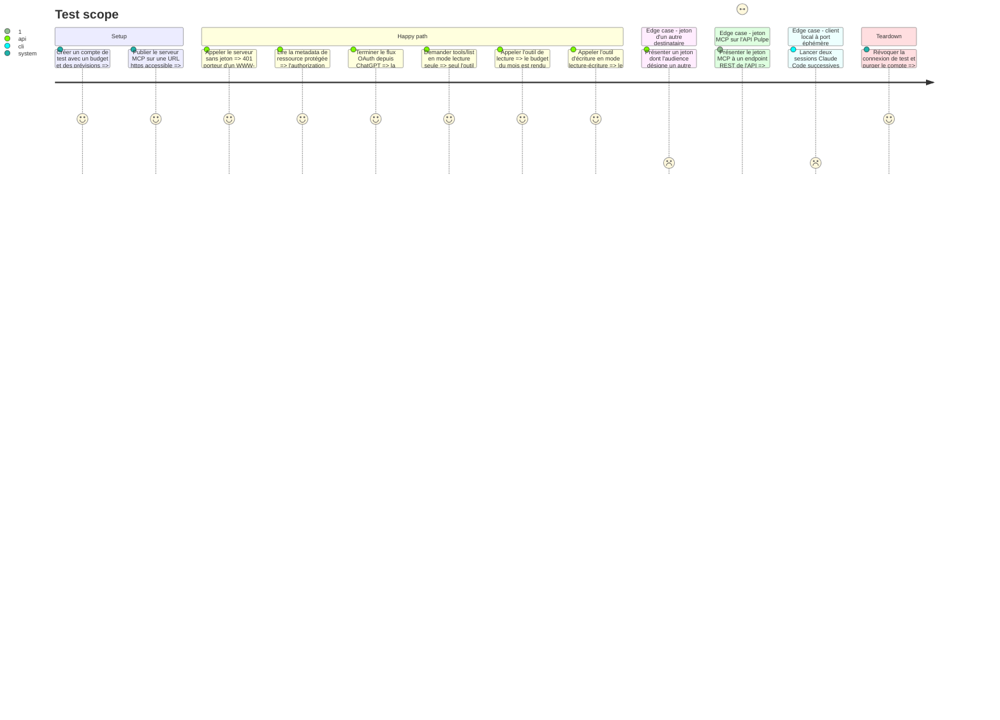

# Instruction: Socle MCP authentifié

## Architecture projection

> Tree of the final files. ✅ create · ✏️ modify · ❌ delete

```txt
.
├── backend-nest/
│   ├── src/
│   │   ├── app.module.ts                                          ✏️ enregistre McpModule
│   │   ├── common/guards/auth.guard.ts                           ✏️ rejette un jeton dont l'audience est le serveur MCP
│   │   └── modules/
│   │       ├── budget/budget.module.ts                            ✏️ exporte BUDGET_MONTH_READ_PORT (useExisting)
│   │       ├── transaction/transaction.module.ts                  ✏️ exporte TRANSACTION_CREATE_PORT (useExisting)
│   │       ├── mcp/                                               ✅ nouveau module
│   │           ├── domain/
│   │           │   ├── mcp-tool.entity.ts                         ✅ définition d'un outil et de ses annotations
│   │           │   ├── access-mode.ts                             ✅ lecture seule ou lecture-écriture
│   │           │   └── ports/
│   │           │       └── mcp-connection-repository.port.ts      ✅ lecture de la connexion, de son mode et de sa clé enveloppée
│   │           ├── application/
│   │           │   ├── list-tools.use-case.ts                     ✅ filtre le catalogue selon le mode
│   │           │   └── call-tool.use-case.ts                      ✅ dispatch vers l'outil et remonte le résultat
│   │           ├── infrastructure/
│   │           │   ├── http/
│   │           │   │   ├── mcp.controller.ts                      ✅ endpoint Streamable HTTP
│   │           │   │   └── protected-resource-metadata.controller.ts ✅ RFC 9728
│   │           │   ├── auth/
│   │           │   │   └── mcp-token.guard.ts                     ✅ vérifie signature, audience, expiration ; charge mcp_connection ; pose user, supabase et clientKey en CLS
│   │           │   └── tools/
│   │           │       ├── get-current-month.tool.ts              ✅ outil de lecture témoin, consomme BUDGET_MONTH_READ_PORT
│   │           │       └── add-movement.tool.ts                   ✅ outil d'écriture témoin, consomme TRANSACTION_CREATE_PORT
│   │           ├── mcp.module.ts                                  ✅
│   │           ├── mcp.tokens.ts                                  ✅
│   │           └── index.ts                                       ✅
│   └── .env.example                                               ✏️ MCP_RESOURCE_URL, MCP_WRAPPING_KEY
└── aidd_docs/tasks/2026_08/2026_08_23_pulpe-mcp-agent-connector/
    └── spike-client-registration.md                               ✅ résultat du test par client
```

## User Journey



## Test Scope



## Tasks to do

### `1)` Lever le doute sur l'inscription des clients

> Savoir avant d'écrire du code si le DCR de Supabase convient aux quatre clients visés.

1. Activer le serveur OAuth 2.1 sur le projet Supabase et vérifier la metadata publiée.
2. Décoder le jeton émis et consigner sous quel claim apparaissent `client_id` et l'audience : deux agents d'un même utilisateur doivent rester distinguables.
3. Monter un serveur MCP jetable exposant un seul outil de lecture, derrière ce Supabase.
4. Y brancher successivement ChatGPT, Claude Desktop, Claude Code et Codex CLI.
5. Consigner par client si la connexion aboutit, et l'erreur exacte sinon, dans `spike-client-registration.md`.
6. Ne prévoir une couche de registre client que si un échec est constaté.

### `2)` Poser le module MCP

> Un module NestJS conforme à l'architecture en trois couches du projet.

1. Créer `modules/mcp/` avec ses trois couches, son module, ses tokens et son index.
2. Déclarer le port `MCP_CONNECTION_REPOSITORY` dans `domain/ports/`.
3. Exposer deux ports depuis les modules métier, `BUDGET_MONTH_READ_PORT` et `TRANSACTION_CREATE_PORT`, branchés en `useExisting` sur les use cases actuels et ajoutés à `exports`. Le module MCP n'importe jamais l'`application/` d'un autre module (`no-cross-module-direct`).
4. Enregistrer le module dans `app.module.ts` avec les providers de logger correspondants.

### `3)` Exposer le transport et la découverte

> Un client MCP conforme doit pouvoir se connecter sans configuration manuelle.

1. Exposer l'endpoint Streamable HTTP sans état, sans identifiant de session.
2. Servir la metadata de ressource protégée RFC 9728 désignant l'authorization server Supabase.
3. Répondre `401` avec un `WWW-Authenticate` conforme quand le jeton manque ou est invalide.

### `4)` Valider le jeton entrant

> Aucun jeton qui ne nous est pas destiné ne doit passer.

1. Vérifier signature et expiration contre le JWKS de Supabase.
2. Rejeter tout jeton dont l'audience ne désigne pas le serveur MCP.
3. Charger la ligne `mcp_connection` du couple utilisateur et client : absente ou révoquée, `401`. Le mode vient de la ligne, jamais d'un claim.
4. Poser `user`, `supabase` et `clientKey` en CLS exactement comme `AuthGuard`, pour que les use cases existants tournent sans savoir qu'un agent les appelle.
5. Le jeton entrant ne sort jamais du garde : aucun appel HTTP vers l'API Pulpe, les outils consomment les ports en process.
6. Dans `AuthGuard`, rejeter tout jeton dont l'audience désigne le serveur MCP : l'API REST ne doit pas l'accepter par accident.

### `5)` Livrer deux outils témoins

> Prouver la chaîne complète, lecture et écriture, avant d'en écrire treize autres.

1. Implémenter un outil de lecture du mois courant et un outil d'ajout de mouvement, chacun consommant son port, avec `title` et annotations exactes.
2. Filtrer `tools/list` selon le mode de la connexion.
3. Tant que la phase 2 n'existe pas, alimenter le `clientKey` depuis une variable d'environnement de test, jamais depuis un défaut codé en dur.

## Test acceptance criteria

| Task | Acceptance criteria                                                                                                          |
| ---- | ---------------------------------------------------------------------------------------------------------------------------- |
| 1    | Le fichier de spike consigne ChatGPT et claude.ai (OK, 2026-08-23) ; décision actée « 2/4 suffisent pour avancer ». Claude Code et Codex CLI restent à constater — repris comme préalable de la phase 6, ce socle n'en dépend pas |
| 2    | `bun run lint:arch` passe : aucune dépendance de l'application vers l'infrastructure dans le nouveau module                    |
| 3    | Un appel sans jeton renvoie `401` et son en-tête permet à un client de trouver seul l'authorization server                     |
| 4    | Un jeton valide mais destiné à un autre service est rejeté ; un jeton MCP présenté à l'API REST est rejeté aussi                |
| 4    | Un jeton MCP valide dont la connexion est absente ou révoquée renvoie `401`                                                    |
| 5    | Depuis un vrai client, l'outil de lecture rend le budget du mois et l'outil d'écriture crée un mouvement visible dans l'app    |
| 5    | En mode lecture seule, l'outil d'écriture n'apparaît pas dans `tools/list`                                                     |
