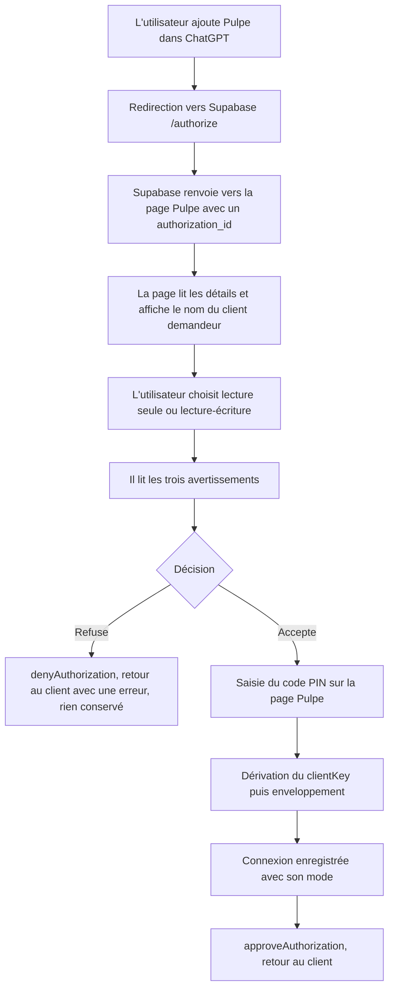
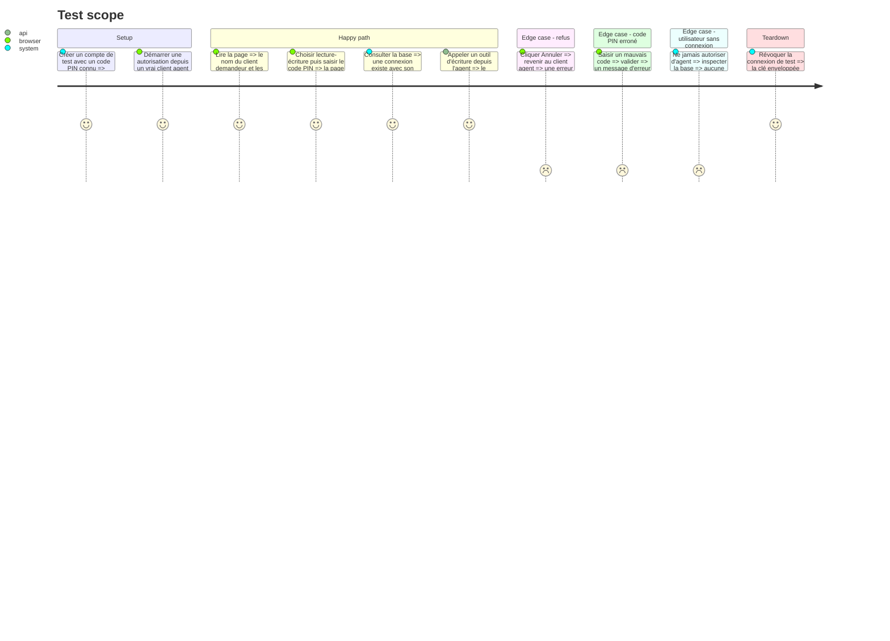

# Instruction: Consentement et clé enveloppée

## Architecture projection

> Tree of the final files. ✅ create · ✏️ modify · ❌ delete

```txt
.
├── backend-nest/
│   ├── supabase/migrations/
│   │   └── 2026XXXXXXXXXX_mcp_connection.sql                      ✅ table mcp_connection, service_role seul
│   └── src/modules/
│       ├── mcp/
│       │   ├── application/
│       │   │   ├── approve-connection.use-case.ts                 ✅ enveloppe le clientKey et crée la connexion
│       │   │   └── deny-connection.use-case.ts                    ✅ refuse sans rien conserver
│       │   ├── infrastructure/
│       │   │   ├── http/mcp-consent.controller.ts                 ✅ détails, approbation, refus
│       │   │   └── persistence/supabase-mcp-connection.repository.ts ✅ CRUD service_role
│       │   └── domain/mcp-connection.entity.ts                    ✅ connexion, mode, clé enveloppée
│       └── encryption/
│           ├── domain/ports/encryption.port.ts                    ✏️ ajoute wrapSecret / unwrapSecret au port
│           └── infrastructure/crypto/aes-gcm.crypto-service.ts    ✏️ implémente sur le modèle de wrapDEK
├── frontend/projects/webapp/src/app/
│   ├── app.routes.ts                                              ✏️ route de consentement sous auth-layout
│   ├── core/routing/                                              ✏️ ROUTES et PAGE_TITLES
│   └── feature/auth/mcp-consent/                                  ✅ page de consentement
│       ├── mcp-consent.ts                                         ✅ composant
│       └── mcp-consent-store.ts                                   ✅ état de la page
├── shared/
│   └── schemas.ts                                                 ✏️ schémas de consentement et de mode
└── frontend/projects/webapp/src/app/feature/legal/             ✏️ section Connexions à des assistants IA dans la politique
```

## User Journey



## Test Scope



## Wireframe

```txt
┌──────────────────────────────────────────────────────────┐
│                        [ logo ]                          │
│                                                          │
│              Connecter Pulpe à ChatGPT                   │
│         ChatGPT demande l'accès à ton budget.            │
│                                                          │
│  ┌────────────────────────────────────────────────────┐  │
│  │ ( ) Lecture seule                                  │  │
│  │     Consulter et analyser, sans rien changer.      │  │
│  │ (•) Lecture et écriture                            │  │
│  │     Ajouter, modifier, supprimer et pointer.       │  │
│  └────────────────────────────────────────────────────┘  │
│                                                          │
│  Trois choses à savoir avant d'accepter                  │
│                                                          │
│  ▸ Tes données passent par ChatGPT.                      │
│    Chaque question envoie à OpenAI les éléments de       │
│    budget nécessaires pour y répondre : intitulés,       │
│    montants, dates, objectifs. Leurs conditions          │
│    d'utilisation s'appliquent à ce traitement.           │
│                                                          │
│  ▸ Je garde une copie protégée de ta clé.                │
│    Aujourd'hui tes montants ne sont lisibles qu'avec     │
│    ton code, et je ne peux pas les déchiffrer sans toi.  │
│    Pour que ChatGPT réponde quand tu n'es pas devant     │
│    ton téléphone, je conserve une copie protégée de      │
│    cette clé aussi longtemps que la connexion existe.    │
│                                                          │
│  ▸ Tu peux couper quand tu veux.                         │
│    Réglages, puis Connexions. La coupure est immédiate : │
│    l'accès est retiré et la copie de ta clé détruite.    │
│                                                          │
│  Ton code Pulpe                                          │
│  ┌────┐ ┌────┐ ┌────┐ ┌────┐                             │
│  │    │ │    │ │    │ │    │                             │
│  └────┘ └────┘ └────┘ └────┘                             │
│  Il ne quitte pas cette page et n'est jamais transmis    │
│  à ChatGPT.                                              │
│                                                          │
│      [    Annuler    ]    [    Autoriser    ]            │
│                                                          │
│           Ce que je fais de tes données                  │
└──────────────────────────────────────────────────────────┘
```

## Tasks to do

### `1)` Créer le stockage de connexion

> Une connexion par couple utilisateur et client, avec son mode et sa clé enveloppée.

1. Écrire la migration `mcp_connection` : utilisateur, identifiant client, nom affiché, mode, clé enveloppée, date d'autorisation, date de révocation. Unique sur `(user_id, client_id)`.
2. Révoquer `authenticated` et `anon` sur la table, comme pour `user_encryption_key`.
3. Régénérer les types de base et repasser le formateur derrière.
4. Implémenter le repository `service_role` et le brancher sur son port.

### `2)` Envelopper le clientKey

> Réutiliser la crypto existante plutôt qu'en écrire une.

1. Ajouter `wrapSecret` / `unwrapSecret` à `EncryptionPort` et les implémenter dans le service sur le modèle de `wrapDEK`. Le module MCP n'importe que le port, jamais le service.
2. Lire la clé d'enveloppe depuis une variable d'environnement dédiée, distincte de `ENCRYPTION_MASTER_KEY`, et vérifier sa présence et sa longueur au démarrage.
3. Effacer tout `clientKey` en clair de la mémoire après usage.

### `3)` Construire la page de consentement

> Une page Pulpe, sur le domaine Pulpe, seule à demander le code.

1. Ajouter la route sous `auth-layout`, avec le garde d'authentification et sans le garde de budget.
2. Lire les détails de la demande via l'API Supabase et afficher le nom du client tel que déclaré.
3. Rendre le sélecteur de mode, les trois avertissements et le champ de code, sur le modèle de la page de saisie du code existante.
4. Poser un en-tête interdisant l'affichage en cadre, et n'installer le paramètre d'état qu'après approbation explicite.

### `4)` Traiter la décision

> Accepter enveloppe et enregistre. Refuser ne laisse aucune trace.

1. Sur refus, appeler le refus Supabase et ne rien écrire.
2. Sur acceptation, dériver le `clientKey` avec le PBKDF2 existant du frontend, l'envelopper côté serveur, créer la connexion avec son mode, puis appeler l'approbation Supabase.
3. Faire consommer la connexion par le garde de la phase 1, à la place de la variable d'environnement de test.

### `5)` Publier la section juridique

> Ce qui est promis dans l'écran doit exister dans la politique.

1. Ajouter la section Connexions à des assistants IA dans la politique de confidentialité du webapp (`feature/legal`) : catégories de données, finalité, destinataires, sort de la clé, durées de conservation, retrait du consentement.
2. Lier cette section depuis la page de consentement.

## Test acceptance criteria

| Task | Acceptance criteria                                                                                                       |
| ---- | --------------------------------------------------------------------------------------------------------------------------- |
| 1    | Un client `authenticated` ne peut ni lire ni écrire la table de connexions                                                  |
| 2    | Le serveur refuse de démarrer si la clé d'enveloppe manque ou fait la mauvaise taille                                       |
| 2    | Un `clientKey` enveloppé puis désenveloppé redonne exactement la valeur d'origine, et une clé d'enveloppe erronée échoue     |
| 3    | La page affiche le nom du client tel que déclaré par la demande, jamais une valeur saisie                                    |
| 3    | La page ne s'affiche pas dans un cadre, et aucun paramètre d'état n'est posé avant l'approbation                             |
| 4    | Refuser renvoie une erreur OAuth au client et ne crée aucune connexion                                                      |
| 4    | Accepter crée une connexion avec le mode choisi, et l'agent peut ensuite lire les montants de l'utilisateur                  |
| 4    | Un utilisateur qui n'a jamais autorisé d'agent n'a aucune clé enveloppée stockée                                            |
| 5    | La politique de confidentialité publiée contient la section et la page de consentement y renvoie                            |
