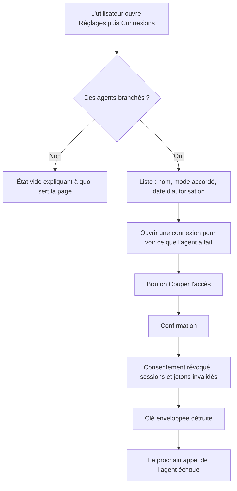
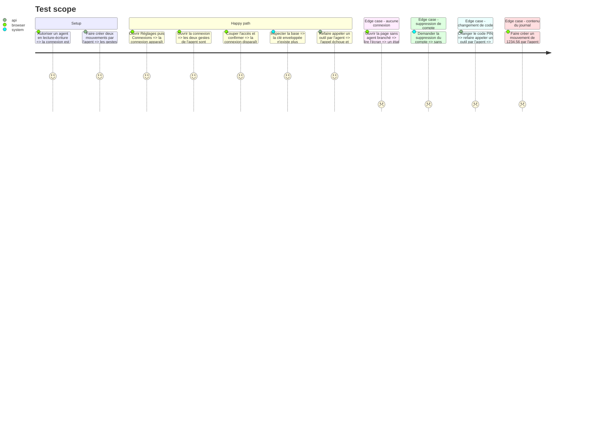

# Instruction: Connexions et révocation, web

## Architecture projection

> Tree of the final files. ✅ create · ✏️ modify · ❌ delete

```txt
.
├── backend-nest/
│   ├── supabase/migrations/
│   │   └── 2026XXXXXXXXXX_mcp_activity_log.sql                    ✅ journal des gestes de l'agent
│   └── src/modules/
│       ├── mcp/
│       │   ├── application/
│       │   │   ├── list-connections.use-case.ts                   ✅ connexions et leur mode
│       │   │   ├── revoke-connection.use-case.ts                  ✅ révoque, détruit la clé, journalise
│       │   │   └── list-activity.use-case.ts                      ✅ journal lisible
│       │   ├── domain/mcp-activity.entity.ts                      ✅ geste, outil, date
│       │   └── infrastructure/
│       │       ├── http/mcp-connections.controller.ts             ✅ liste, révocation, journal
│       │       ├── persistence/supabase-mcp-activity.repository.ts ✅
│       │       └── interceptors/mcp-activity.interceptor.ts       ✅ journalise chaque écriture
│       ├── user/application/schedule-account-deletion.use-case.ts ✏️ révoque toutes les connexions via REVOKE_AGENT_CONNECTIONS_PORT
│       └── encryption/application/
│           ├── change-pin.use-case.ts                             ✏️ révoque via REVOKE_AGENT_CONNECTIONS_PORT
│           └── recover-with-recovery-key.use-case.ts              ✏️ révoque via REVOKE_AGENT_CONNECTIONS_PORT
├── frontend/projects/webapp/src/app/feature/settings/
│   ├── connections/                                               ✅ écran Connexions
│   │   ├── connections.ts                                         ✅ page
│   │   ├── connections-store.ts                                   ✅ état
│   │   └── ui/connection-card.ts                                  ✅ carte d'une connexion
│   └── settings.routes.ts                                         ✏️ route Connexions
└── shared/
    └── schemas.ts                                                 ✏️ schémas connexions et journal
```

## User Journey



## Test Scope



## Wireframe

```txt
┌──────────────────────────────────────────────────────────┐
│  ‹ Réglages                                              │
│                                                          │
│  Connexions                                              │
│  Les assistants autorisés à accéder à ton budget.        │
│                                                          │
│  ┌────────────────────────────────────────────────────┐  │
│  │  ChatGPT                                           │  │
│  │  Lecture et écriture · depuis le 23 août 2026      │  │
│  │                                                    │  │
│  │  Dernières actions                                 │  │
│  │  · Dépense ajoutée              aujourd'hui 14:02  │  │
│  │  · Prévision pointée            hier 09:41         │  │
│  │  Tout voir ›                                       │  │
│  │                                                    │  │
│  │                          [  Couper l'accès  ]      │  │
│  └────────────────────────────────────────────────────┘  │
│                                                          │
│  ┌────────────────────────────────────────────────────┐  │
│  │  Claude                                            │  │
│  │  Lecture seule · depuis le 21 août 2026            │  │
│  │                          [  Couper l'accès  ]      │  │
│  └────────────────────────────────────────────────────┘  │
└──────────────────────────────────────────────────────────┘

État vide
┌──────────────────────────────────────────────────────────┐
│                                                          │
│                     [ illustration ]                     │
│                                                          │
│              Aucun assistant branché                     │
│   Tu peux brancher Pulpe dans ChatGPT ou Claude pour     │
│   gérer ton budget en parlant. Rien n'est partagé tant   │
│   que tu n'as rien autorisé.                             │
│                                                          │
│                  Comment faire ›                         │
└──────────────────────────────────────────────────────────┘
```

## Tasks to do

### `1)` Journaliser les gestes de l'agent

> Sans expiration de connexion, le journal est la seule trace exploitable.

1. Écrire la migration du journal : connexion, outil appelé, horodatage, résultat.
2. Journaliser chaque appel d'outil en écriture, via un intercepteur du module.
3. N'y écrire aucun montant ni intitulé libre : le journal décrit le geste, pas le contenu.
4. Prévoir une purge au-delà de douze mois, alignée sur la durée annoncée dans la politique.

### `2)` Exposer les connexions

> L'utilisateur doit voir qui a accès à quoi.

1. Implémenter la liste des connexions à partir des grants Supabase enrichis du mode local.
2. Implémenter la lecture du journal d'une connexion, paginée.
3. Exposer ces lectures sur un contrôleur protégé par le garde d'authentification existant.

### `3)` Rendre la révocation réelle

> Une révocation qui laisserait la clé vivre serait cosmétique.

1. Révoquer le grant Supabase, ce qui invalide sessions et jetons de rafraîchissement.
2. Détruire la clé enveloppée et marquer la connexion révoquée dans la même transaction logique.
3. Faire échouer tout appel d'outil portant un jeton d'une connexion révoquée.
4. Déclarer `REVOKE_AGENT_CONNECTIONS_PORT` dans `mcp/domain/ports/`, l'implémenter et l'exporter depuis `McpModule`. L'injecter dans `ScheduleAccountDeletionUseCase` (`user/`), pas dans le cron de purge.
5. Injecter le même port dans `ChangePinUseCase` et `RecoverWithRecoveryKeyUseCase`, appelé dans la transaction qui re-chiffre : les copies enveloppées de l'ancien `clientKey` seraient mortes.

### `4)` Construire l'écran Connexions

> Le pendant visible de la promesse faite dans l'écran de consentement.

1. Ajouter la route Connexions dans les réglages.
2. Afficher chaque connexion avec son nom, son mode et sa date, et ses derniers gestes.
3. Demander confirmation avant de couper, puis rafraîchir la liste.
4. Écrire l'état vide et sa porte d'entrée vers la documentation.

## Test acceptance criteria

| Task | Acceptance criteria                                                                                                  |
| ---- | ---------------------------------------------------------------------------------------------------------------------- |
| 1    | Deux écritures faites par l'agent produisent deux entrées lisibles, sans montant ni intitulé libre                     |
| 2    | La page liste chaque connexion avec le mode réellement accordé, pas une valeur par défaut                              |
| 3    | Après coupure, la clé enveloppée n'existe plus et le prochain appel de l'agent échoue                                  |
| 3    | Planifier la suppression du compte révoque toutes les connexions de l'utilisateur immédiatement                        |
| 3    | Changer le code PIN ou récupérer le coffre révoque toutes les connexions                                               |
| 4    | Couper demande confirmation, et la connexion disparaît de la liste sans rechargement de page                           |
| 4    | Sans aucune connexion, l'écran affiche un état vide explicite et non une liste vide                                    |
