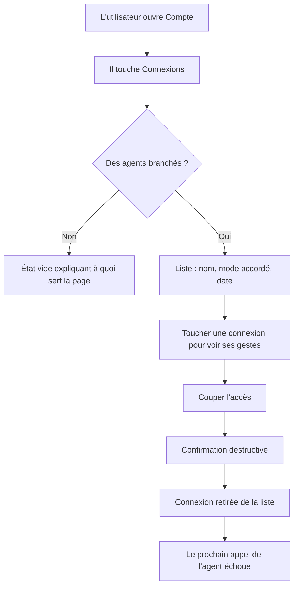
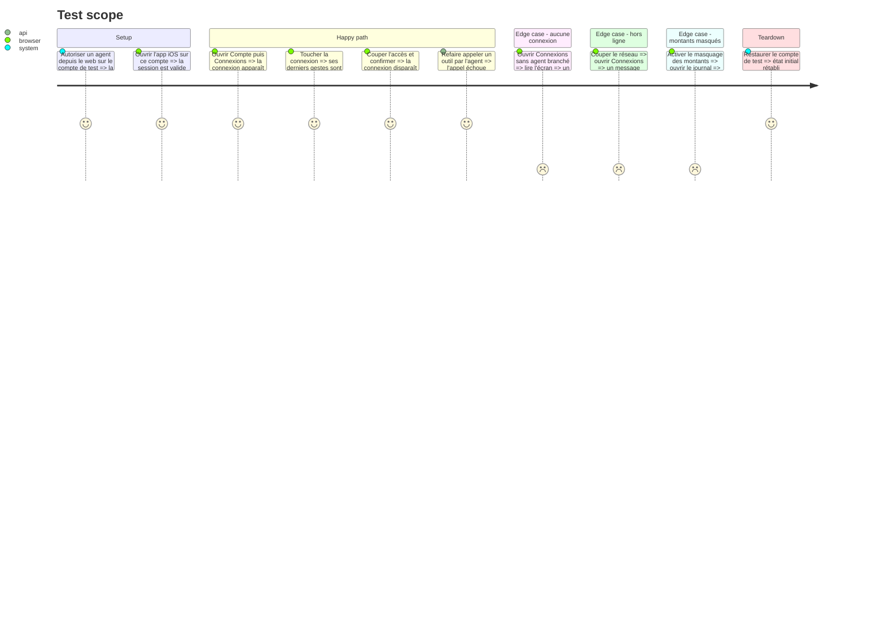

# Instruction: Connexions et révocation, iOS

## Architecture projection

> Tree of the final files. ✅ create · ✏️ modify · ❌ delete

```txt
.
└── ios/
    ├── Pulpe/
    │   ├── Features/Account/
    │   │   ├── Connections/                                       ✅ écran Connexions
    │   │   │   ├── ConnectionsView.swift                          ✅ liste et état vide
    │   │   │   ├── ConnectionDetailView.swift                     ✅ journal d'une connexion
    │   │   │   └── ConnectionsStore.swift                         ✅ @Observable, chargement et révocation
    │   │   └── AccountView.swift                                  ✏️ entrée vers Connexions
    │   └── Domain/Services/
    │       └── MCPConnectionsService.swift                        ✅ appels liste, journal, révocation
    └── PulpeTests/Features/Account/
        └── ConnectionsStoreTests.swift                            ✅ chargement, révocation, état vide
```

## User Journey



## Test Scope



## Wireframe

```txt
┌────────────────────────────┐
│ ‹ Compte                   │
│                            │
│  Connexions                │
│                            │
│  ┌──────────────────────┐  │
│  │ ChatGPT           ›  │  │
│  │ Lecture et écriture  │  │
│  │ depuis le 23 août    │  │
│  └──────────────────────┘  │
│  ┌──────────────────────┐  │
│  │ Claude            ›  │  │
│  │ Lecture seule        │  │
│  │ depuis le 21 août    │  │
│  └──────────────────────┘  │
│                            │
│  Les assistants que tu as  │
│  autorisés à accéder à     │
│  ton budget.               │
└────────────────────────────┘

┌────────────────────────────┐
│ ‹ Connexions               │
│                            │
│  ChatGPT                   │
│  Lecture et écriture       │
│  Autorisé le 23 août 2026  │
│                            │
│  DERNIÈRES ACTIONS         │
│  ┌──────────────────────┐  │
│  │ Dépense ajoutée      │  │
│  │ aujourd'hui 14:02    │  │
│  ├──────────────────────┤  │
│  │ Prévision pointée    │  │
│  │ hier 09:41           │  │
│  └──────────────────────┘  │
│                            │
│  ┌──────────────────────┐  │
│  │    Couper l'accès    │  │
│  └──────────────────────┘  │
└────────────────────────────┘
```

## Tasks to do

### `1)` Brancher le service réseau

> Les trois appels de la phase 3, côté iOS.

1. Ajouter le service appelant la liste des connexions, le journal d'une connexion et la révocation.
2. Décoder les dates ISO nues en `String`, jamais en `Date`, conformément à l'usage du projet.
3. Laisser les erreurs remonter telles quelles jusqu'au store, sans les avaler.

### `2)` Construire le store

> Un `@Observable` qui charge, révoque et distingue vide de cassé.

1. Exposer l'état de chargement, l'état vide et l'état d'erreur séparément.
2. Sur révocation, recharger la liste plutôt que de la modifier localement.
3. Traiter l'échec de révocation comme une erreur affichée, pas comme un succès silencieux.

### `3)` Construire les écrans

> Deux vues, conformes au système de design du projet.

1. Écrire la liste avec son état vide et son texte d'explication.
2. Écrire le détail avec les derniers gestes et le bouton destructif.
3. Utiliser les extensions et formateurs partagés, le fond Pulpe et le masquage du fond de liste.
4. Ajouter l'entrée Connexions dans l'écran Compte.

### `4)` Couvrir par des tests

> Le comportement, pas le rendu.

1. Tester le chargement, l'état vide et l'état d'erreur.
2. Tester que la révocation déclenche un rechargement.
3. Lancer la suite sur le simulateur dédié aux tests, jamais sur le simulateur interactif.

## Test acceptance criteria

| Task | Acceptance criteria                                                                                       |
| ---- | ----------------------------------------------------------------------------------------------------------- |
| 1    | Les connexions autorisées depuis le web apparaissent dans l'app iOS avec le bon mode                        |
| 2    | Une erreur réseau produit un message exploitable, jamais un écran vide qui ressemble à une absence de données |
| 3    | Couper l'accès demande une confirmation destructive et la connexion disparaît après succès                  |
| 3    | Avec le masquage des montants actif, aucune valeur chiffrée n'apparaît à l'écran ni en accessibilité         |
| 4    | `xcodebuild test` passe sur le simulateur dédié                                                             |
