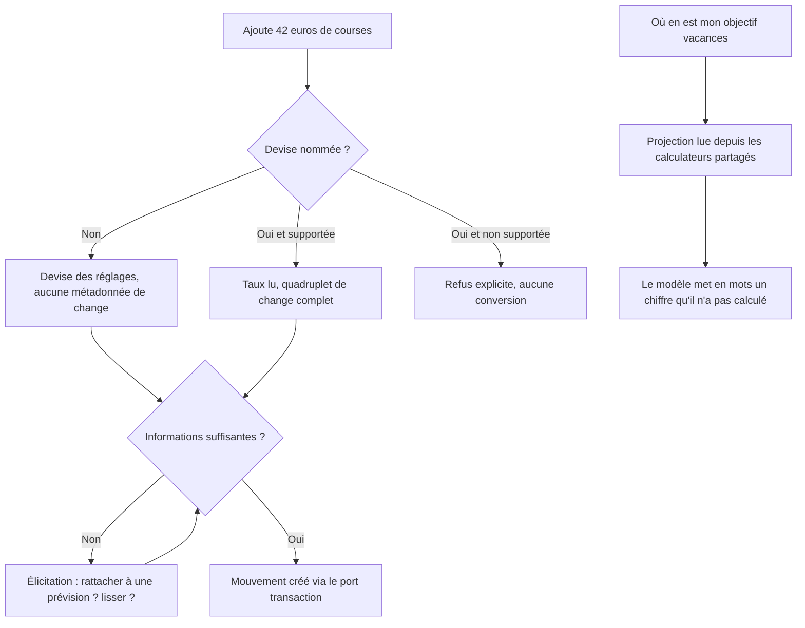
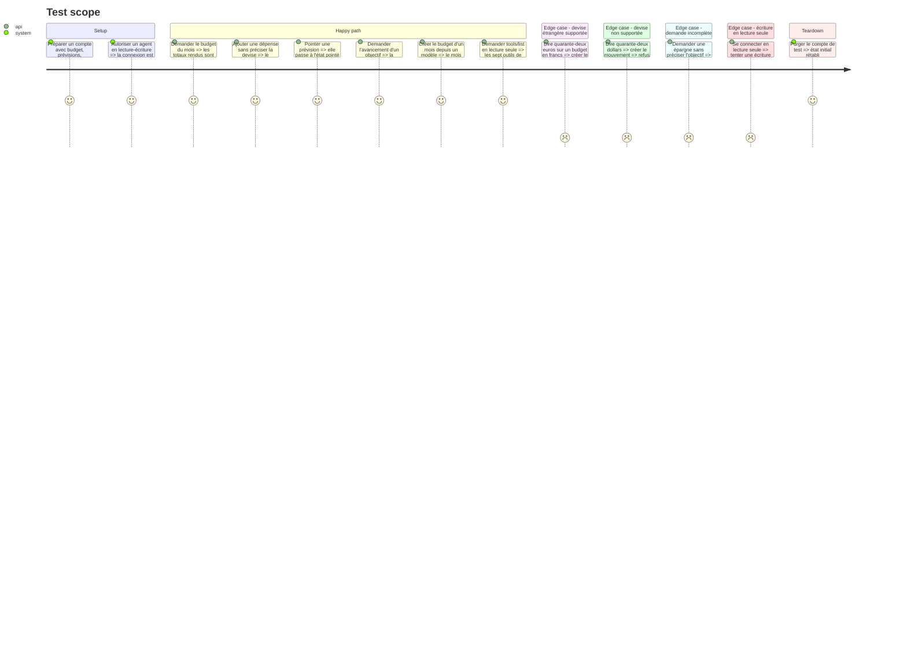

# Instruction: Les quinze outils métier

## Architecture projection

> Tree of the final files. ✅ create · ✏️ modify · ❌ delete

```txt
.
└── backend-nest/src/modules/mcp/
    ├── domain/
    │   └── tool-catalog.ts                                        ✅ catalogue, mode requis, annotations
    ├── application/
    │   ├── list-tools.use-case.ts                                 ✏️ sert le catalogue complet
    │   └── resolve-currency.use-case.ts                           ✅ devise par défaut ou quadruplet de change
    └── infrastructure/tools/
        ├── read/
        │   ├── get-current-month.tool.ts                          ✏️ agrégats calculés ajoutés
        │   ├── get-month.tool.ts                                  ✅
        │   ├── list-months.tool.ts                                ✅
        │   ├── search-movements.tool.ts                           ✅
        │   ├── list-savings-goals.tool.ts                         ✅
        │   ├── get-savings-goal-outlook.tool.ts                   ✅
        │   └── list-templates.tool.ts                             ✅
        └── write/
            ├── add-movement.tool.ts                               ✏️ élicitation et devise ajoutées
            ├── update-movement.tool.ts                            ✅
            ├── delete-movement.tool.ts                            ✅ destructif
            ├── add-forecast.tool.ts                               ✅
            ├── update-forecast.tool.ts                            ✅
            ├── spread-expense.tool.ts                             ✅
            ├── create-month-from-template.tool.ts                 ✅
            └── toggle-check.tool.ts                               ✅ mouvement ou prévision
```

## User Journey



## Test Scope



## Tasks to do

### `1)` Poser le catalogue

> Une source unique déclarant chaque outil, son mode et ses annotations.

1. Déclarer les quinze outils avec leur `title`, leur description et leur mode requis.
2. Mettre `destructiveHint` à vrai sur les seules suppressions, et `openWorldHint` à faux partout.
3. Faire dériver `tools/list` de ce catalogue et du mode de la connexion.

### `2)` Écrire les sept outils de lecture

> Les chiffres viennent de Pulpe, jamais du modèle.

1. Implémenter mois courant, mois donné, liste des mois, recherche de mouvements, objectifs, projection d'un objectif, modèles.
2. Consommer les calculateurs partagés pour les agrégats plutôt que de recalculer.
3. Rendre des libellés conformes au vocabulaire Pulpe, sans jamais employer le mot transaction.
4. N'exposer aucun outil de conseil : le raisonnement appartient au modèle.

### `3)` Écrire les huit outils d'écriture

> Les gestes du quotidien, y compris le pointage.

1. Implémenter ajout, modification et suppression d'un mouvement, ajout et modification d'une prévision, lissage, création d'un mois depuis un modèle, pointage.
2. Faire passer le rattachement d'un mouvement à une prévision par l'outil d'ajout, sans outil dédié.
3. Renvoyer une élicitation quand une information manque, plutôt que de choisir à la place de l'utilisateur.

### `4)` Traiter la devise

> Suivre le contrat existant, ne pas en inventer un.

1. Utiliser la devise des réglages quand aucune n'est nommée, sans métadonnée de change.
2. Quand une autre devise supportée est nommée, lire le taux et produire le quadruplet complet exigé par les schémas partagés.
3. Refuser explicitement toute devise non supportée, sans conversion silencieuse.

### `5)` Prouver la concordance des chiffres

> Le risque principal est qu'un agent annonce un montant différent de l'app.

1. Écrire un test comparant les agrégats rendus par les outils de lecture et ceux produits par les calculateurs partagés, sur un jeu de données fixé.
2. Couvrir au moins un mois avec lissage et un objectif d'épargne en cours.

## Test acceptance criteria

| Task | Acceptance criteria                                                                                             |
| ---- | ----------------------------------------------------------------------------------------------------------------- |
| 1    | Chaque outil porte un titre et des annotations qui décrivent son comportement réel                                |
| 1    | En lecture seule, aucun outil d'écriture n'est listé, et un appel direct est refusé                               |
| 2    | Pour un même mois, les totaux rendus par l'outil et ceux affichés par l'app sont identiques                       |
| 3    | Un pointage demandé à l'agent se retrouve à l'état pointé dans l'app                                              |
| 3    | Une demande incomplète produit une élicitation, jamais une valeur par défaut inventée                             |
| 4    | Un montant dans une autre devise supportée produit le quadruplet de change complet                                |
| 4    | Une devise non supportée est refusée avec un message clair, sans mouvement créé                                   |
| 5    | Le test de concordance échoue si un calculateur partagé change sans que l'outil suive                             |
