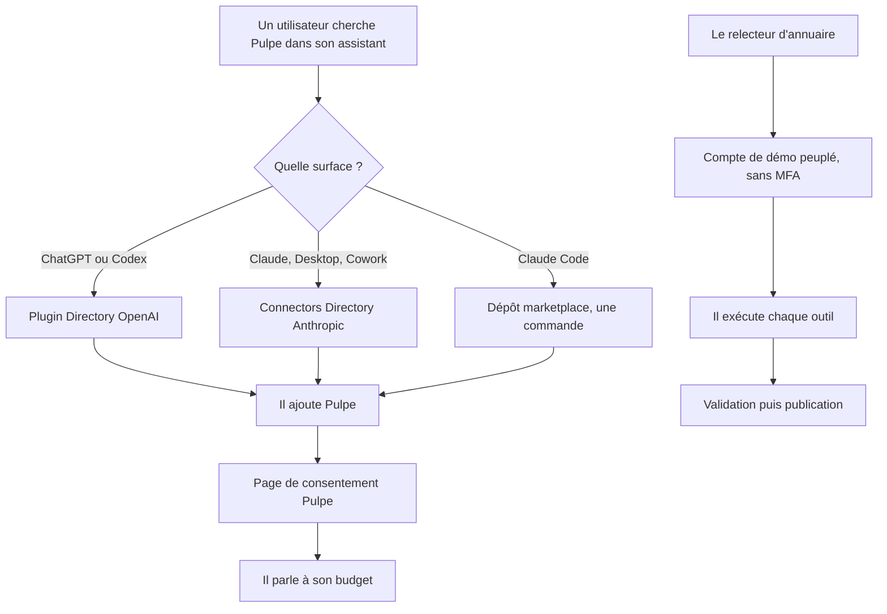
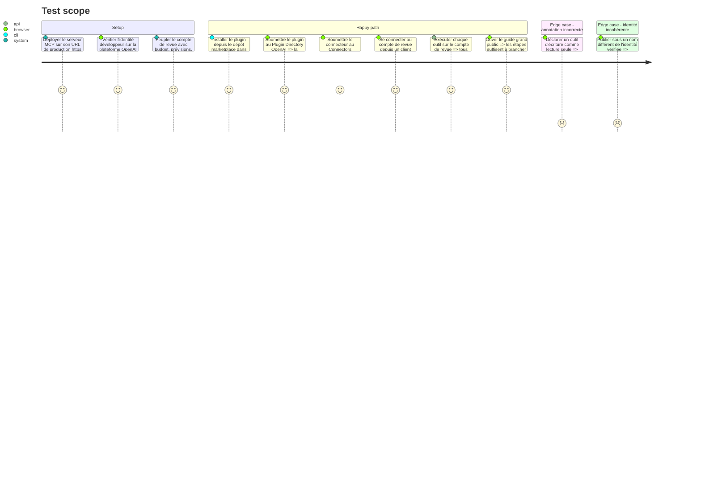

# Instruction: Publication dans les annuaires

## Architecture projection

> Tree of the final files. ✅ create · ✏️ modify · ❌ delete

```txt
.
├── .claude-plugin/
│   └── marketplace.json                                           ✅ catalogue du dépôt, entrée plugin sans version
├── plugins/pulpe/
│   ├── .claude-plugin/plugin.json                                 ✅ manifeste sans version, le SHA Git signale les mises à jour
│   └── .mcp.json                                                  ✅ serveur MCP distant https, ni stdio ni variable à renseigner
├── landing/
│   └── app/{(fr),[lang]}/support/connecter-un-assistant/          ✅ guide grand public, quatre langues
├── frontend/…/feature/legal/                                      ✏️ sections assistants IA, CGU et confidentialité (les pages légales vivent dans la webapp, pas la landing)
├── backend-nest/src/modules/demo/                                 ✏️ compte de revue peuplé de données réalistes
└── aidd_docs/tasks/2026_08/2026_08_23_pulpe-mcp-agent-connector/
    └── submission-checklist.md                                    ✅ état des deux soumissions
```

## User Journey



## Test Scope



## Tasks to do

### `0)` Lever les préalables techniques

> Trois restes de review à solder avant toute soumission.

1. Lancer le flux OAuth réel depuis Claude Code, puis Codex CLI, contre `mcp-spike`, et consigner le constat dans `spike-client-registration.md` ; si le DCR refuse le port éphémère (supabase#41695), demander le client ID fixe détenu par Anthropic.
2. Lancer `xcodebuild test` sur un simulateur dédié et consigner le verdict — critère resté ouvert de la phase 4.
3. Poser `MCP_RESOURCE_URL` sur chaque environnement Railway, puis seulement ensuite retirer le `.default` de `environment.ts` pour rendre la variable obligatoire — dans cet ordre, sous peine de panne de l'API au boot.

### `1)` Publier pour Claude Code

> La surface la moins chère, et celle qui sert de source aux deux autres.

1. Écrire le manifeste du plugin et le catalogue du dépôt marketplace.
2. Y déclarer le serveur MCP distant, sans serveur stdio local ni configuration utilisateur.
3. Vérifier l'installation depuis un poste vierge, en une commande.

### `2)` Soumettre chez OpenAI

> Un seul artefact sert ChatGPT et Codex.

1. Vérifier l'identité développeur individuelle sur la plateforme OpenAI.
2. Aligner le nom publié, le site, le contact support, la politique de confidentialité et les CGU sur cette identité.
3. Convertir le plugin, en retirant ce qui est propre à Claude et en rendant les libellés neutres vis-à-vis du fournisseur.
4. Renseigner l'URL de production, l'authentification et le compte de démo, puis soumettre.

### `3)` Soumettre chez Anthropic

> Le portail vit dans les réglages d'organisation, pas sur un plan individuel.

1. Ouvrir une organisation Team, prérequis assumé du côté éditeur.
2. Connecter le serveur de production au portail et corriger tout outil signalé pour titre ou annotation manquants.
3. Renseigner listing, cas d'usage, société, authentification et traitement des données.
4. Choisir le mode d'authentification retenu à l'issue du spike de la phase 1, et demander le client ID fixe détenu par Anthropic si le DCR pose problème.
5. Signer les sept déclarations de conformité, dont celles sur les transactions financières et l'injection de prompt.

### `4)` Préparer la revue

> Un relecteur qui bloque fait échouer la soumission entière.

1. Peupler un compte de revue avec un budget, des prévisions, des mouvements et un objectif d'épargne en cours.
2. Vérifier que son parcours complet passe sans MFA, SMS ni confirmation par e-mail, y compris la saisie du code sur la page de consentement.
3. Exécuter chaque outil sur ce compte et consigner le résultat.
4. Rédiger les instructions d'accès, chaque lien et chaque étape comprise.

### `5)` Écrire le guide grand public

> Un utilisateur non technique doit y arriver seul.

1. Écrire une page décrivant, pour chaque assistant, comment ajouter Pulpe.
2. Expliquer le choix entre lecture seule et lecture-écriture, et où couper l'accès.
3. Écrire à la première personne, dans le vocabulaire Pulpe.

## Test acceptance criteria

| Task | Acceptance criteria                                                                                           |
| ---- | --------------------------------------------------------------------------------------------------------------- |
| 0    | Le spike porte un constat pour Claude Code et Codex CLI, `xcodebuild test` a un verdict consigné, et `MCP_RESOURCE_URL` est obligatoire après avoir été posée sur chaque environnement |
| 1    | Depuis un poste vierge, une seule commande installe le plugin et les outils apparaissent                        |
| 2    | La soumission OpenAI est acceptée en revue, sans rejet pour identité ou URL manquante                           |
| 3    | Le portail Anthropic synchronise les quinze outils sans signaler de titre ni d'annotation manquants             |
| 4    | Un tiers, avec les seules instructions fournies, connecte le compte de revue et exécute chaque outil            |
| 5    | Le guide permet de brancher Pulpe dans ChatGPT et dans Claude sans poser de question                            |
