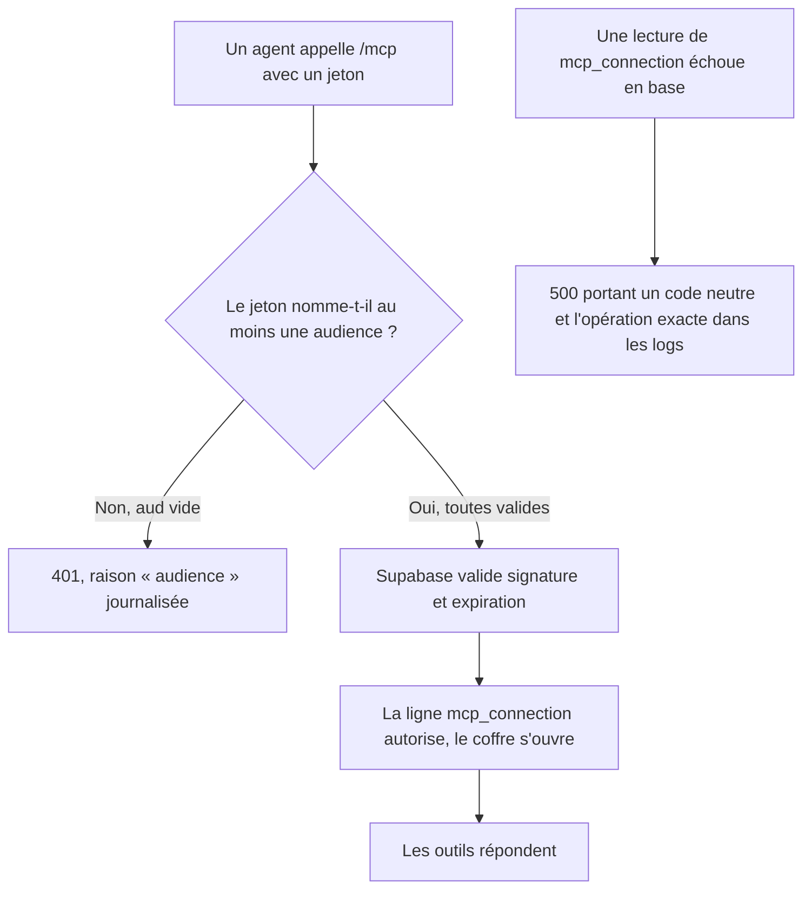
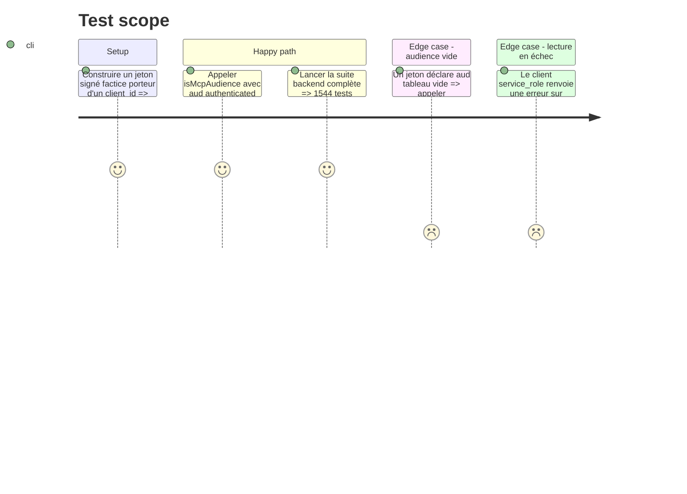

# Instruction: Durcir le garde et le diagnostic backend

## Architecture projection

> Tree of the final files. ✅ create · ✏️ modify · ❌ delete

```txt
.
├── shared/src/
│   └── error-codes.ts                                   ✏️ MCP_CONNECTION_SAVE_FAILED devient MCP_CONNECTION_OPERATION_FAILED
├── backend-nest/src/common/constants/
│   └── error-definitions.ts                             ✏️ le message ne parle plus d'enregistrement
└── backend-nest/src/modules/mcp/infrastructure/
    ├── auth/
    │   ├── mcp-token.guard.ts                           ✏️ une liste d'audiences vide est refusée ; la zéroisation manuelle porte sa raison
    │   └── mcp-token.guard.spec.ts                      ✏️ un cas pour `aud: []`
    └── persistence/
        └── supabase-mcp-connection.repository.ts        ✏️ les trois opérations lèvent le code neutre
```

## User Journey



## Test Scope



## Tasks to do

### `1)` Refuser une liste d'audiences vide

> `every` sur un tableau vide répond `true` : le contrôle se lit plus strict qu'il n'est.

1. Dans `isMcpAudience`, refuser avant le `every` quand la liste d'audiences est vide.
2. Ajouter le cas `aud: []` au bloc « rejects a token for another service or without client_id » de `mcp-token.guard.spec.ts`.

### `2)` Un code d'erreur qui ne ment pas sur l'opération

> `listActive` et `revoke` remontent aujourd'hui un échec d'enregistrement.

1. Renommer `MCP_CONNECTION_SAVE_FAILED` en `MCP_CONNECTION_OPERATION_FAILED` dans `shared/src/error-codes.ts`, valeur `ERR_MCP_CONNECTION_OPERATION_FAILED`.
2. Reporter le renommage dans `ERROR_DEFINITIONS` et rendre le message neutre.
3. Reporter l'appel dans `#fail` du repository, qui sert déjà les trois opérations.
4. Rebâtir `shared` avant de lancer la suite backend.

### `3)` Consigner pourquoi le garde zéroise à la main

> Sans la raison écrite, la prochaine lecture croira à un oubli et ajoutera un second `fill(0)`.

1. Au-dessus du `catch` qui zéroise le `clientKey` dans `McpTokenGuard`, écrire que c'est le seul chemin où `request.user` n'existe pas encore, donc le seul que `ClientKeyCleanupInterceptor` ne peut pas couvrir.

## Test acceptance criteria

| Task | Acceptance criteria                                                                                                       |
| ---- | ------------------------------------------------------------------------------------------------------------------------- |
| 1    | Un jeton porteur d'un `client_id` et d'un `aud` vide est refusé, et les jetons valides d'aujourd'hui passent toujours     |
| 2    | Un échec de `listActive` produit un code d'erreur qui ne nomme aucune écriture, et l'opération exacte reste dans les logs |
| 2    | `grep ERR_MCP_CONNECTION_SAVE_FAILED` ne trouve plus rien dans le dépôt                                                   |
| 3    | La zéroisation manuelle du garde porte sa raison, et aucun second `fill(0)` n'est ajouté sur le chemin nominal            |
| 1-3  | `bun test` est vert dans `backend-nest`, et `bun run quality` passe                                                       |
