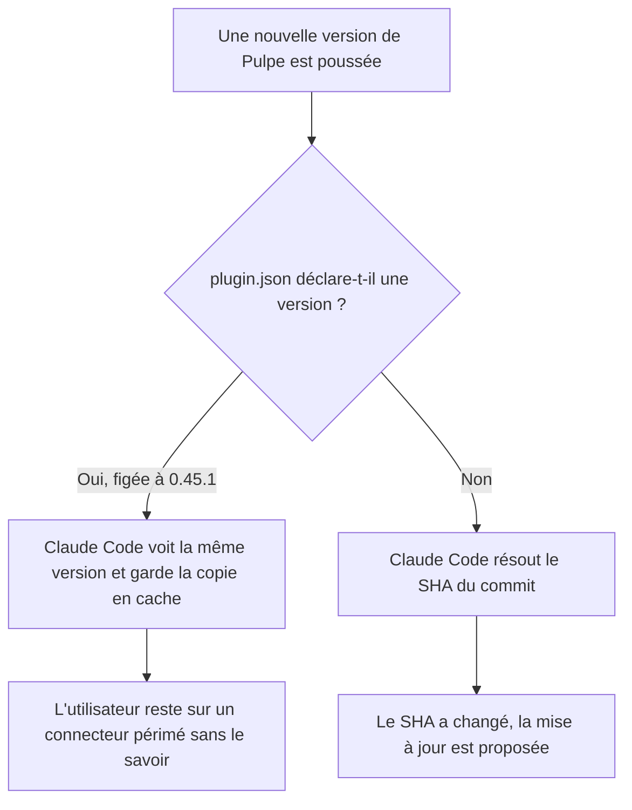
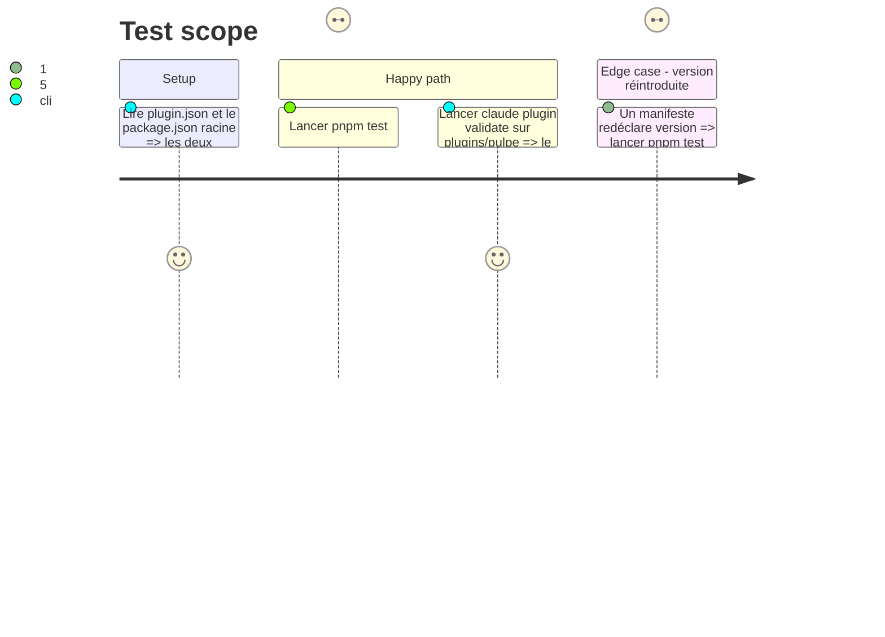

# Instruction: Dépiner le plugin Claude Code

## Architecture projection

> Tree of the final files. ✅ create · ✏️ modify · ❌ delete

```txt
.
├── plugins/pulpe/.claude-plugin/
│   └── plugin.json                                                    ✏️ le champ version disparaît
├── .github/scripts/
│   └── public-surface.test.mjs                                        ✏️ garde : le manifeste ne redéclare pas de version
└── aidd_docs/tasks/2026_08/2026_08_23_pulpe-mcp-agent-connector/
    └── review.md                                                      ✏️ deux lignes de findings passent à leur état réel
```

## User Journey



## Test Scope



## Tasks to do

### `1)` Retirer l'épinglage

> Déclarer `version` fige les utilisateurs sur cette chaîne jusqu'au prochain bump manuel.

1. Supprimer le champ `version` de `plugins/pulpe/.claude-plugin/plugin.json`.
2. Laisser `.claude-plugin/marketplace.json` tel quel : son `version` nomme la révision du catalogue, pas le plugin.

### `2)` Empêcher son retour

> Le champ se réajoute tout seul à la première relecture qui le trouve « manquant ».

1. Ajouter à `.github/scripts/public-surface.test.mjs` un test qui lit `plugins/pulpe/.claude-plugin/plugin.json` et refuse la présence d'une clé `version`.
2. Écrire dans le test la raison : sur une source git, le SHA du commit est le signal de mise à jour, et un `version` figé masque chaque release.

### `3)` Remettre la review sur l'état réel

> Deux lignes de `Findings` décrivent un monde qui n'existe plus.

1. Ligne 🟡 `functional` phase 6 « guide grand public » : marquer corrigé, en nommant la page livrée et ses quatre langues.
2. Ligne 🟢 `code` `mcp-token.guard.ts:141` « clientKey non zéroisé » : marquer faux positif, en nommant `ClientKeyCleanupInterceptor` monté en `APP_INTERCEPTOR` comme la couverture du chemin nominal.
3. Ne toucher à aucune autre ligne ni section : la review reste l'instantané de son diff.

## Test acceptance criteria

| Task | Acceptance criteria                                                                                                         |
| ---- | --------------------------------------------------------------------------------------------------------------------------- |
| 1    | Le manifeste installé ne déclare plus de version, et `claude plugin validate plugins/pulpe` l'accepte toujours              |
| 2    | Réintroduire un champ `version` dans le manifeste fait échouer `pnpm test:public-surface`, avec un message qui dit pourquoi |
| 3    | La review ne présente plus le guide grand public comme manquant, ni la zéroisation du `clientKey` comme un défaut           |
| 1-3  | `pnpm quality` passe à la racine                                                                                            |
