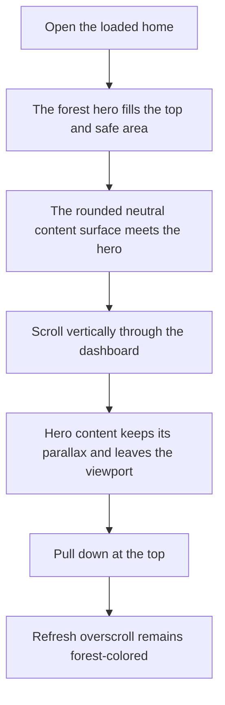
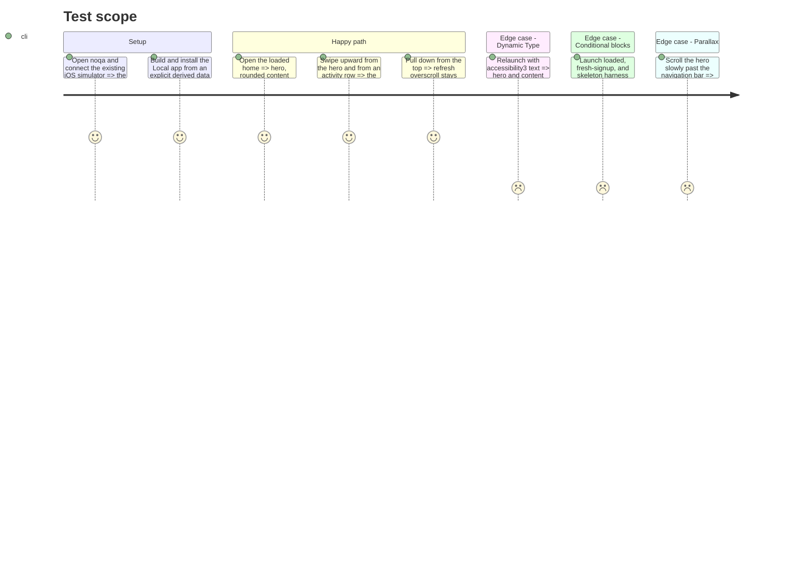

# Instruction: Prove a native-list shell can preserve the two-zone home

## Architecture projection

> Tree of the final files. ✅ create · ✏️ modify · ❌ delete

```txt
ios/
├── Pulpe/
│   ├── Features/CurrentMonth/
│   │   └── ✏️ CurrentMonthView.swift                 ScrollView shell → one native List with explicit hero/content rows
│   └── Shared/Components/HeroZone/
│       └── ✏️ HeroZoneSurface.swift                  list-compatible hero and content-zone treatments beside the existing modifiers
├── PulpeTests/Features/CurrentMonth/
│   └── ✏️ HomeHeroCardTests.swift                    assert the new home shell keeps the shared hero contract
└── PulpeUITests/
    └── ✏️ ContextualCreationUITests.swift            retain layout, scroll, and Dynamic Type evidence for the converted shell
```

## User Journey



## Test Scope



## Wireframe

```txt
┌──────────────────────────────────────┐
│ (1) Native navigation bar            │
├──────────────────────────────────────┤
│ (2) Hero row                         │
│     metric · chart · summary         │
╰──────────────────────────────────────╯
╭──────────────────────────────────────╮
│ (3) Continuous content zone          │
│     primary action                   │
│     summary blocks                   │
│     activity block                   │
╰──────────────────────────────────────╯
└──────────────────────────────────────┘
```

1. Native bar: current month and account access remain outside the scroll content.
2. Hero row: the existing home hero remains one semantic row on the forest surface.
3. Content zone: every following row paints one continuous neutral surface behind its cards.

## Tasks to do

### `1)` Add list-compatible treatments to the shared hero family

> Reproduce the two-zone boundary without asking neighboring list cells to overlap or bleed outside their bounds.

1. Keep `heroZone()` and `contentZone()` unchanged for their existing callers.
2. Add the smallest list-row treatments needed to paint the hero row, the rounded content cap, and subsequent full-width content rows from the same tokens and surfaces.
3. Let the list's underlying forest surface provide the status-bar and pull-to-refresh color; let every content row cover it with `Color.appBackground` so scrolling exposes no gaps.
4. Preserve the hero content's existing `visualEffect` parallax and Reduce Motion behavior without storing per-frame scroll geometry in view state.

### `2)` Convert only the loaded home shell to one `List`

> Make activity rows eligible for native list behavior while retaining the current dashboard hierarchy.

1. Replace the loaded `ScrollView` inside `dashboardContent` with a `.plain` `List`, hidden system scroll background, hidden separators, and zero system row spacing/insets where Pulpe owns them.
2. Keep `ScrollViewReader`, the unchecked-deck identifier, `.refreshable`, navigation behavior, and conditional block animations.
3. Express the hero, rounded content cap, and dashboard blocks as list content using the treatments from task 1; keep the current custom trailing swipe in place for this phase.
4. Preserve the existing content rail and spacing tokens rather than reproducing inset-grouped defaults across non-ledger cards.

### `3)` Lock the visual and scroll contract

> Make the phase fail before phase 2 if the list shell changes the homepage character.

1. Update the structural home test to assert the shared list hero/content treatments rather than the old scroll-only modifiers.
2. Extend the deterministic home UI harness checks for vertical scroll from an activity row, the rounded boundary, and accessible Dynamic Type states.
3. Build with an explicit derived data path, run the focused Swift tests and `ContextualCreationUITests`, then inspect the same scenarios through Noqa.
4. Stop before phase 2 if parallax clips, the content surface shows forest gaps, or Dynamic Type needs a fixed list height.

## Test acceptance criteria

| Task | Acceptance criteria |
| ---- | ------------------- |
| 1 | Existing budget, savings-goal, yearly, and skeleton callers retain the unchanged `heroZone()` / `contentZone()` path. |
| 1 | The home status bar and pull-to-refresh overscroll remain forest-colored while scrolled content exposes only the neutral content surface. |
| 1 | Parallax remains scroll-driven and does not introduce per-pixel `@State` updates. |
| 2 | The loaded home uses one vertical scroll container with no nested vertical `List` or fixed activity height. |
| 2 | The hero, content boundary, dashboard rails, refresh action, and unchecked-deck scroll target remain observable. |
| 3 | A vertical flick beginning on the activity content scrolls on the same finger in Noqa. |
| 3 | Large and accessibility3 text render without clipped rows or hard-coded list height. |
| 3 | Phase 2 starts only after the normal, scrolled, overscrolled, skeleton, and fresh-signup screenshots show no layout regression. |
