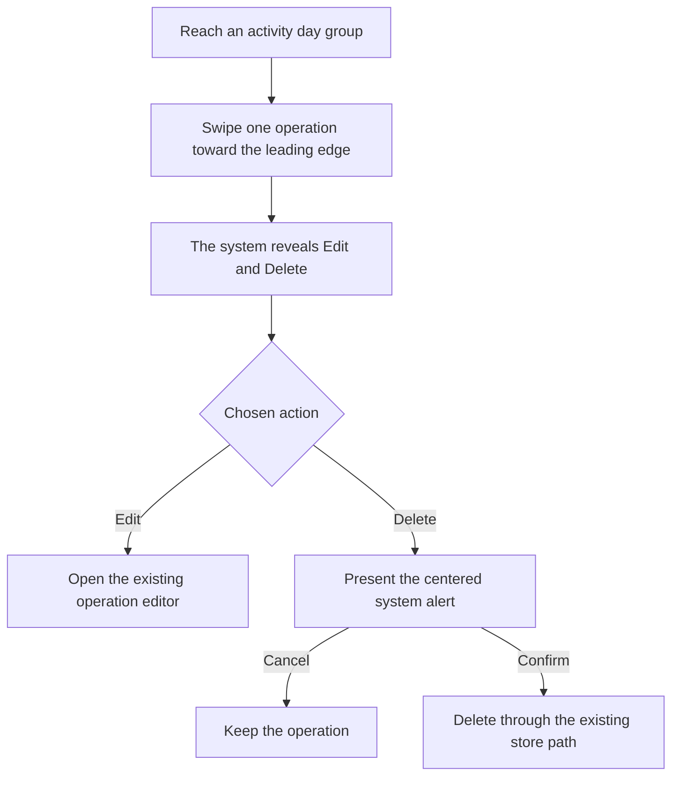
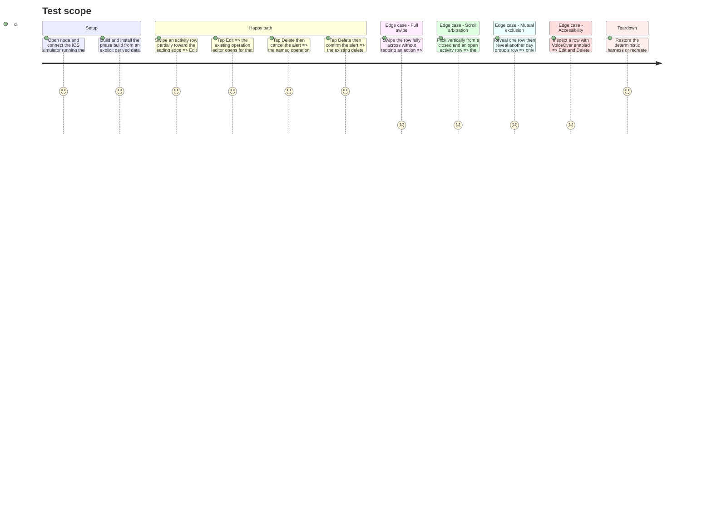

# Instruction: Replace the custom activity swipe with native row actions

## Architecture projection

> Tree of the final files. ✅ create · ✏️ modify · ❌ delete

```txt
ios/
├── Pulpe/
│   ├── Features/CurrentMonth/Components/
│   │   └── ✏️ ActivityCard.swift                     direct list sections and native trailing actions
│   └── Shared/
│       ├── Components/
│       │   └── ❌ TrailingSwipeActions.swift         home-only gesture renderer replaced by SwiftUI
│       └── Design/
│           └── ✏️ DesignTokens+Animation.swift       remove the now-unused swipe projection rate
├── PulpeTests/Shared/
│   └── ❌ TrailingSwipeActionsTests.swift            obsolete tests for deleted custom physics
└── PulpeUITests/
    └── ✏️ ContextualCreationUITests.swift            native reveal, edit, confirmation, scroll, and accessibility checks
```

## User Journey



## Test Scope



## Wireframe

```txt
┌──────────────────────────────────────┐
│ (1) Activity header and period       │
│                                      │
│ (2) Day-group header                 │
│ ┌────────────────┬─────────┬───────┐ │
│ │ (3) Operation │ (4)     │ (5)   │ │
│ │     row       │ action  │ danger│ │
│ ├────────────────┴─────────┴───────┤ │
│ │     Operation row                 │ │
│ └───────────────────────────────────┘ │
│ (6) Centered system alert            │
└──────────────────────────────────────┘
```

1. Activity header: total, destination link, and period selector retain their hierarchy.
2. Day header: one date labels the native row group.
3. Operation row: icon, description, tags, and amount remain unchanged.
4. Secondary action: edits the selected operation.
5. Destructive action: requests deletion.
6. Dialog: names the operation and separates cancellation from confirmation.

## Tasks to do

### `1)` Make each activity operation a native list row

> Keep the Activity presentation while moving its repeated rows into list-recognized sections.

1. Preserve the filter, total, day grouping, row content, stable transaction identity, and empty state.
2. Express the activity heading and period selector as non-swipeable list content and each day as a section whose transaction views are direct rows.
3. Use list row backgrounds, insets, separators, and section spacing to retain the Home Ledger grouping without custom card clipping or fixed heights.
4. Remove `openRowId`, the custom action-strip builder, and duplicate tap gestures.

### `2)` Declare the two system actions

> Let SwiftUI own gesture arbitration, release physics, chrome, hit testing, and assistive behavior.

1. Add `.swipeActions(edge: .trailing, allowsFullSwipe: false)` to each transaction row.
2. Declare Delete first in the builder so it sits closest to the trailing edge, followed by Edit, yielding the visible left-to-right order Edit then Delete.
3. Use native `Button` labels with `pencil` and `trash`, `.editAction` and `.destructivePrimary` tints, and the destructive role on Delete.
4. Present an item-driven system alert from `pendingActivityDeletion` and route Edit/Delete through the existing callbacks.
5. Verify native VoiceOver actions before removing the explicit duplicate `.accessibilityAction` declarations.

### `3)` Delete the home-only swipe implementation

> Remove code that the platform now owns.

1. Delete `TrailingSwipeActions.swift`; keep `HorizontalPanGesture` because `LeadingSwipeAction` still uses it.
2. Delete `TrailingSwipeActionsTests.swift` and remove `swipeDecelerationRate`, whose only production caller was the deleted modifier.
3. Confirm no `TrailingSwipeActions`, `trailingSwipeActions`, or `swipeDecelerationRate` references remain.

### `4)` Verify the native interaction end to end

> Prove the system implementation satisfies the validated product behavior and the old scroll fix.

1. Give deterministic activity rows stable accessibility identifiers in the existing home UI harness.
2. Cover partial reveal, Edit routing, mandatory Delete confirmation, cancellation, full-swipe refusal, mutual exclusion, and vertical scroll arbitration.
3. Run focused Swift/XCUITests and SwiftLint, then walk the visual and gesture cases through Noqa.
4. Capture normal and accessibility-size evidence under the task's ignored `evidence/` directory; do not track screenshots or video.

## Test acceptance criteria

| Task | Acceptance criteria |
| ---- | ------------------- |
| 1 | Every visible operation is a direct native list row with stable transaction identity and no fixed-height nested list. |
| 1 | Day labels, card grouping, dividers, tag wrapping, amounts, and Dynamic Type remain readable on the existing home rails. |
| 2 | A partial trailing swipe reveals native Edit and Delete actions; a full swipe executes neither action. |
| 2 | Delete always presents a centered system alert naming the operation before the store mutation can run. |
| 2 | Edit opens the existing editor and both actions remain available to VoiceOver without hidden custom tap targets. |
| 3 | The custom trailing modifier, its tests, and its private projection token are absent; the leading ledger swipe still compiles and behaves unchanged. |
| 4 | Vertical flicks from closed and revealed activity rows scroll immediately, and the system dismisses revealed actions while scrolling. |
| 4 | Opening another row closes the previous row without app-owned `openRowId` state. |
| 4 | Focused tests succeed, SwiftLint is clean, and Noqa confirms system chrome in light, dark, and accessibility-size presentations. |
