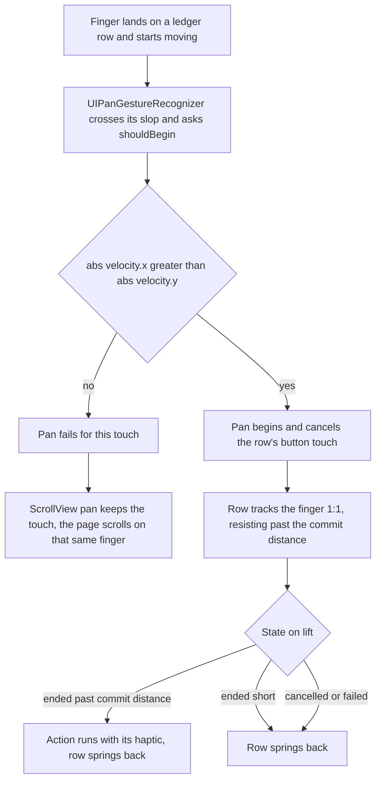
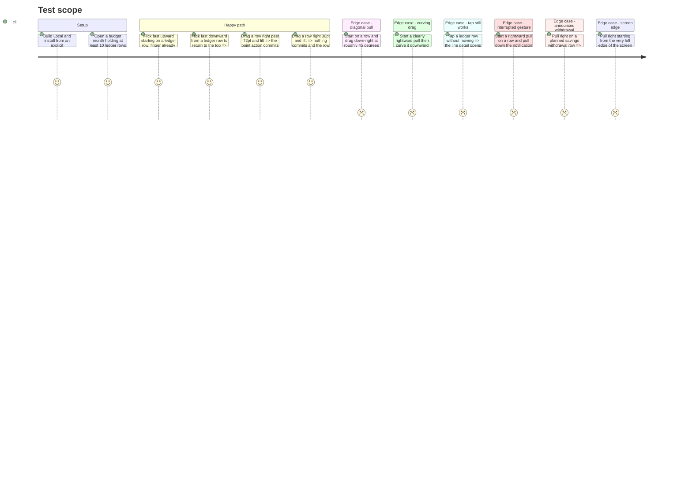

# Instruction: A horizontal pan that yields the vertical pulls to the scroll

## Architecture projection

> Tree of the final files. ✅ create · ✏️ modify · ❌ delete

```txt
ios/
├── Pulpe/Shared/Components/
│   ├── ✅ HorizontalPanGesture.swift    UIKit pan bridged to SwiftUI; refuses to begin on a vertical pull
│   └── ✏️ LeadingSwipeAction.swift      DragGesture → HorizontalPanGesture; 1:1 tracking; settles on cancel
└── project.yml                          unchanged — sources are folder-globbed, but `xcodegen generate --use-cache` still has to run
```

## User Journey



## Test Scope



## Tasks to do

### `1)` Create the shared pan primitive

> A `UIPanGestureRecognizer` that only ever begins for a horizontal pull, so an enclosing `ScrollView` keeps every vertical one.

1. New file `ios/Pulpe/Shared/Components/HorizontalPanGesture.swift`, a `struct HorizontalPanGesture: UIGestureRecognizerRepresentable` with `let isEnabled: Bool`, `let onChange: (CGFloat) -> Void`, `let onEnd: (CGFloat, CGFloat) -> Void` and `let onCancel: () -> Void`.
2. `makeUIGestureRecognizer(context:)` returns a `UIPanGestureRecognizer` with `maximumNumberOfTouches = 1` and `delegate = context.coordinator`.
3. `makeCoordinator(converter:)` returns a `final class Coordinator: NSObject, UIGestureRecognizerDelegate` whose only member is `gestureRecognizerShouldBegin`: cast to `UIPanGestureRecognizer`, read `velocity(in: recognizer.view?.window)`, and return `abs(velocity.x) > abs(velocity.y)`.
4. `updateUIGestureRecognizer(_:context:)` mirrors `isEnabled` onto the recognizer, so VoiceOver, Switch Control and a non-swipeable row disable it without a second code path.
5. `handleUIGestureRecognizerAction(_:context:)` switches on `state`: `.changed` calls `onChange(translation.x)`, `.ended` calls `onEnd(translation.x, velocity.x)`, `.cancelled` and `.failed` call `onCancel()`. Read both in `recognizer.view?.window` space so the row's own `.offset` transform cannot feed back into the translation.
6. Document, in the type's doc comment, why this exists rather than a `DragGesture`: `minimumDistance` is radial and is crossed inside the first delivered event by a finger that was already moving, and no SwiftUI gesture priority orders a SwiftUI gesture against the `ScrollView`'s UIKit pan. Name the three commits that tried.

### `2)` Rewire `LeadingSwipeAction`

> Same visual band and same commit distance, driven by the pan instead of the drag.

1. Replace `.gesture(drag, including:)` with `.gesture(HorizontalPanGesture(isEnabled: isEnabled && !voiceOver && !switchControl, onChange:onEnd:onCancel:))` and delete the `private var drag` property.
2. `onChange` keeps the existing rubber-band shape — clamp at `swipeCommitDistance`, then add the overshoot divided by four — but drops the `dx > abs(value.translation.height)` guard, which the pan's `shouldBegin` now owns; keep only `guard dx > 0 else { offset = 0; return }` so a leftward pull reveals nothing.
3. `onEnd` commits when `isArmed`, then springs `offset` back to 0 inside `withAnimation`.
4. `onCancel` springs `offset` back to 0 without committing.
5. Move the spring off the live drag: delete `.animation(reduceMotion ? nil : gentleSpring, value: offset)` and wrap only the release and cancel resets in `withAnimation(reduceMotion ? nil : DesignTokens.Animation.gentleSpring)`, so the band tracks the finger 1:1 and springs only on lift.
6. Rewrite the doc comment: the paragraph claiming `gesture` beats `highPriorityGesture` and `simultaneousGesture` is the theory this phase disproves, and must not survive as guidance.

### `3)` Regenerate and verify

> The new file has to reach the Xcode project, and the fix has to be seen on a real finger.

1. `cd ios && xcodegen generate --use-cache`.
2. `xcodebuild build -configuration Local` with an explicit `-derivedDataPath`, then install that exact build on the interactive simulator — never a path found by globbing DerivedData.
3. `swiftlint --strict` clean on both files.
4. Walk the Test Scope above by hand on the simulator. The fast-flick cases are the point of the phase and cannot be asserted from a unit test.

## Test acceptance criteria

| Task | Acceptance criteria                                                                                                                                       |
| ---- | ----------------------------------------------------------------------------------------------------------------------------------------------------------- |
| 1    | A pan whose touchdown velocity is more vertical than horizontal never leaves `.possible`, so the enclosing scroll view keeps the touch.                     |
| 1    | `isEnabled: false` leaves the row inert and still scrollable — no band, no swallowed pan.                                                                   |
| 2    | A fast vertical flick started on any ledger row scrolls the budget detail on that same finger, including when the finger is already moving on touchdown.    |
| 2    | A rightward pull past 72pt still commits the point toggle with its haptic; a shorter one springs back and commits nothing.                                  |
| 2    | The band follows the finger without lag, and springs only once the finger lifts.                                                                            |
| 2    | A drag interrupted by a system gesture leaves the row at rest, not stuck part-open.                                                                         |
| 2    | Tapping a ledger row still opens the line detail, and the `PointCircle` still toggles on its own tap.                                                       |
| 2    | A rightward pull starting at the screen's left edge still pops back to the accueil rather than revealing the band.                                          |
| 3    | `xcodebuild build -configuration Local` succeeds and `swiftlint --strict` reports nothing on either file.                                                   |
