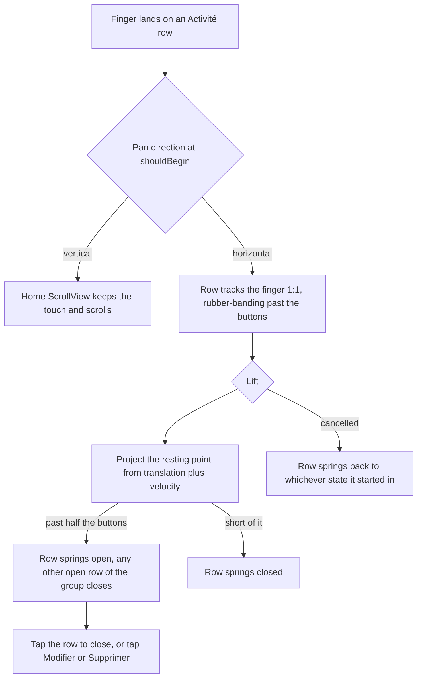
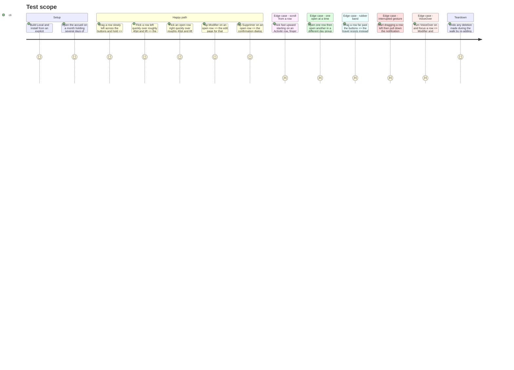

# Instruction: The trailing swipe gets an iOS row's release physics

## Architecture projection

> Tree of the final files. ✅ create · ✏️ modify · ❌ delete

```txt
ios/
├── Pulpe/Shared/Components/
│   └── ✏️ TrailingSwipeActions.swift          pan instead of drag, 1:1 tracking, projected release, rubber-band, cancel settle
├── Pulpe/Shared/Design/
│   └── ✏️ DesignTokens+Animation.swift        + swipeDecelerationRate, the projection's only constant
└── PulpeTests/Shared/
    └── ✏️ TrailingSwipeActionsTests.swift     restingOffset gains velocity — existing zero-velocity cases must still pass
```

## User Journey



## Test Scope



## Tasks to do

### `1)` Add the projection constant

> The release decision needs the platform's deceleration rate, and the project forbids a magic value.

1. In `DesignTokens+Animation.swift`, next to `swipeCommitDistance`, add `static let swipeDecelerationRate: CGFloat = 0.998` with a one-line comment: `UIScrollView.DecelerationRate.normal`, the rate WWDC18 *Designing Fluid Interfaces* projects a flick's resting point with.

### `2)` Give `restingOffset` the flick

> A quick flick must open the row whatever distance it covered.

1. Change the signature to `restingOffset(translation:velocity:wasOpen:width:)`.
2. Project the resting point: `projected = translation + (velocity / 1000) * rate / (1 - rate)`, with `rate` the new token, then apply the existing half-width comparison to `start + projected` instead of `start + translation`.
3. In `TrailingSwipeActionsTests`, pass `velocity: 0` to the four existing cases — they must still hold, which is what proves the projection only adds to the old behaviour — and add two cases: a 40pt leftward translation at −900 pt/s opens, and a 40pt rightward translation at +900 pt/s from an open row closes.

### `3)` Rewire the modifier onto the pan

> The same arbitration fix as phase 1, on the primitive the home rows use.

1. Replace `.gesture(drag, including:)` with `.gesture(HorizontalPanGesture(isEnabled: !voiceOver && !switchControl, onChange:onEnd:onCancel:))` and delete the `private var drag` property.
2. `onChange` drops the `abs(dx) > abs(dy)` guard — `shouldBegin` owns the axis now — and adds `guard width > 0 else { return }`, because a row whose buttons have not been measured yet clamps every translation to zero and swallows the first swipe.
3. `onEnd` calls the new `restingOffset` with the pan's velocity, resets `dragOffset` and sets `openId`, all inside one `withAnimation`.
4. `onCancel` resets `dragOffset` to 0 inside `withAnimation` and leaves `openId` untouched, so the row returns to whichever state it started the gesture in.

### `4)` Track the finger, then spring

> An iOS row is pinned to the finger and springs only on lift.

1. Delete `.animation(reduceMotion ? nil : gentleSpring, value: offset)` — it currently interpolates every tracking frame, which is the lag the report describes — and let tasks 3.3 and 3.4 own the spring through `withAnimation(reduceMotion ? nil : DesignTokens.Animation.gentleSpring)`.
2. Rubber-band the travel past the buttons instead of the current hard clamp: beyond `-width` (or beyond `0` when closing an open row), add only a quarter of the overshoot, the same resistance shape `LeadingSwipeAction` already uses.
3. Update the doc comment and drop the `// ponytail:` line about the missing rubber-band. Full-swipe-to-commit stays out of scope and stays named as such.

### `5)` Regenerate and verify

1. `cd ios && xcodegen generate --use-cache` (no new file, but the token and test edits ride along).
2. `xcodebuild build -configuration Local` with an explicit `-derivedDataPath`, install that exact build on the interactive simulator.
3. Run `TrailingSwipeActionsTests` on the dedicated test simulator, never the interactive one.
4. `swiftlint --strict` clean on all three files.
5. Walk the Test Scope above by hand.

## Test acceptance criteria

| Task | Acceptance criteria                                                                                                                                     |
| ---- | ----------------------------------------------------------------------------------------------------------------------------------------------------- |
| 1    | No literal deceleration rate appears in `TrailingSwipeActions.swift`.                                                                                   |
| 2    | The four original `restingOffset` cases still hold at zero velocity, and a short fast flick now resolves to the opposite side from the same translation. |
| 3    | A fast vertical flick started on an Activité row scrolls the accueil on that same finger.                                                                |
| 3    | A row whose buttons have not yet been measured no longer swallows the first swipe.                                                                       |
| 3    | A gesture interrupted mid-drag leaves the row fully open or fully closed, never stuck between the two.                                                   |
| 4    | The row sits under the finger with no visible lag during the drag, and springs only once the finger lifts.                                               |
| 4    | Dragging far past the buttons resists instead of sliding the row off screen.                                                                             |
| 5    | Modifier still opens the edit page, Supprimer still raises the confirmation dialog naming the operation, and opening a second row still closes the first. |
| 5    | Under VoiceOver the pan is inert and both actions remain reachable as accessibility actions.                                                             |
| 5    | `xcodebuild build -configuration Local` succeeds, `TrailingSwipeActionsTests` passes, `swiftlint --strict` reports nothing.                              |
