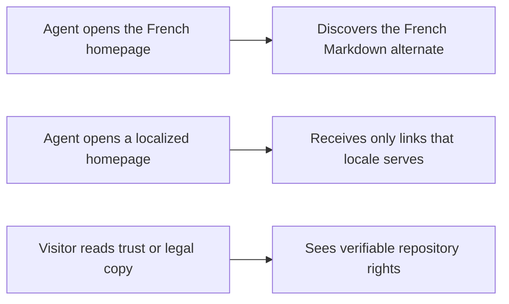
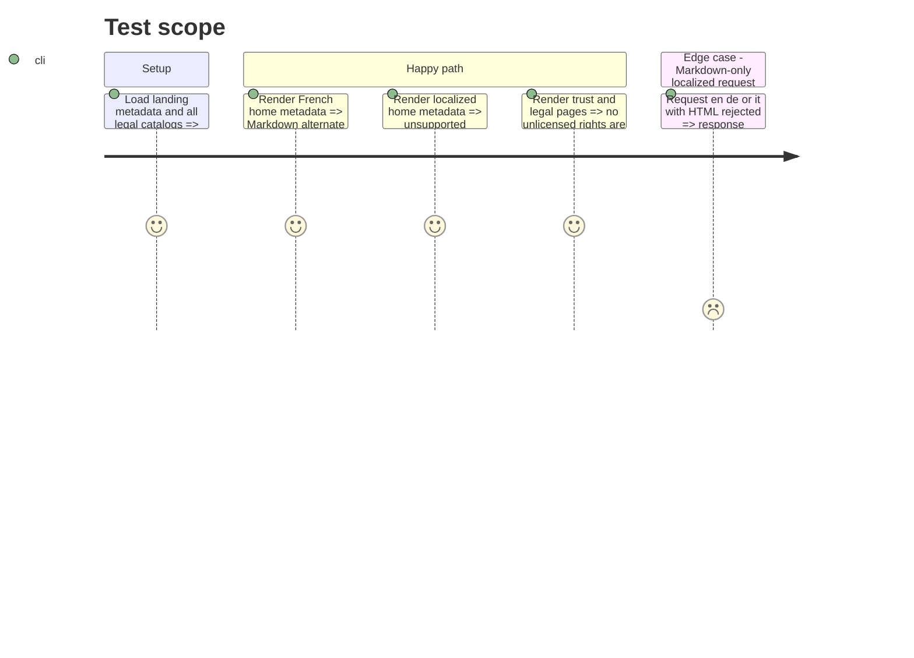

# Instruction: align public contracts and factual claims

## Architecture projection

> Tree of the final files. ✅ create · ✏️ modify · ❌ delete

```txt
.
├── landing
│   ├── app
│   │   ├── (fr)/about/page.tsx                         ✏️
│   │   └── agent-readiness.test.tsx                    ✏️
│   └── components/pages/metadata.ts                    ✏️
└── frontend/projects/webapp
    ├── public/i18n/{fr,en,de,it}.json                   ✏️
    └── src/app/feature/legal/components
        ├── privacy-policy.spec.ts                       ✏️
        └── terms-of-service.spec.ts                     ✏️
```

## User Journey



## Test Scope



## Tasks to do

### `1)` Match metadata to negotiation

> Advertise `/index.md` only from the French root that actually negotiates it.

1. Keep the existing localized HTML alternates unchanged.
2. Add regression coverage for French and non-French home metadata.

### `2)` Correct licensing claims at their sources

> Describe public source visibility without granting MIT, modification, redistribution, or self-hosting rights.

1. Update the About page and both affected legal sections in all four catalogs.
2. Preserve the privacy statement and GitHub link without calling the repository open source.

### `3)` Guard the public wording

> Extend existing landing and legal component tests instead of creating a new test layer.

1. Assert the alternate and localized 406 boundary.
2. Assert every rendered locale omits the unsupported rights claims.

## Test acceptance criteria

| Task | Acceptance criteria |
| ---- | ------------------- |
| 1 | `/` advertises `/index.md`; `/en`, `/de`, and `/it` do not advertise a Markdown representation they reject. |
| 2 | About, privacy, and terms copy accurately says the source is publicly visible without claiming an absent license or reuse rights. |
| 3 | Landing and Angular legal tests fail if either mismatch is reintroduced in any supported locale. |
