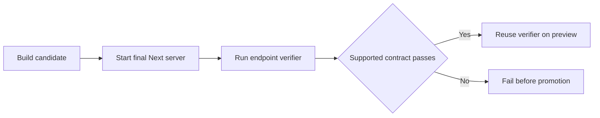
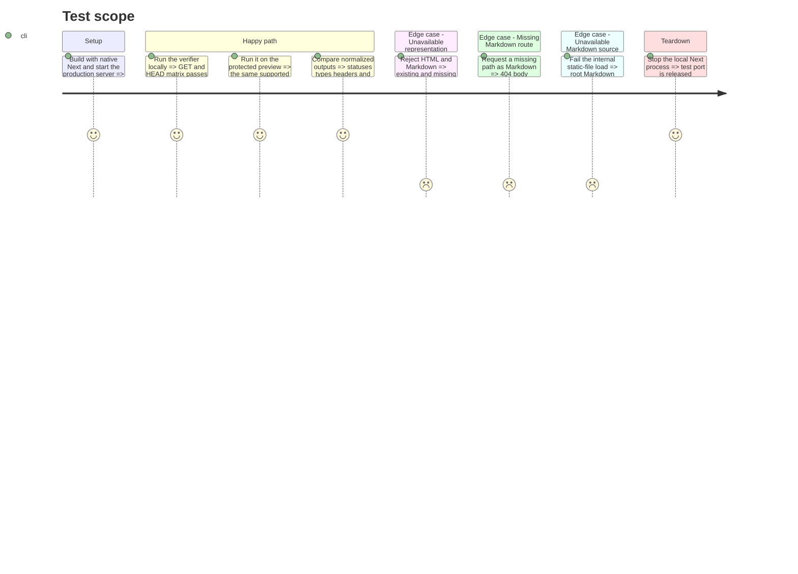

# Instruction: verify final HTTP responses without patching Next internals

## Architecture projection

> Tree of the final files. ✅ create · ✏️ modify · ❌ delete

```txt
.
├── landing
│   ├── app/agent-readiness.test.tsx                    ✏️
│   ├── package.json                                    ✏️
│   ├── proxy.ts                                        ✏️
│   └── scripts
│       ├── patch-next-vary.js                           ❌
│       └── verify-agent-readiness.js                    ✅
└── pnpm-lock.yaml                                      ✏️
```

## User Journey



## Test Scope



## Tasks to do

### `1)` Restore the native build

> Remove the ineffective runtime mutation, forced Webpack build, exact Next pin, and patch-only tests.

1. Restore the pre-change Next build and version policy.
2. Regenerate only the landing lockfile importer changes.

### `2)` Return negotiated Markdown directly

> Load the existing static Markdown file through its matcher-excluded URL and return a direct Proxy response.

1. Keep `public/index.md` as the only Markdown content source.
2. Preserve GET/HEAD semantics and forward only same-origin protection credentials needed by protected previews.
3. Return a cache-safe 503 if the tracked source cannot be loaded; never silently serve HTML.

### `3)` Add one final-response verifier

> Use built-in `fetch` to check a supplied base URL without logging secrets.

1. Cover HTML and Markdown GET/HEAD, quality values, wildcards, 404, 406, content types, `Vary`, robots, and recovery links.
2. Accept the optional Vercel bypass secret from the environment and emit stable textual or JSON results.

### `4)` Encode the supported boundary

> Require cache-safe negotiated responses while making the upstream HTML limitation visible.

1. Preserve RSC `Vary` tokens on HTML and exact `Accept, Accept-Encoding` on direct negotiated responses.
2. Report missing `Accept` on final HTML as the accepted Next/Vercel limitation, not as a passing implementation claim.

## Test acceptance criteria

| Task | Acceptance criteria |
| ---- | ------------------- |
| 1 | `next build` succeeds without mutating `node_modules`, forcing Webpack, or pinning Next solely for a private-runtime patch. |
| 2 | `/` returns the tracked Markdown as a direct GET/HEAD response without duplicating its content; an unavailable source returns 503 with `Vary: Accept, Accept-Encoding`. |
| 3 | One command validates the same observable endpoint matrix against local, protected preview, and production URLs without exposing credentials. |
| 4 | Markdown, Markdown 404, 406, and Markdown-source 503 responses vary on `Accept`; HTML keeps native RSC tokens and the unresolved upstream gap is explicit. |
