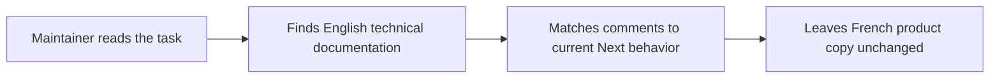
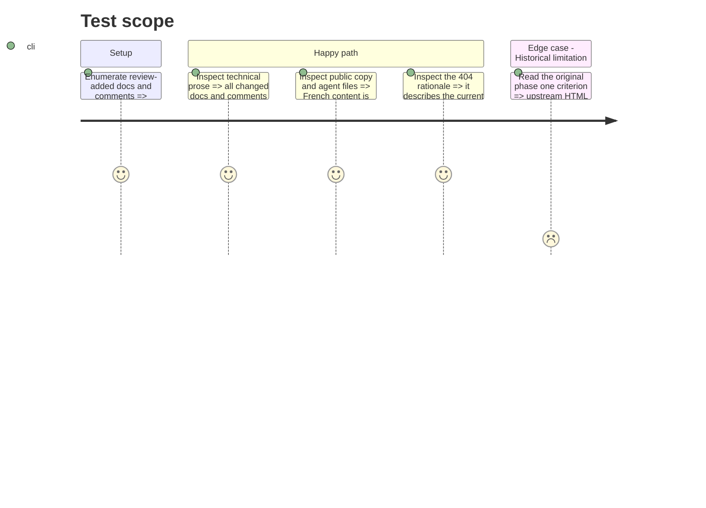

# Instruction: restore documentation and comment conformity

## Architecture projection

> Tree of the final files. ✅ create · ✏️ modify · ❌ delete

```txt
.
├── aidd_docs/tasks/2026_08/2026_08_25_landing-agent-readiness
│   ├── plan.md                                          ✏️
│   └── phase-{1,2,3,4}.md                               ✏️
└── landing
    ├── app/{(fr)/layout.tsx,[lang]/layout.tsx}           ✏️
    ├── app/{global-not-found.tsx,sitemap.ts}             ✏️
    ├── components/{RootDocument.tsx,pages/metadata.ts}   ✏️
    ├── lib/routes.ts                                     ✏️
    └── next.config.ts                                    ✏️
```

## User Journey



## Test Scope



## Tasks to do

### `1)` Translate the original AIDD task

> Convert technical planning prose to English while preserving evidence and status history.

1. Revise the strict HTML `Vary` criterion to the supported boundary from Phase 2.
2. Do not translate French product copy, `index.md`, or `llms.txt`.

### `2)` Translate changed implementation comments

> Keep only comments that explain a current constraint and write them in English.

1. Translate the comments introduced by this change set.
2. Remove the stale static-export sentence from `global-not-found.tsx`.

## Test acceptance criteria

| Task | Acceptance criteria |
| ---- | ------------------- |
| 1 | The original plan and four phases are English, retain their evidence, and no longer claim that the ineffective patch proves final HTML compliance. |
| 2 | Changed technical comments are English and accurate; all user-facing and agent-facing French text remains French. |
