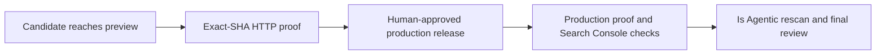
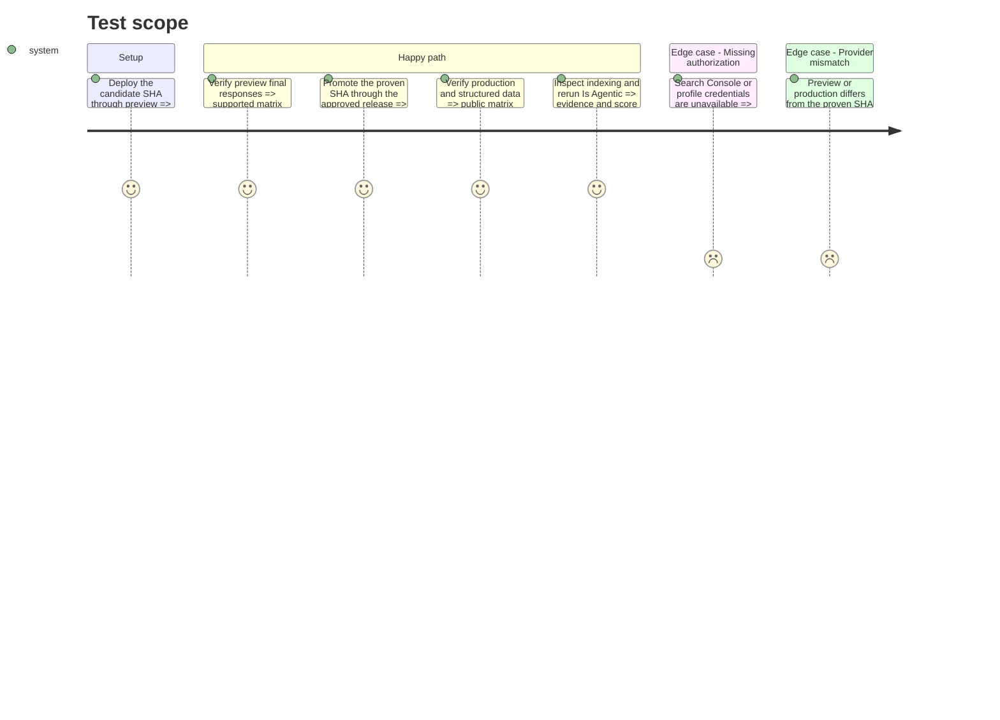

# Instruction: promote, verify, and rescan the public site

## Architecture projection

> Tree of the final files. ✅ create · ✏️ modify · ❌ delete

```txt
aidd_docs/tasks/2026_08
├── 2026_08_25_landing-agent-readiness
│   ├── plan.md                                          ✏️
│   ├── phase-4.md                                       ✏️
│   └── review.md                                        ✏️
└── 2026_08_25_landing-agent-readiness-review-fixes
    └── verification.md                                  ✅
```

## User Journey



## Test Scope



## Tasks to do

### `1)` Record protected-preview proof

> Run the final-response verifier against the exact preview SHA and store a textual matrix.

1. Keep bypass credentials in the environment and out of logs.
2. Record the accepted HTML limitation separately from passing Markdown checks.

### `2)` Promote through the existing release flow

> Use `preview` for staging and a human-approved release to `main`; do not deploy production directly.

1. Re-run the matrix, JSON-LD, sitemap, `llms.txt`, and trust-page checks on `pulpe.app`.
2. Stop if the deployed commit or behavior differs from preview.

### `3)` Close external evidence and review

> Verify canonical identity, indexing, and the post-deployment readiness score.

1. Use authorized Search Console access to inspect/request indexing and check existing external profiles; do not create a new outreach campaign unless evidence requires it.
2. Rerun Is Agentic and the AIDD review, then synchronize the original and correction-plan statuses.

## Test acceptance criteria

| Task | Acceptance criteria |
| ---- | ------------------- |
| 1 | The tracked report identifies the preview URL and SHA and contains a passing supported endpoint matrix with no secret values. |
| 2 | `pulpe.app` serves the same proven statuses, types, recovery content, discovery files, and structured data after a human-approved release. |
| 3 | Search Console/profile evidence, the new Is Agentic score, the clean-brand observation, and an approved final review are recorded; unavailable credentials are named precisely. |
