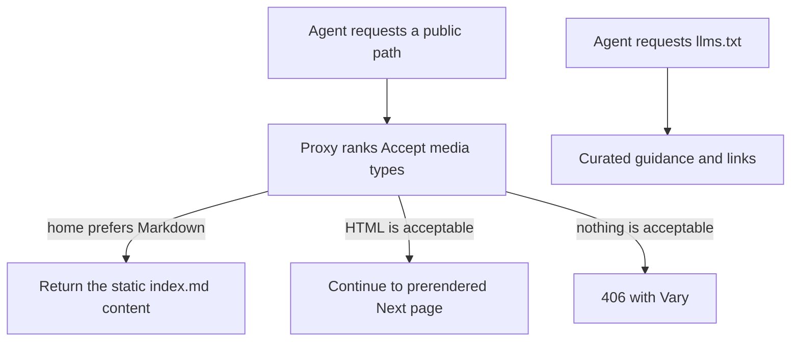
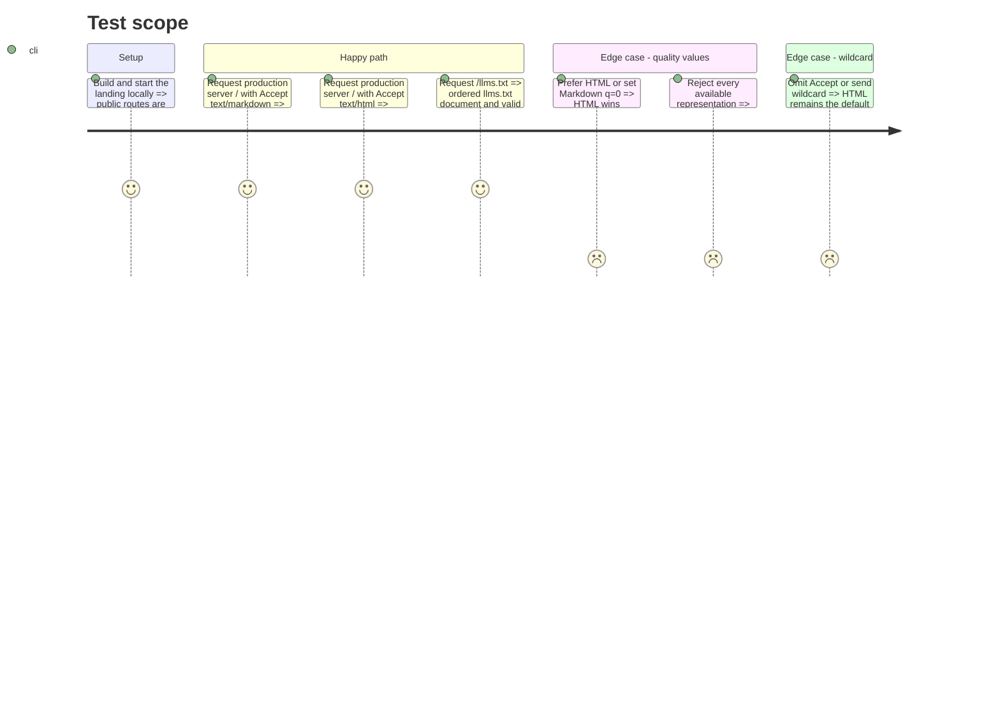

# Instruction: Markdown negotiation and agent instructions

## Architecture projection

> Tree of the final files. ✅ create · ✏️ modify · ❌ delete

```txt
.
├── ✏️ pnpm-lock.yaml
└── landing/
    ├── ✅ proxy.ts
    ├── app/
    │   ├── ✏️ (fr)/layout.tsx
    │   ├── ✏️ [lang]/layout.tsx
    │   ├── ✅ agent-readiness.test.tsx
    │   └── ✏️ sitemap.ts
    ├── components/
    │   ├── ✏️ RootDocument.tsx
    │   └── pages/
    │       └── ✏️ metadata.ts
    ├── ✏️ next.config.ts
    ├── ✏️ package.json
    ├── public/
    │   ├── ✅ index.md
    │   └── ✅ llms.txt
    └── scripts/
        └── ✅ verify-agent-readiness.js
```

## User Journey



## Test Scope



## Tasks to do

### `1)` Leave pure export without making pages dynamic

> Allow a minimal request boundary while preserving static page rendering.

1. Remove only `output: "export"` from `next.config.ts`; keep unoptimized images and all other settings.
2. Add `dynamicParams = false` to the `[lang]` layout so unknown languages retain a 404.
3. Correct stale comments in `(fr)/layout.tsx`, `[lang]/layout.tsx`, `RootDocument.tsx`, and `sitemap.ts`; do not change routes or root layouts.
4. Prove in the build that `/`, localized pages, and the sitemap remain `Static`/`SSG`.

### `2)` Negotiate representations correctly

> One Proxy ranks `text/html` and `text/markdown` with their `q` values.

1. Declare `negotiator` and its types, already present transitively, instead of rewriting an HTTP parser.
2. Limit the matcher to content paths: exclude `_next`, assets with extensions, `/ph`, and `/app`; derive existing paths from the sitemap instead of maintaining a second list.
3. On `/`, load the tracked `public/index.md` and return it directly only when Markdown is preferred; return 406 when neither HTML nor Markdown is acceptable.
4. On another existing route without a Markdown variant, continue as HTML if acceptable, otherwise return 406; never turn an existing page into a 404.
5. Set `Vary: Accept, Accept-Encoding` and `Content-Type: text/markdown; charset=utf-8` on direct Proxy responses.
6. If the Markdown source cannot be loaded, return an explicit cache-safe 503 instead of falling through to HTML.
7. Keep HTML as the default for a missing header or `*/*`; test ties, weighted values, and `q=0`.

### `3)` Publish agent entry points

> Two small static files, without a generator or CMS.

1. `index.md` contains only stable homepage facts, use cases, and main links; it makes no promise absent from the HTML.
2. `llms.txt` follows the v2 order exactly: H1, blockquote, details, then link lists under H2 headings.
3. `When to use Pulpe` names the right jobs: prepare an annual budget, place irregular expenses, project available money, and use CHF/EUR without bank connectivity.
4. State explicitly that no public agent API exists: an agent recommends or opens the app/calculator and does not invent an automated call.
5. Add `rel="alternate" type="text/markdown"` on the French homepage and `rel="describedby"` to `/llms.txt` in the root document.

### `4)` Lock the contract

> One dedicated test file for agent surfaces.

1. Test representation selection, statuses, `Content-Type`, Proxy `Vary`, source-load failure, and the absence of an HTML regression.
2. Parse `llms.txt` to verify the required order, its single H1, and H2 sections containing valid absolute links.
3. Verify that `index.md` exceeds 500 useful characters, contains an H1, and contains neither HTML tags nor nonexistent API jargon.
4. Add a dependency-free final-response verifier that runs the same matrix against local, preview, and production URLs.
5. On the final local server and preview, require `Accept` and `Accept-Encoding` on negotiated Markdown/404/406 responses, preserve native RSC tokens on HTML, and record Next's upstream omission of `Accept` from final HTML `Vary`.

## Test acceptance criteria

| Task | Acceptance criteria                                                                                                                                                                                                                                                                   |
| ---- | ------------------------------------------------------------------------------------------------------------------------------------------------------------------------------------------------------------------------------------------------------------------------------------- |
| 1    | The build still marks the homepage and existing pages as static/SSG; a locale outside FR/EN/DE/IT remains a 404.                                                                                                                                                                      |
| 2    | `Accept` preferences and `q` values select the correct representation, `q=0` is never served, and every negotiated Markdown/404/406 final response varies on `Accept` and `Accept-Encoding`. Final HTML preserves Next's RSC tokens; the upstream missing `Accept` token is explicit. |
| 3    | `/llms.txt` follows the v2 format and explains precisely when to recommend Pulpe without claiming to expose an API.                                                                                                                                                                   |
| 4    | Landing tests fail if Markdown, cache headers, source failure handling, or discovery links drift.                                                                                                                                                                                     |
