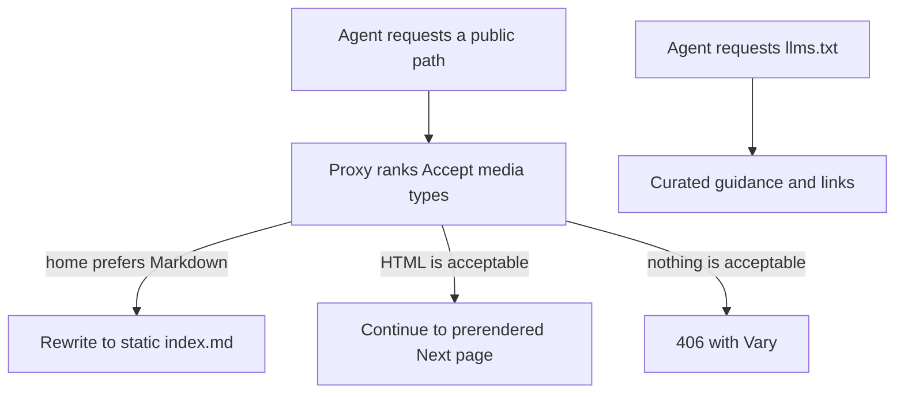
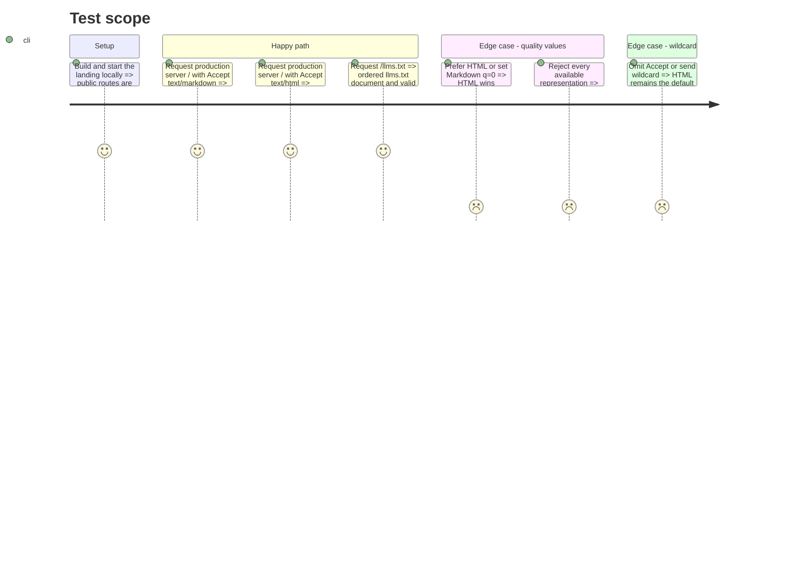

# Instruction: négociation Markdown et instructions agents

## Architecture projection

> Tree of the final files. ✅ create · ✏️ modify · ❌ delete

```txt
.
├── ✏️ pnpm-lock.yaml
└── landing/
    ├── ✅ proxy.ts
    ├── app/
    │   ├── ✏️ (fr)/layout.tsx
    │   ├── ✏️ [lang]/layout.tsx
    │   ├── ✅ agent-readiness.test.tsx
    │   └── ✏️ sitemap.ts
    ├── components/
    │   ├── ✏️ RootDocument.tsx
    │   └── pages/
    │       └── ✏️ metadata.ts
    ├── ✏️ next.config.ts
    ├── ✏️ package.json
    ├── public/
    │   ├── ✅ index.md
    │   └── ✅ llms.txt
    └── scripts/
        └── ✅ patch-next-vary.js
```

## User Journey



## Test Scope



## Tasks to do

### `1)` Sortir de l'export pur sans rendre les pages dynamiques

> Autoriser une frontière de requête minuscule tout en conservant le rendu statique des pages.

1. Retirer seulement `output: "export"` de `next.config.ts`; garder `distDir`, les images non optimisées et les autres réglages.
2. Ajouter `dynamicParams = false` au layout `[lang]` pour conserver le 404 des langues inconnues, auparavant imposé par l'export.
3. Corriger les commentaires de `(fr)/layout.tsx`, `[lang]/layout.tsx`, `RootDocument.tsx` et `sitemap.ts` devenus faux ; ne changer ni les routes ni les root layouts.
4. Prouver dans le build que `/`, les pages localisées et le sitemap restent `Static`/`SSG`.

### `2)` Négocier la représentation de façon conforme

> Un proxy unique classe `text/html` et `text/markdown` avec leurs valeurs `q`.

1. Déclarer directement `negotiator` et ses types, déjà présents transitivement, plutôt que réécrire un parseur HTTP.
2. Limiter le matcher aux chemins de contenu : exclure `_next`, les assets avec extension, `/ph` et `/app`; dériver les chemins existants du sitemap au lieu de maintenir une seconde liste.
3. Sur `/`, réécrire vers `public/index.md` seulement lorsque Markdown est la représentation préférée; renvoyer 406 lorsque ni HTML ni Markdown ne sont acceptables.
4. Sur une autre route existante sans variante Markdown, poursuivre en HTML si ce type reste acceptable, sinon renvoyer 406; ne jamais transformer une page existante en 404.
5. Poser `Vary: Accept, Accept-Encoding` et `Content-Type: text/markdown; charset=utf-8` sur les réponses directes du proxy.
6. Verrouiller Next sur `16.3.1` et exécuter avant chaque build un script idempotent qui ajoute `Accept` à l'unique `getVaryHeader` du runtime App Page de production ; refuser le build si la version ou le motif exact change. La compression native ajoute ensuite `Accept-Encoding`.
7. Garder HTML comme valeur par défaut pour en-tête absent ou `*/*`; tester les égalités, valeurs pondérées et `q=0`.

### `3)` Publier les points d'entrée agents

> Deux petits fichiers statiques, sans générateur ni CMS.

1. `index.md` reprend uniquement les faits stables de la homepage, ses cas d'usage et les liens principaux; aucune promesse absente du HTML.
2. `llms.txt` suit exactement l'ordre v2 : H1, blockquote, détails, puis listes de liens sous H2.
3. La section `When to use Pulpe` nomme les bons travaux : préparer un budget annuel, placer les dépenses irrégulières, projeter le disponible et utiliser CHF/EUR sans connexion bancaire.
4. Dire explicitement qu'il n'existe pas d'API publique pour agents : un agent recommande ou ouvre l'app/calculateur, il n'invente pas d'appel automatisé.
5. Ajouter `rel="alternate" type="text/markdown"` sur la homepage et `rel="describedby"` vers `/llms.txt` dans le document racine.

### `4)` Verrouiller le contrat

> Un seul fichier de test dédié aux surfaces agents.

1. Tester la sélection de représentation, les statuts, `Content-Type`, le `Vary` du proxy et l'absence de régression HTML.
2. Parser `llms.txt` pour vérifier l'ordre requis, l'unique H1 et des listes H2 constituées de liens absolus valides.
3. Vérifier que `index.md` dépasse 500 caractères utiles, contient un H1 et ne contient ni balise HTML ni jargon d'API inexistant.
4. Vérifier dans le même test la version exacte de Next, la transformation du runtime, son idempotence et son échec sur un motif inattendu, puis ajouter le test au script `pulpe-landing test`.
5. Valider sur le serveur de production local, puis en preview si disponible, que les réponses Markdown et HTML finales contiennent `Accept` et `Accept-Encoding`, et que l'HTML conserve les quatre champs RSC.

## Test acceptance criteria

| Task | Acceptance criteria |
| ---- | ------------------- |
| 1 | Le build marque toujours la homepage et les pages existantes comme statiques/SSG; une locale hors FR/EN/DE/IT reste 404. |
| 2 | Les préférences `Accept` et `q` choisissent la bonne représentation, `q=0` n'est jamais servi, et la réponse finale de chaque variante annonce `Accept` et `Accept-Encoding` dans `Vary` sans perdre les champs RSC de l'HTML. |
| 3 | `/llms.txt` respecte le format v2 et explique précisément quand recommander Pulpe, sans prétendre exposer une API. |
| 4 | Les tests de landing échouent si le Markdown, les en-têtes de cache ou les liens de découverte divergent. |
