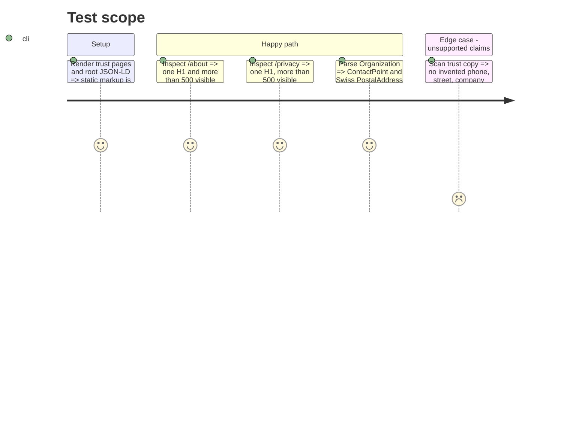

# Instruction: trust pages and Organization identity

## Architecture projection

> Tree of the final files. ✅ create · ✏️ modify · ❌ delete

```txt
landing/
├── app/
│   ├── (fr)/
│   │   ├── about/
│   │   │   └── ✅ page.tsx
│   │   └── privacy/
│   │       └── ✅ page.tsx
│   ├── ✏️ agent-readiness.test.tsx
│   └── ✏️ sitemap.ts
├── components/
│   └── ✏️ RootDocument.tsx
├── lib/
│   └── ✏️ routes.ts
└── public/
    ├── ✏️ index.md
    └── ✏️ llms.txt
```

## User Journey

```mermaid
flowchart TD
  A[Agent discovers sitemap or llms.txt] --> B[/about]
  A --> C[/privacy]
  B --> D[Creator, purpose, business model, source]
  C --> E[Privacy summary and complete policy link]
  B --> F[Organization JSON-LD]
  C --> F
```

## Test Scope



## Wireframe

```txt
┌──────────────────────────────────────────┐
│ (1) Shared landing header                │
├──────────────────────────────────────────┤
│ (2) Page title · short introduction      │
│                                          │
│ (3) Narrow editorial sections            │
│     heading · paragraphs · factual links │
│                                          │
│ (4) Primary source or policy link         │
├──────────────────────────────────────────┤
│ (5) Shared landing footer                │
└──────────────────────────────────────────┘
```

1. Header: reuse the existing navigation and skip-link contract.
2. Intro: identify the trust topic with one H1.
3. Sections: expose enough plain text for humans and agents without a new card system.
4. Source: link to the repository on About and the complete legal policy on Privacy.
5. Footer: preserve the current landing navigation and legal destinations.

## Tasks to do

### `1)` Publish `/about`

> Make the identity already visible on the homepage available at a canonical URL.

1. Reuse the `Header`/`Container`/`Footer` shell and factual `home.whyFree` content; do not create a new generic component.
2. Add an introduction identifying Pulpe, Maxime, Switzerland, the current free model, the publicly visible source code, and the absence of bank connectivity.
3. Keep one H1, ordered H2 headings, a `/about` canonical, and more than 500 visible characters in raw HTML.

### `2)` Publish `/privacy`

> Provide a concise trust anchor without duplicating the complete legal policy.

1. Summarize data categories, amount encryption, PostHog diagnostics, processors, rights, and contact from `docs/CONSENT.md` and the current Angular component.
2. Link clearly to the complete policy on `app.pulpe.app` with the French locale; do not change onboarding or the Angular document.
3. Keep one H1, ordered H2 headings, a `/privacy` canonical, and more than 500 visible characters.

### `3)` Make trust anchors discoverable

> One route source for the sitemap, Proxy, and agent files.

1. Declare the two French routes in `lib/routes.ts` without adding them to `ROUTES`, which is reserved for pages translated into all four languages.
2. Add `/about` and `/privacy` to the sitemap without nonexistent hreflang variants.
3. List them in `llms.txt` and `index.md`; keep `/support` as the Contact page already verified by the audit.

### `4)` Complete the Organization entity

> Add only contact details that are already published and verifiable.

1. Add `contactPoint` with `CONTACT_EMAIL`, `contactType: "customer support"`, the `/support` URL, and available languages.
2. Add a `PostalAddress` with `addressCountry: "CH"`, already stated in the policy; do not invent a phone number, street address, or registration.
3. Extend JSON-LD and page/sitemap tests in `agent-readiness.test.tsx`.

## Test acceptance criteria

| Task | Acceptance criteria                                                                                                                 |
| ---- | ----------------------------------------------------------------------------------------------------------------------------------- |
| 1    | `/about` returns 200 with a clean canonical, one H1, a gap-free hierarchy, and more than 500 visible characters without JavaScript. |
| 2    | `/privacy` returns 200 with the same contract and leads to the complete policy without replacing its URL or content.                |
| 3    | The sitemap and `llms.txt` expose About, Privacy, and the existing Contact page without advertising nonexistent translations.       |
| 4    | JSON-LD contains a reachable `ContactPoint` and Swiss `PostalAddress` without invented personal data.                               |
