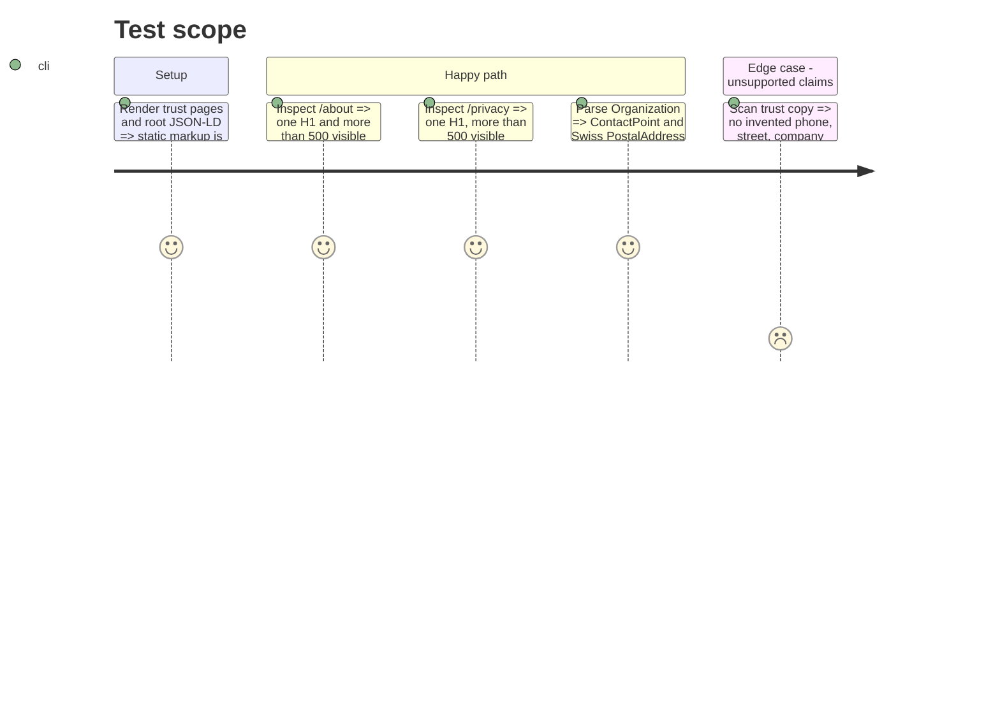

# Instruction: pages de confiance et identité Organization

## Architecture projection

> Tree of the final files. ✅ create · ✏️ modify · ❌ delete

```txt
landing/
├── app/
│   ├── (fr)/
│   │   ├── about/
│   │   │   └── ✅ page.tsx
│   │   └── privacy/
│   │       └── ✅ page.tsx
│   ├── ✏️ agent-readiness.test.tsx
│   └── ✏️ sitemap.ts
├── components/
│   └── ✏️ RootDocument.tsx
├── lib/
│   └── ✏️ routes.ts
└── public/
    ├── ✏️ index.md
    └── ✏️ llms.txt
```

## User Journey

```mermaid
flowchart TD
  A[Agent discovers sitemap or llms.txt] --> B[/about]
  A --> C[/privacy]
  B --> D[Creator, purpose, business model, source]
  C --> E[Privacy summary and complete policy link]
  B --> F[Organization JSON-LD]
  C --> F
```

## Test Scope



## Wireframe

```txt
┌──────────────────────────────────────────┐
│ (1) Shared landing header                │
├──────────────────────────────────────────┤
│ (2) Page title · short introduction      │
│                                          │
│ (3) Narrow editorial sections            │
│     heading · paragraphs · factual links │
│                                          │
│ (4) Primary source or policy link         │
├──────────────────────────────────────────┤
│ (5) Shared landing footer                │
└──────────────────────────────────────────┘
```

1. Header: reuse the existing navigation and skip-link contract.
2. Intro: identify the trust topic with one H1.
3. Sections: expose enough plain text for humans and agents without a new card system.
4. Source: link to the repository on About and the complete legal policy on Privacy.
5. Footer: preserve the current landing navigation and legal destinations.

## Tasks to do

### `1)` Publier `/about`

> Rendre l'identité déjà visible sur la homepage accessible à une URL canonique.

1. Réutiliser le shell `Header`/`Container`/`Footer` et les contenus factuels de `home.whyFree`; ne pas créer un nouveau composant générique.
2. Ajouter une introduction qui identifie Pulpe, Maxime, la Suisse, le modèle gratuit actuel, l'open source et l'absence de connexion bancaire.
3. Garder un H1 unique, des H2 ordonnés, un canonical `/about` et plus de 500 caractères visibles dans le HTML brut.

### `2)` Publier `/privacy`

> Donner une ancre de confiance concise sans dupliquer la politique légale complète.

1. Résumer les catégories de données, le chiffrement des montants, les diagnostics PostHog, les sous-traitants, les droits et le contact à partir de `docs/CONSENT.md` et du composant Angular courant.
2. Lier clairement la politique complète sur `app.pulpe.app` avec la locale française; ne pas modifier le parcours d'inscription ni le document Angular.
3. Garder un H1 unique, des H2 ordonnés, un canonical `/privacy` et plus de 500 caractères visibles.

### `3)` Rendre les ancres découvrables

> Une source de routes pour le sitemap, le proxy et les fichiers agents.

1. Déclarer les deux routes françaises dans `lib/routes.ts` sans les ajouter à `ROUTES`, réservé aux pages traduites quatre fois.
2. Ajouter `/about` et `/privacy` au sitemap sans `hreflang` inexistant.
3. Les lister dans `llms.txt` et `index.md`; conserver `/support` comme page Contact déjà vérifiée par l'audit.

### `4)` Compléter l'entité Organization

> Ajouter uniquement les coordonnées déjà publiées et vérifiables.

1. Ajouter `contactPoint` avec `CONTACT_EMAIL`, `contactType: "customer support"`, URL `/support` et langues disponibles.
2. Ajouter `address` de type `PostalAddress` avec `addressCountry: "CH"`, déjà affirmé dans la politique; ne pas inventer téléphone, rue ou immatriculation.
3. Étendre le test JSON-LD et les tests de pages/sitemap dans `agent-readiness.test.tsx`.

## Test acceptance criteria

| Task | Acceptance criteria |
| ---- | ------------------- |
| 1 | `/about` répond 200 avec un canonical propre, un H1, une hiérarchie sans saut et plus de 500 caractères visibles sans JavaScript. |
| 2 | `/privacy` répond 200 avec le même contrat et conduit à la politique complète sans remplacer son URL ni son contenu. |
| 3 | Le sitemap et `llms.txt` exposent About, Privacy et le Contact existant sans annoncer de traduction inexistante. |
| 4 | Le JSON-LD contient un `ContactPoint` joignable et un `PostalAddress` suisse, sans donnée personnelle inventée. |
