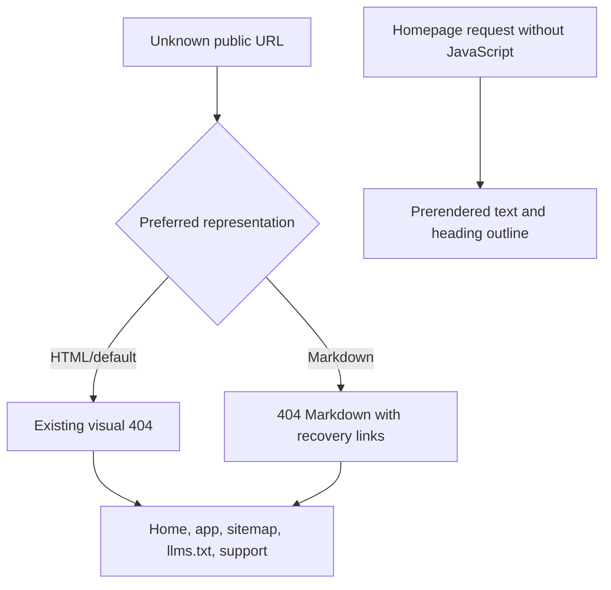
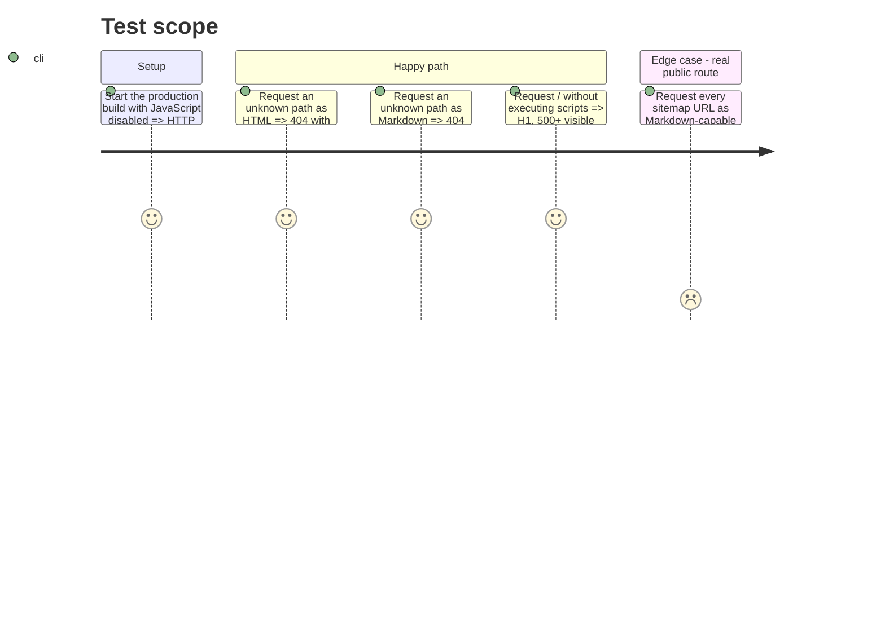

# Instruction: recoverable 404 and no-JavaScript HTML proof

## Architecture projection

> Tree of the final files. ✅ create · ✏️ modify · ❌ delete

```txt
✏️ .vercelignore
landing/
├── app/
│   ├── ✏️ agent-readiness.test.tsx
│   └── ✏️ global-not-found.tsx
├── content/dictionaries/
│   └── ✏️ fr.ts
├── ✏️ next-env.d.ts
├── ✏️ next.config.ts
├── ✏️ package.json
└── ✏️ proxy.ts
```

## User Journey



## Test Scope



## Wireframe

```txt
┌────────────────────────────────────────┐
│ (1) Brand link                         │
│                                        │
│ (2) Error code · title · explanation   │
│                                        │
│ (3) Primary human destinations         │
│                                        │
│ (4) Compact recovery links for agents  │
└────────────────────────────────────────┘
```

1. Brand: preserve the current compact Pulpe identity.
2. Message: explain an unknown path rather than only the historical app move.
3. Human destinations: keep the app and homepage actions unchanged.
4. Recovery: expose sitemap, llms.txt and support without changing the visual hierarchy.

## Tasks to do

### `1)` Make the 404 actionable

> Preserve the status and design while replacing the dead end with reliable destinations.

1. Keep `global-not-found.tsx`, its complete document, `noindex`, and app/home buttons.
2. Replace the French copy about the historical move with a generic unknown-path explanation.
3. Add compact links to `/sitemap.xml`, `/llms.txt`, and `/support`; labels remain French because the global 404 has no reliable locale.
4. In Proxy, respond directly with `text/markdown; charset=utf-8`, status 404, and the same destinations when a missing path prefers Markdown.
5. Use sitemap-derived URLs so Proxy never classifies a real page as missing.

### `2)` Treat “without JavaScript” as regression proof

> The homepage is already prerendered; do not modify a component without a reproducible defect.

1. From the production build, extract `/` HTML without executing scripts and count visible text.
2. Verify exactly one H1, at least one H2, and no level gap in the current H1/H2/H3/H4 order.
3. Add these assertions to the agent integration test; change headings only if the test reproduces a real gap.
4. Confirm that server sections remain outside the client bundle as in the existing accessibility test.

### `3)` Verify the local and preview HTTP contract

> Statuses and headers are exit criteria, not optional manual inspection.

1. Test at least `GET` and `HEAD` on a random URL, first as HTML and then Markdown.
2. Verify 404, `Content-Type`, and `Vary` on `GET`/`HEAD`; verify `noindex` in HTML and the three recovery links in both `GET` bodies.
3. Replay the matrix on a Vercel preview before merge to cover the CDN/Proxy boundary.
4. Keep the native `.next` build directory expected by Vercel after removal of the former static export.
5. Keep `public/index.md` in the Vercel artifact and use the native Next build. The final-response verifier must prove direct negotiated responses; final HTML keeps native RSC tokens and records the upstream `Accept` omission.

## Test acceptance criteria

| Task | Acceptance criteria                                                                                                                                               |
| ---- | ----------------------------------------------------------------------------------------------------------------------------------------------------------------- |
| 1    | Every missing URL remains a real 404; HTML preserves the current design and Markdown provides a short recovery map.                                               |
| 2    | Raw `/` HTML contains one H1, more than 500 useful characters, and a gap-free heading hierarchy without JavaScript execution.                                     |
| 3    | The same statuses, types, negotiated-response `Vary`, and links are observed locally and on the Vercel preview; the final HTML limitation is recorded explicitly. |
