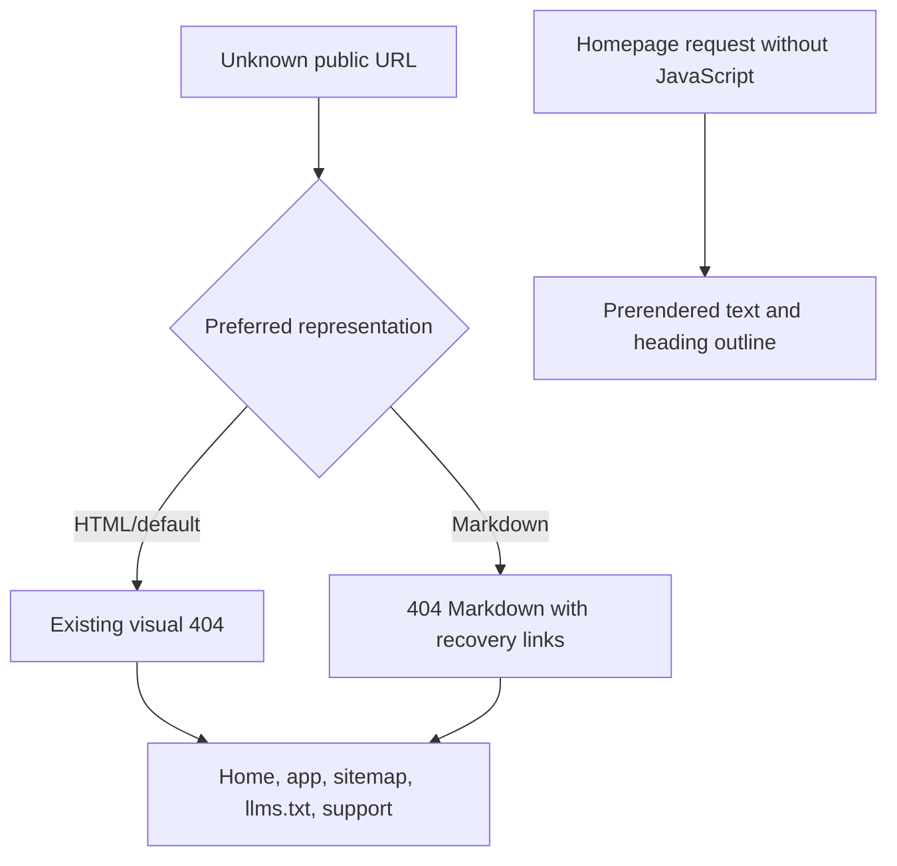
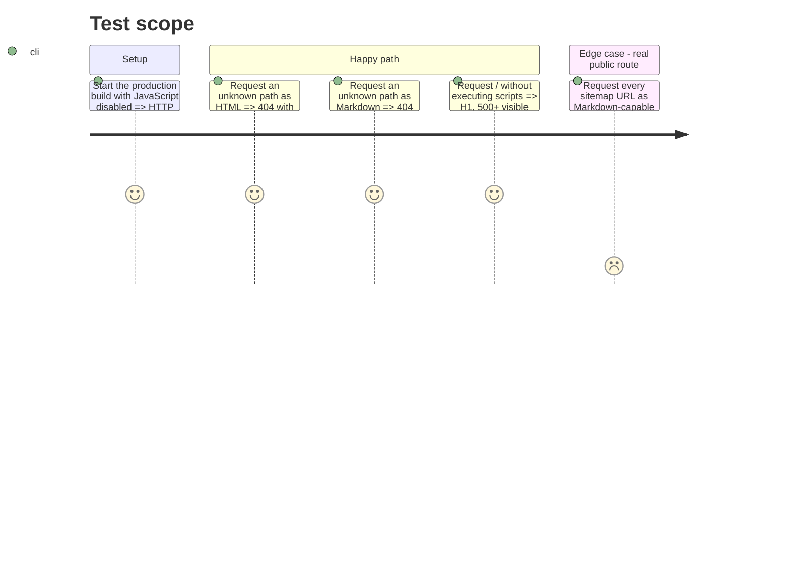

# Instruction: 404 récupérable et preuve du HTML sans JavaScript

## Architecture projection

> Tree of the final files. ✅ create · ✏️ modify · ❌ delete

```txt
✏️ .vercelignore
landing/
├── app/
│   ├── ✏️ agent-readiness.test.tsx
│   └── ✏️ global-not-found.tsx
├── content/dictionaries/
│   └── ✏️ fr.ts
├── ✏️ next-env.d.ts
├── ✏️ next.config.ts
├── ✏️ package.json
└── ✏️ proxy.ts
```

## User Journey



## Test Scope



## Wireframe

```txt
┌────────────────────────────────────────┐
│ (1) Brand link                         │
│                                        │
│ (2) Error code · title · explanation   │
│                                        │
│ (3) Primary human destinations         │
│                                        │
│ (4) Compact recovery links for agents  │
└────────────────────────────────────────┘
```

1. Brand: preserve the current compact Pulpe identity.
2. Message: explain an unknown path rather than only the historical app move.
3. Human destinations: keep the app and homepage actions unchanged.
4. Recovery: expose sitemap, llms.txt and support without changing the visual hierarchy.

## Tasks to do

### `1)` Rendre le 404 actionnable

> Conserver le statut et le design, remplacer le cul-de-sac par des destinations fiables.

1. Garder `global-not-found.tsx`, son document complet, son `noindex` et les boutons app/accueil.
2. Remplacer le texte français centré sur l'ancien déménagement par une explication générique de chemin inconnu.
3. Ajouter des liens compacts vers `/sitemap.xml`, `/llms.txt` et `/support`; leurs libellés restent français car le 404 global n'a pas de locale fiable.
4. Dans le proxy, répondre directement en `text/markdown; charset=utf-8` avec statut 404 et les mêmes destinations lorsqu'un chemin absent préfère Markdown.
5. Utiliser les URLs issues du sitemap pour qu'aucune vraie page ne soit classée absente par le proxy.

### `2)` Traiter le constat « sans JavaScript » comme une preuve de non-régression

> La homepage est déjà pré-rendue; ne modifier aucun composant sans défaut reproductible.

1. Depuis le build de production, extraire le HTML de `/` sans exécuter de script et compter le texte visible.
2. Vérifier exactement un H1, au moins un H2 et aucun saut de niveau dans l'ordre H1/H2/H3/H4 actuel.
3. Ajouter ces assertions au test d'intégration agent; ne changer les headings que si ce test reproduit un saut réel.
4. Confirmer que les sections serveur restent hors du bundle client comme dans le test d'accessibilité existant.

### `3)` Vérifier le contrat HTTP local et preview

> Les statuts et en-têtes sont des critères de sortie, pas une inspection manuelle facultative.

1. Tester au minimum `GET` et `HEAD` sur une URL aléatoire, en HTML puis Markdown.
2. Vérifier 404, `Content-Type` et `Vary` sur `GET`/`HEAD`; vérifier `noindex` côté HTML et les trois liens de récupération dans les deux corps `GET`.
3. Rejouer la matrice sur une preview Vercel avant fusion pour couvrir la frontière CDN/proxy.
4. Conserver le répertoire de build Next natif `.next`, attendu par Vercel depuis la suppression de l'ancien export statique.
5. Conserver `public/index.md` dans l'artefact Vercel malgré l'exclusion documentaire générale et forcer le build Webpack, seul runtime couvert par le garde-fou `Vary` exact de la phase 1.

## Test acceptance criteria

| Task | Acceptance criteria |
| ---- | ------------------- |
| 1 | Toute URL absente reste un vrai 404; HTML conserve le design actuel et Markdown fournit une courte carte de récupération. |
| 2 | Le HTML brut de `/` contient un H1, plus de 500 caractères utiles et une hiérarchie de titres sans saut, sans exécution JavaScript. |
| 3 | Les mêmes statuts, types, `Vary` et liens sont observés en local puis sur la preview Vercel. |
