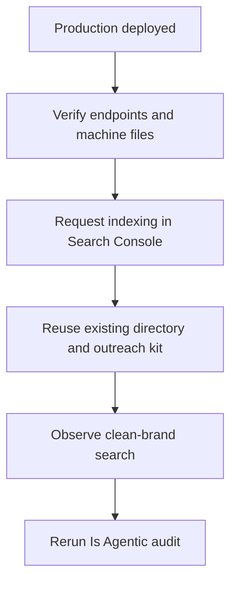
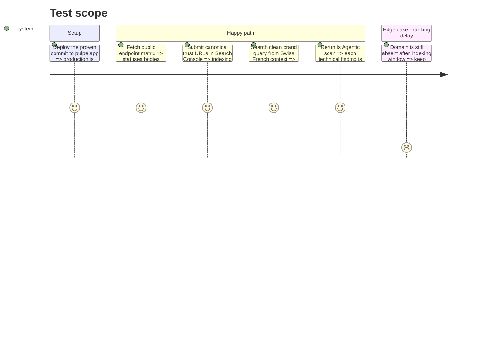

# Instruction: brand activation and public verification

## Blocker

Commit `954303d96bd600f0ac85e246fef038df12ec6f25` passed the exact matrix at the
immutable Vercel preview
`https://pulpe-landing-4xqnnaylp-maximes-projects-56d66b35.vercel.app`, but
promoting it to `pulpe.app` is a production mutation that has not been
authorized. On August 25, 2026, production still served the old version:
`Accept: text/markdown` returned HTML, and `/llms.txt`, `/index.md`, `/about`,
and `/privacy` returned 404. Search Console and external submissions also
require Maxime's access or approval.

The clean `Pulpe` query observed the same day placed `pulpe.app` first. The brand
finding can therefore be revalidated without a new campaign or rank promise.

## Architecture projection

> Tree of the final files. ✅ create · ✏️ modify · ❌ delete

```txt
.
└── No product file: Search Console, directory, outreach, and public-proof actions.
```

## User Journey



## Test Scope



## Tasks to do

### `1)` Prove every production surface

> Replay an explicit matrix against the canonical domain after deployment.

1. Verify `/`, `/llms.txt`, `/index.md`, `/about`, `/privacy`, `/support`, `/sitemap.xml`, `/robots.txt`, and a random path.
2. On `/`, test HTML, Markdown, `q` values, wildcard, and an impossible representation; record status, `Content-Type`, `Vary`, `Link`, and body size.
3. On the random path, test HTML and Markdown and require 404 in both cases.
4. Validate JSON-LD with Rich Results Test or Schema Markup Validator and retain the textual results in the implementation report.

### `2)` Activate existing brand discovery

> “Pulpe” rank depends on indexes and external mentions, not a new component.

1. In Search Console, already verified by the existing meta tag, request indexing for `/`, `/about`, `/privacy`, and priority SEO pages; do not target one country exclusively.
2. Reuse `aidd_docs/tasks/2026_07/2026_07_23_growth-seo-assets/outreach-directories.md` for AlternativeTo and Les Pépites Tech.
3. Reuse `outreach-listicles.md` for editorial mentions; do not submit or contact anyone without Maxime's account or approval.
4. Use the same entity everywhere: “Pulpe, app de budget pour planifier son année, sans connexion bancaire”, `https://pulpe.app`, Switzerland, and the contact address that is actually available.
5. If an `@pulpe.app` mailbox exists, use it consistently; otherwise keep `CONTACT_EMAIL` and do not invent an alias.

### `3)` Measure without promising a rank

> Close technical fixes immediately; keep the brand finding open until external observation.

1. Repeat `Pulpe`, `Pulpe app budget`, and `site:pulpe.app` from a non-personalized fr-CH context after the indexing window.
2. Record engine, locale, date, and position of the first canonical result; the App Store does not replace the domain for this criterion.
3. Rerun the Is Agentic scan only after CDN purge/deployment; compare each result with the 73/100 baseline.
4. In the final summary, separate verified results, remaining ranking delay, content decisions, and missing credentials.

## Test acceptance criteria

| Task | Acceptance criteria                                                                                                                     |
| ---- | --------------------------------------------------------------------------------------------------------------------------------------- |
| 1    | The production matrix confirms the same statuses, bodies, types, links, and headers as preview for every public endpoint.               |
| 2    | Search Console and external profiles use the canonical domain and a consistent identity without a duplicate campaign in the repository. |
| 3    | The technical score is rescanned; the “Pulpe” item is declared resolved only when `pulpe.app` appears in a clean search.                |
