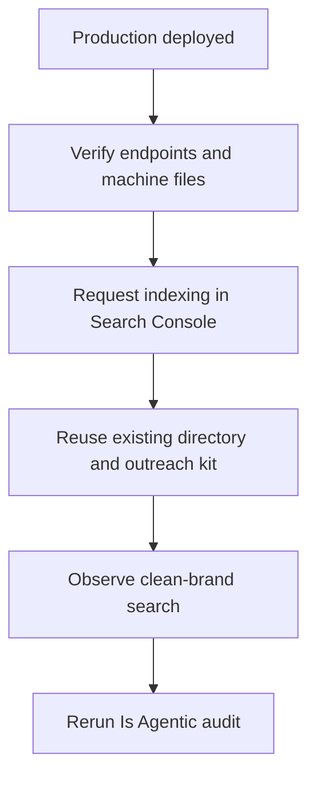
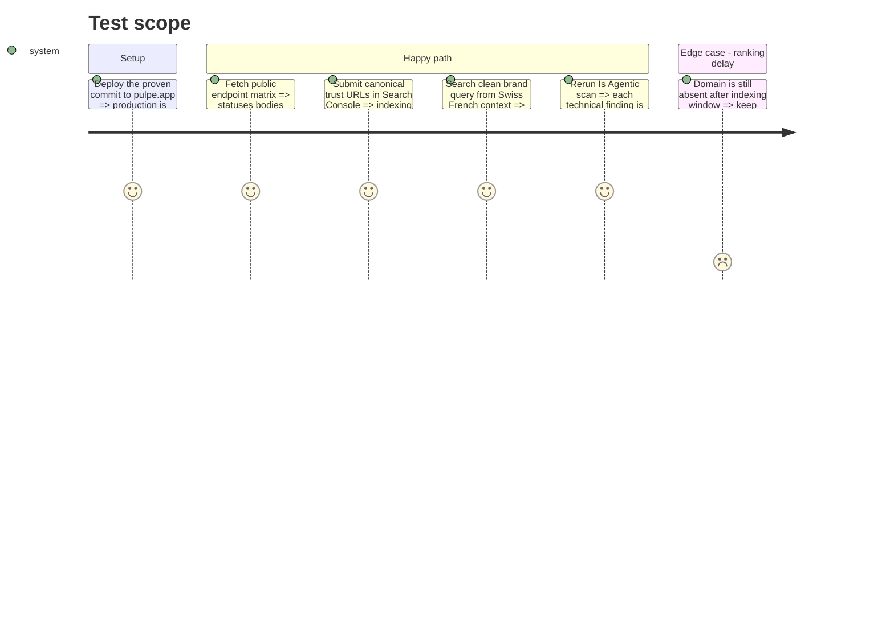

# Instruction: activation de marque et vérification publique

## Blocker

La preview Vercel vérifiée est prête, mais sa promotion vers `pulpe.app` est une
mutation de production qui n'a pas été autorisée. La production du 25 août 2026
sert encore l'ancienne version : `Accept: text/markdown` renvoie du HTML et
`/llms.txt`, `/index.md`, `/about` et `/privacy` répondent 404. Search Console et
les soumissions externes demandent en plus les accès ou l'accord de Maxime.

La requête propre `Pulpe` observée le même jour place désormais `pulpe.app` en
premier résultat. Le constat de marque peut donc être revalidé, sans nouvelle
campagne ni promesse de rang.

## Architecture projection

> Tree of the final files. ✅ create · ✏️ modify · ❌ delete

```txt
.
└── Aucun fichier produit : actions Search Console, annuaires, outreach et preuve publique.
```

## User Journey



## Test Scope



## Tasks to do

### `1)` Prouver toutes les surfaces en production

> Rejouer une matrice explicite sur le domaine canonique après déploiement.

1. Vérifier `/`, `/llms.txt`, `/index.md`, `/about`, `/privacy`, `/support`, `/sitemap.xml`, `/robots.txt` et un chemin aléatoire.
2. Sur `/`, tester HTML, Markdown, valeurs `q`, wildcard et représentation impossible; relever statut, `Content-Type`, `Vary`, `Link` et taille du corps.
3. Sur le chemin aléatoire, tester HTML et Markdown; exiger 404 dans les deux cas.
4. Valider le JSON-LD avec le Rich Results Test ou Schema Markup Validator et conserver les résultats textuels dans le compte-rendu d'implémentation.

### `2)` Activer la découverte de marque existante

> Le rang « Pulpe » dépend d'index et de mentions externes, pas d'un nouveau composant.

1. Dans Search Console déjà vérifiée par la meta présente, demander l'indexation de `/`, `/about`, `/privacy` et des pages SEO prioritaires; ne pas cibler un pays unique.
2. Réutiliser `aidd_docs/tasks/2026_07/2026_07_23_growth-seo-assets/outreach-directories.md` pour AlternativeTo et Les Pépites Tech.
3. Réutiliser `outreach-listicles.md` pour les mentions éditoriales; aucune soumission ou prise de contact n'est faite sans le compte ou l'accord de Maxime.
4. Employer partout la même entité : « Pulpe, app de budget pour planifier son année, sans connexion bancaire », `https://pulpe.app`, Suisse, et l'adresse de contact réellement disponible.
5. Si une boîte `@pulpe.app` existe, l'utiliser de façon cohérente; sinon conserver `CONTACT_EMAIL` et ne pas inventer d'alias.

### `3)` Mesurer sans promettre un rang

> Fermer les correctifs techniques immédiatement; garder le constat de marque ouvert jusqu'à observation externe.

1. Refaire les requêtes `Pulpe`, `Pulpe app budget` et `site:pulpe.app` depuis un contexte non personnalisé fr-CH après le délai d'indexation.
2. Noter moteur, locale, date et position du premier résultat canonique; l'App Store ne remplace pas le domaine dans ce critère.
3. Relancer le scan Is Agentic seulement après purge/déploiement CDN; comparer chaque preuve au baseline 73/100.
4. Dans le résumé final, séparer résultats vérifiés, délai de ranking encore ouvert, décisions de contenu et credentials manquants.

## Test acceptance criteria

| Task | Acceptance criteria |
| ---- | ------------------- |
| 1 | La matrice production confirme les mêmes statuts, corps, types, liens et en-têtes que la preview pour chaque endpoint public. |
| 2 | Search Console et les profils externes utilisent le domaine canonique et une identité cohérente, sans nouvelle campagne dupliquée dans le dépôt. |
| 3 | Le score technique est re-scanné; le point « Pulpe » n'est déclaré résolu que lorsque `pulpe.app` apparaît réellement dans une recherche propre. |
